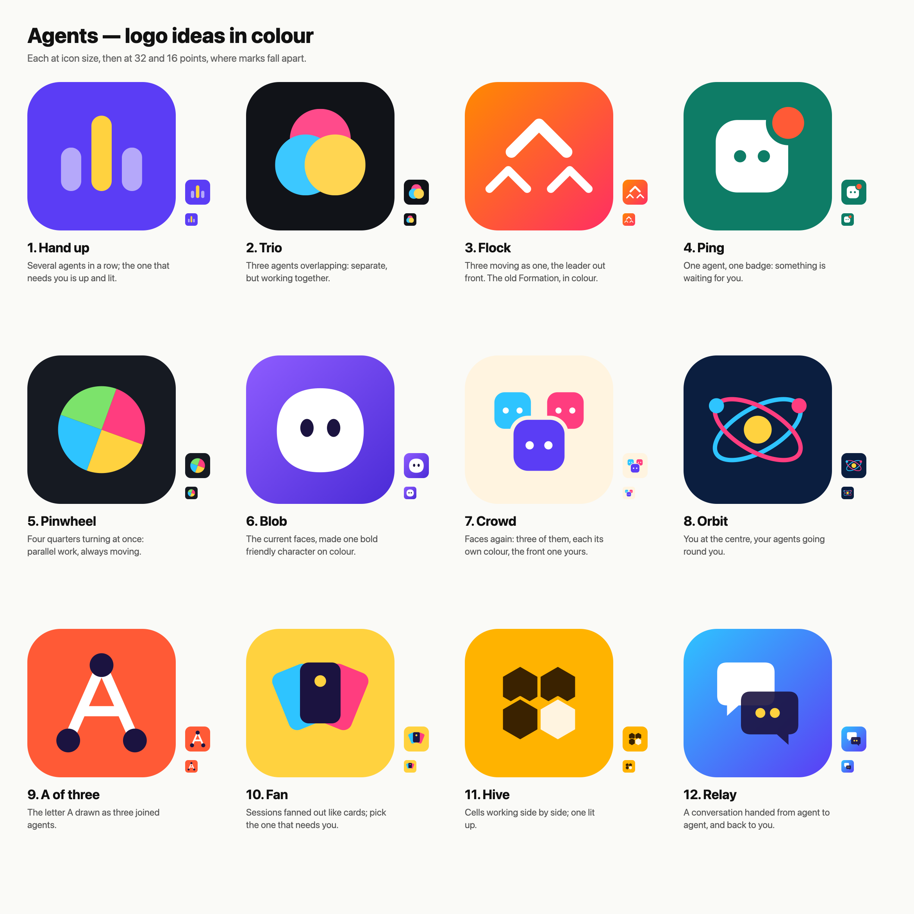

# Logo ideas in colour

The current icon (grey faces, `../crowd`) is vague: grey on white, three shapes that blur
into one at small sizes. Other agent apps have one bold shape on a strong colour: Claude's
burst on orange, for example. These twelve take that brief. Each one is a single idea, two or
three colours, on a ground you could name in one word.

| | Idea | What it says | At 16 points | Note |
|---|---|---|---|---|
| 1 | **Hand up** | A row of agents; the one that needs you is up and lit. | Holds | Closest to what the app does. Also reads as a bar chart, so it may need a rounded head |
| 2 | **Trio** | Three overlapping: separate, but together. | Holds | Simple, but generic. Many brands use overlapping circles |
| 3 | **Flock** | Three moving as one, a leader out front. | Holds | The old Formation idea, warm and fast |
| 4 | **Ping** | One agent with a badge: something is waiting. | Holds | Clear, but the macOS Dock draws its own badge on top of it |
| 5 | **Pinwheel** | Four working at once, always moving. | Holds | Strong colour, but says "colours", not "agents" |
| 6 | **Blob** | The faces made one friendly character. | Holds best | Keeps the current icon's feel; a mascot, but only one agent |
| 7 | **Crowd** | Three faces, each its own colour. | Fails | Today's icon in colour. Too much detail below 32 points |
| 8 | **Orbit** | You at the centre, agents around you. | Weak | Reads as science or React |
| 9 | **A of three** | The letter A as three joined agents. | Holds | A monogram, so it carries the name. The nodes also look like a graph |
| 10 | **Fan** | Sessions fanned out like cards. | Weak | Reads as a card game |
| 11 | **Hive** | Cells side by side, one lit. | Holds | Bees suggest workers well; the honey colour is its own |
| 12 | **Relay** | A conversation passed from agent to agent. | Holds | Says "chat" more than "agents" |

The strongest are **1 Hand up**, **6 Blob** and **9 A of three**. Hand up says what the
app is for. Blob keeps the character people already know from the faces. The A works as
a wordmark as well as an icon.

The old README's rule of "no colour, because colour means something went wrong" applied
inside the window. The icon sits in the Dock among other apps, so it can be coloured without
breaking that rule.

## Making them

`python3 make.py` writes each mark as `<name>.svg` (1024 square, macOS corner radius) and
`sheet.svg`. Then run `qlmanage -t -s 2340 -o . sheet.svg && mv sheet.svg.png sheet.png`
to render the sheet. To change a mark, edit its function in `make.py`.
