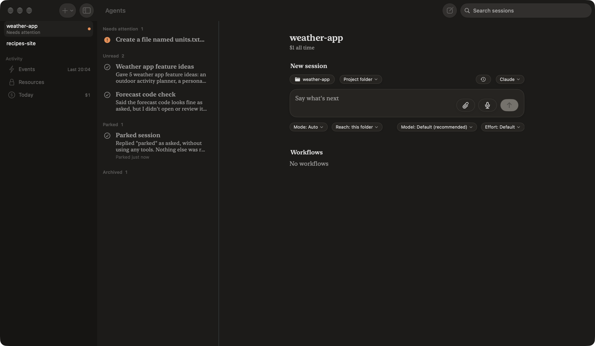
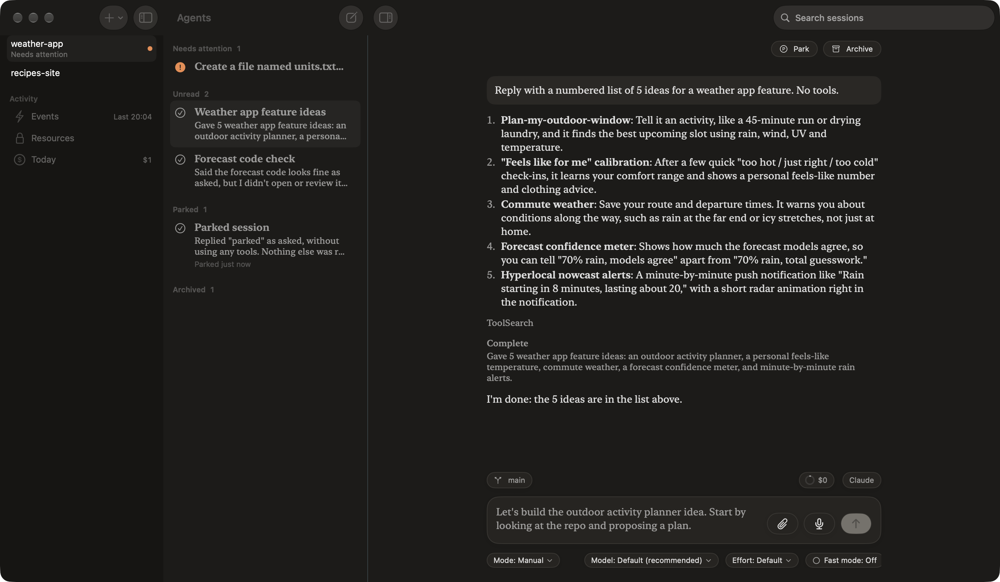
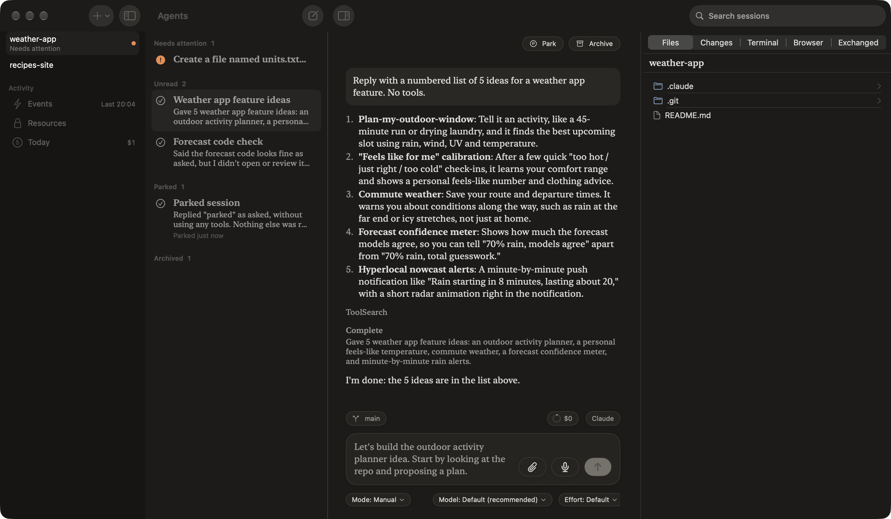
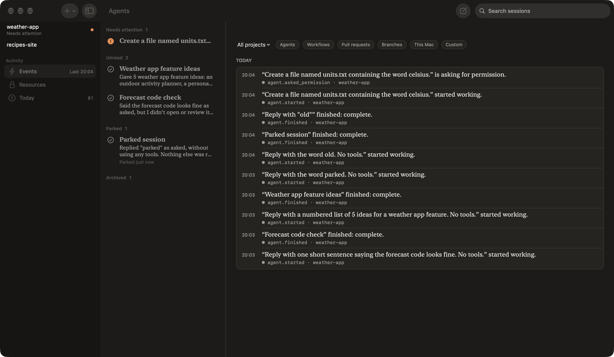

# Three columns: the look, for approval

These are screenshots of the real app (the `three-columns` branch) on a scratch copy with two projects and five sessions. They are not drawings. Nothing beyond the layout has been built yet: no keyboard work, and no changes to the rows.

## 1. A project with no session picked

The middle column lists the project's sessions under the same headings as before: Needs attention, Unread/Read, Parked, and Archived (collapsed). On the right is the project on its own: New session, then pull requests, workflows and worktrees. **New session** at the top of the sessions column and ⌘N both start one here.

## 2. A session picked

Picking a row shows its chat beside the list. There's no back button, and moving to another chat is one click, or ⌥⌘↓ from the Go menu. The selected row stays highlighted.

## 3. With the inspector open

The chat and the inspector share the right-hand column. At this window size (1470 pt wide) the chat keeps about 620 pt.

## 4. Events

Events, Resources and Spending fill the right-hand column. The middle column keeps showing the current project's sessions.

## Rough edges I already know about

- **The window title reads "Agents"**, not the chat's or the project's name. The middle column's title was hiding the chat's, and removing it left nothing. I'll set it from whatever the right-hand column shows.
- **The rows are the old cards' rows**, in the large reading typeface. In a list that narrow they probably want the smaller list size, with the summary on one line.
- **Search** filters by title and summary, but the toolbar gives it more width than it needs.
- **On Events, Resources and Spending the middle column is idle.** It could hide for those pages (two columns), or show something of its own. Hiding it is the simplest option.

## If you approve, what comes next

- The arrow keys move through sessions, ⌫ or ⌥⌘⌫ archives, and ⌘-click selects several.
- Swipe to archive becomes the list's own swipe.
- Tighter rows.
- The window title.
- The middle column hides for Events, Resources and Spending.
- Removing the old push-navigation code and the unused swipe-back.
