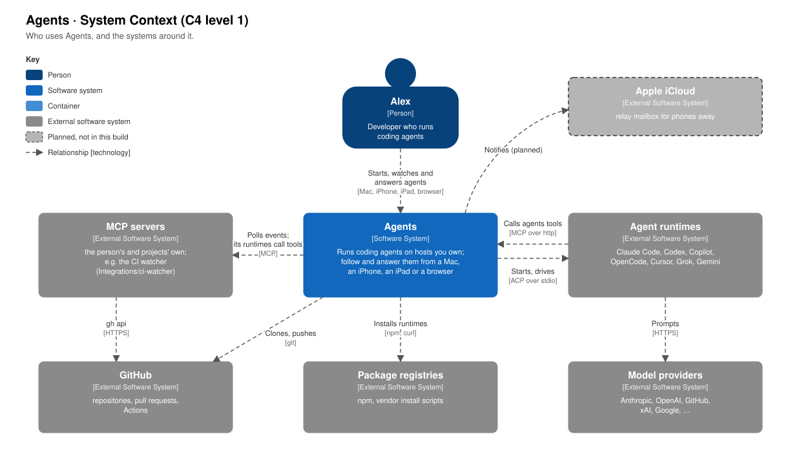
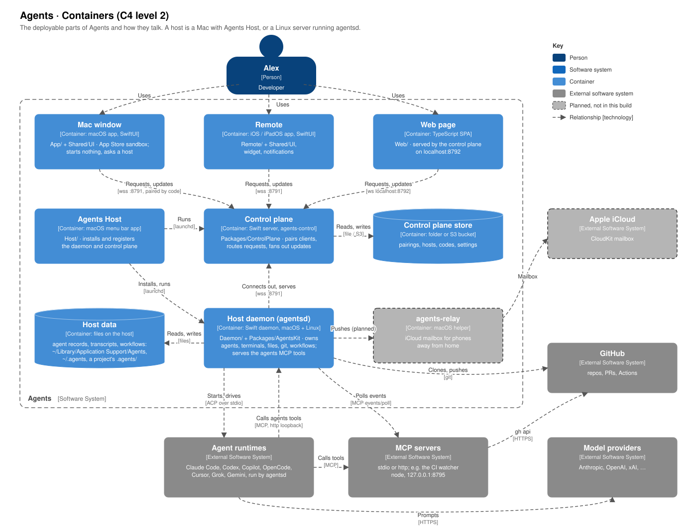
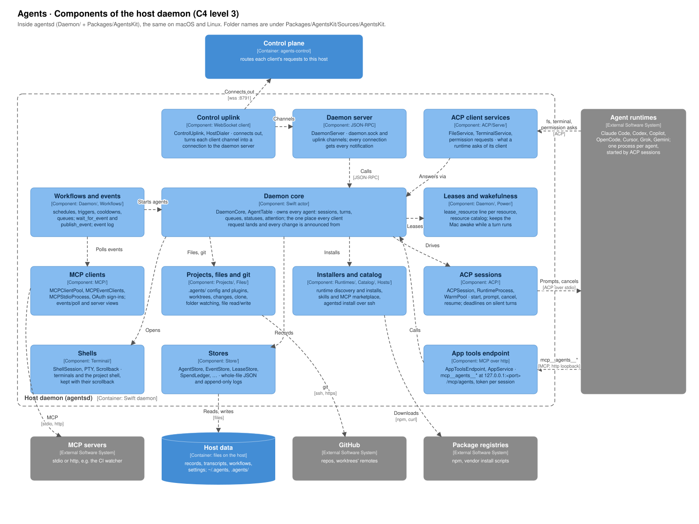
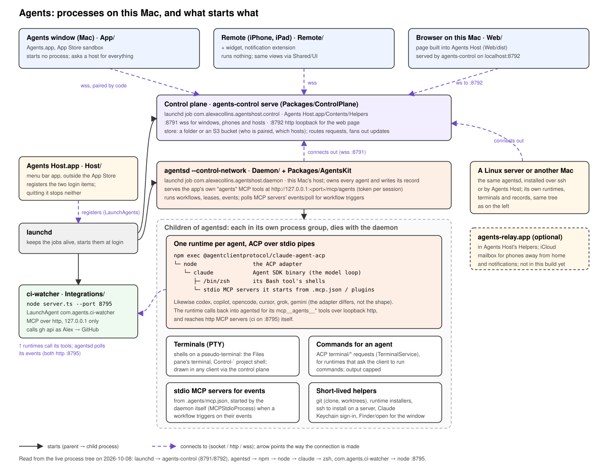

# Architecture

Four views of Agents, from the outside in, in the style of the
[C4 model](https://c4model.com): the system and its neighbours, the containers it is made
of, the components inside the host daemon, and how they run as processes on a Mac.

## System context

You use Agents to run coding agents on hosts you own, and follow and answer them from a
Mac, an iPhone, an iPad or a browser. Agents does not talk to a model itself. It starts and
drives an **agent runtime** (Claude Code, Codex, Copilot, OpenCode, Cursor, Grok or Gemini)
over ACP, and the runtime prompts its own provider. A runtime calls back into Agents for the
app's own tools (`mcp__agents__*`) over MCP.

Agents also polls **MCP servers** for the events that trigger workflows, clones and pushes
to **GitHub** with git, and installs runtimes from **package registries**. A relay through
**iCloud**, for phones away from home, is planned and not in this build.

## Containers

| Container | Code | Technology | What it does |
| --- | --- | --- | --- |
| Mac window | `App/`, `Shared/UI` | macOS app, SwiftUI, App Store sandbox | A client. Starts nothing; asks a host for everything. |
| Remote | `Remote/`, `Shared/UI` | iOS and iPadOS app, SwiftUI, with a widget | A client, on the phone and the iPad. |
| Web page | `Web/` | TypeScript single-page app | A client, served by the control plane on `localhost:8792`. |
| Agents Host | `Host/` | macOS menu bar app | Installs the daemon and the control plane, registers them with launchd, makes pairing codes. |
| Control plane | `Packages/ControlPlane` | Swift server, `agents-control` | Pairs clients, routes each request to its host, sends updates to clients. `:8791` wss, `:8792` loopback http. |
| Control plane store | | A folder or an S3 bucket | Who is paired, which hosts there are, unused codes, settings. Nothing about agents. |
| Host daemon | `Daemon/`, `Packages/AgentsKit` | Swift daemon, `agentsd`, macOS and Linux | Owns agents, terminals, files, git and workflows on its host. Serves the agents MCP tools. |
| Host data | | Files on the host | Agent records, transcripts and settings in `~/Library/Application Support/Agents`; shared skills and instructions in `~/.agents`; a project's own `.agents/`. |
| agents-relay | `Host/Relay` | macOS helper | Planned: an iCloud mailbox for phones away from home. |

Every connection to the control plane is made **outwards**: from a client, and from each
host. A client never reaches a host directly, and a host never needs to be reachable. A
Linux server or another Mac is one more host daemon with its own host data, connected the
same way. See [The control plane](control-plane.md).

## Components of the host daemon

`agentsd` is the same program on macOS and Linux. Its code is in `Daemon/` (a short
`main.swift`) and `Packages/AgentsKit`. The folders below are under
`Packages/AgentsKit/Sources/AgentsKit`.

| Component | Code | What it does |
| --- | --- | --- |
| Control uplink | `Daemon/ControlUplink`, `HostDialer` | The host's one connection out to the control plane. Each client's channel on it becomes a connection to the daemon server. |
| Daemon server | `Daemon/DaemonServer` | JSON-RPC, over `daemon.sock` and over the uplink's channels. Every connection gets every notification, so clients agree. |
| Daemon core | `Daemon/DaemonCore`, `AgentTable` | The actor that owns every agent: sessions, turns, queues, statuses and attention. Every request lands here, and every change is announced from here. |
| Workflows and events | `Daemon/DaemonCore+Workflows`, `+Events`, `+EventWaits`, `Workflows/` | Schedules, triggers, cooldowns and queues. `wait_for_event`, `publish_event` and the event log. |
| Leases and wakefulness | `Daemon/DaemonCore+Leases`, `ResourceCatalog`, `Power/` | A line per declared resource. Keeps the Mac awake while a turn runs. |
| MCP clients | `MCP/` | The daemon's own connections to MCP servers: `events/poll` for workflow triggers, server views and OAuth sign-ins. |
| Projects, files and git | `Projects/`, `Files/` | `.agents/` config and plugins, worktrees, changes, clones, folder watching, and file reads and writes for clients. |
| Installers and catalog | `Runtimes/`, `Catalog/`, `Hosts/` | Finds and installs runtimes, installs skills and MCP servers from the marketplace, installs `agentsd` on a server over ssh. |
| ACP sessions | `ACP/` | Starts each runtime, and prompts, cancels and resumes it over ACP. Keeps a few warm between turns (`WarmPool`), and puts deadlines on silent turns. |
| ACP client services | `ACP/Serve/` | Answers what a runtime asks of its client: files, terminal commands, permission requests. |
| App tools endpoint | `MCP/AppToolsEndpoint`, `ACP/Serve/AppService` | The `mcp__agents__*` tools, over loopback http with a token per session. |
| Shells | `Terminal/` | Terminals and the project shell, each a pseudo-terminal with its scrollback. |
| Stores | `Store/` | Whole-file JSON and append-only logs in the host data, kept by one rule (`StoreFile`). |

## Processes on this Mac

This is how the containers above run on a Mac. A solid arrow means one program starts
another. A dashed arrow is a connection, pointing the way it is made.

**Agents Host** registers two login items, and launchd runs them whether Agents Host is
open or not:

| launchd job | Program |
| --- | --- |
| `com.alexecollins.agentshost.daemon` | `agentsd --control-network` |
| `com.alexecollins.agentshost.control` | `agents-control serve --port 8791` |

The clients start no processes. Every process to do with an agent is a child of `agentsd`,
in a process group of its own, so stopping an agent, or the daemon, takes its whole group
with it:

- **A runtime per agent**, speaking ACP over stdio. For Claude:
  `npm exec @agentclientprotocol/claude-agent-acp` → `node` (the ACP adapter) → `claude`
  (the Agent SDK binary). The runtime starts its own children: shells for its Bash tool,
  and the stdio MCP servers in `.mcp.json` and plugins.
- **Terminals**: shells on a pseudo-terminal, such as the Files pane's terminal and the
  Control-` project shell.
- **Commands for an agent**: what a runtime asks its client to run over ACP's `terminal/*`.
- **MCP servers for events**: stdio servers in `.agents/mcp.json` that a workflow triggers
  on, polled by the daemon.
- **Short-lived helpers**: git, runtime installers, ssh to install on a server, the Claude
  Keychain sign-in, and opening files and Finder for the sandboxed window.

The agents MCP tools are not a process. The daemon serves them at
`http://127.0.0.1:<port>/mcp/agents`, with a token for each session (#185). An http MCP
server, such as the CI watcher on `127.0.0.1:8795`, belongs to no one in this tree: it is
a LaunchAgent of its own.

## Related

- [The window and the host](window-and-daemon.md).
- [The control plane](control-plane.md).
- [How the phone and iPad reach your agents](phone-and-ipad.md).
