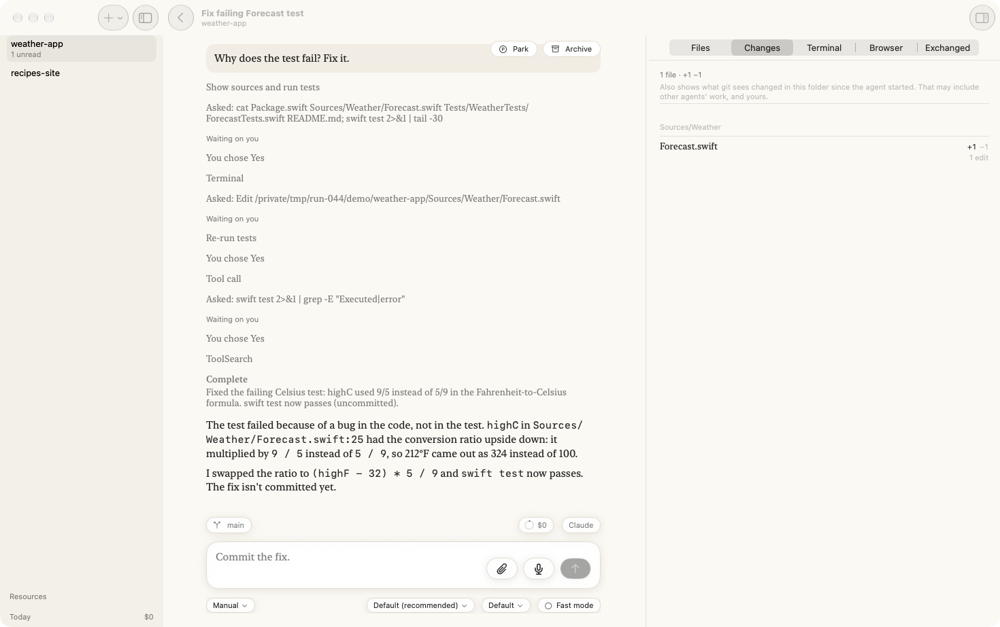
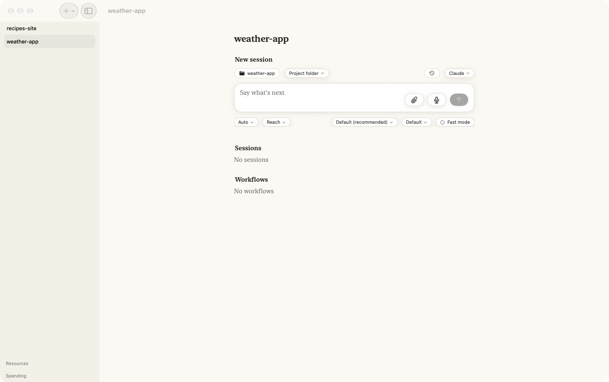
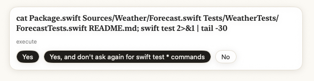
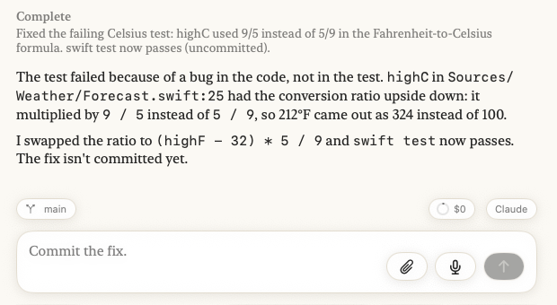
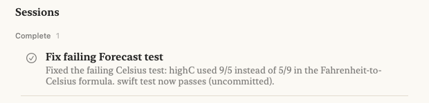

# Your first agent

In this tutorial you build Agents on your Mac, give it a small project with a failing
test, and ask an agent to fix it. You answer the agent's questions as it works, and at the
end you read what it changed. It takes about fifteen minutes, most of it the first build.

**What you'll have at the end:** a finished agent, its fix in your project, and a feel for
how every agent in the app works.



## Before you start

- A Mac with Xcode installed.
- One coding agent installed and signed in on this Mac. This tutorial uses **Claude
  Code**. Grok, Copilot and Cursor work too; see [Reference](../reference/index.md) for
  what each needs.

## 1. Build and open Agents

Agents is built from its source. In Terminal:

```sh
brew install xcodegen
git clone https://github.com/alexec/Agents.git
cd Agents
xcodegen generate
open Agents.xcodeproj
```

In Xcode, choose the **Agents** scheme with **My Mac** as the destination, and choose
**Product ▸ Run**. The first build takes a few minutes.

You should see the Agents window open, saying **No projects yet**.

## 2. Make a project to work on

A project is a folder you work in. For this tutorial, make a small one with a bug in it:
a weather forecast that converts Fahrenheit to Celsius the wrong way round. In Terminal:

```sh
mkdir -p ~/Demo/weather-app/Sources/Weather ~/Demo/weather-app/Tests/WeatherTests
cd ~/Demo/weather-app

cat > Package.swift <<'EOF'
// swift-tools-version:5.9
import PackageDescription

let package = Package(
    name: "Weather",
    targets: [
        .target(name: "Weather"),
        .testTarget(name: "WeatherTests", dependencies: ["Weather"]),
    ]
)
EOF

cat > Sources/Weather/Forecast.swift <<'EOF'
public struct Forecast {
    public var day: String
    public var highF: Double
    public var lowF: Double

    public init(day: String, highF: Double, lowF: Double) {
        self.day = day
        self.highF = highF
        self.lowF = lowF
    }

    /// The high in Celsius.
    public var highC: Double {
        (highF - 32) * 9 / 5
    }
}
EOF

cat > Tests/WeatherTests/ForecastTests.swift <<'EOF'
import XCTest
@testable import Weather

final class ForecastTests: XCTestCase {
    func testHighInCelsius() {
        let monday = Forecast(day: "Monday", highF: 212, lowF: 50)
        XCTAssertEqual(monday.highC, 100, accuracy: 0.01)
    }
}
EOF

git init -q && git add -A && git commit -qm "First version"
```

## 3. Add it to Agents

In the Agents window, click **+** at the top of the list, choose **Add a folder**, and
pick `weather-app` in your `Demo` folder.

You should see `weather-app` in the list on the left, and its page beside it with
**New session** at the top.



## 4. Start the agent

The runtime is on the right, above the prompt. It should say **Claude**. If it says
**Needs signing in**, click it, choose **Sign in, sign out, providers…**, and follow what
it asks. Then come back here.

Click in the prompt, where it says **Say what's next**, type:

```text
Why does the test fail? Fix it.
```

and press Return.

You should see the conversation open, with your question at the top and the agent's first
steps appearing under it.

## 5. Answer its questions

Before the agent runs a command or changes a file, it asks you. A card appears above the
prompt, naming what it wants to do.



Click **Yes**. It will ask two or three times: to read the files and run the tests, to
edit `Forecast.swift`, and to run the tests again. Click **Yes** each time.

While it waits for you, the project in the list says **Needs attention**. That is how
you know an agent wants you, even when you are looking at something else.

## 6. Read what it did

When the agent has finished, it says **Complete** with a one-line summary, then explains
what was wrong and what it changed.



On the right, **Changes** lists the one file it edited. Click `Forecast.swift` to see
the line it changed. Above the prompt, the agent suggests what you might say next, such
as *Commit the fix.* You can take it, change it, or ignore it.

## 7. Find it again

Click the back arrow at the top of the conversation.

You should see the agent on the project's page under **Complete**, named for what it
did, with its summary under the name.



That is the whole loop: ask, answer, read. Every agent in the app works this way,
whether it runs for a minute or an afternoon.

## Where next

- [Follow your agents from your iPhone](follow-from-iphone.md), the next tutorial.
- [How-to guides](../how-to/index.md), for one task at a time, such as starting an agent
  in its own worktree or adding a Linux server.
- [Why agents keep working when the window is closed](../explanation/index.md).
