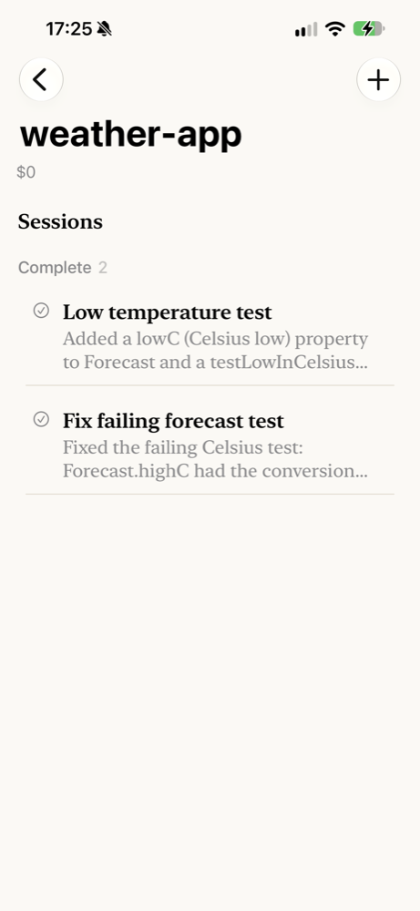
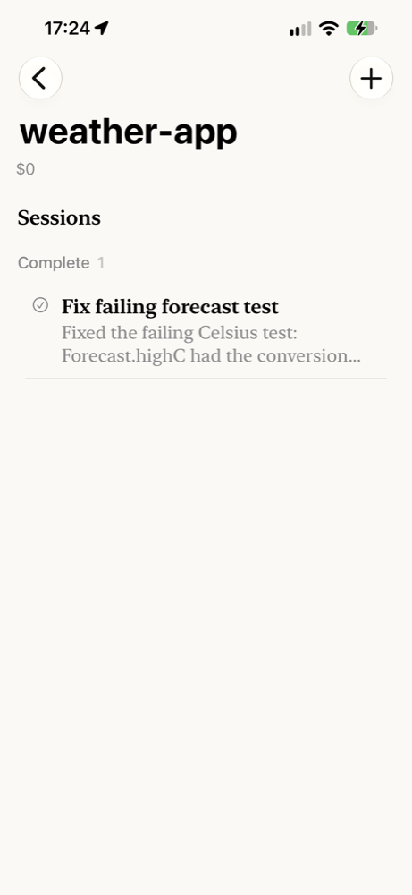
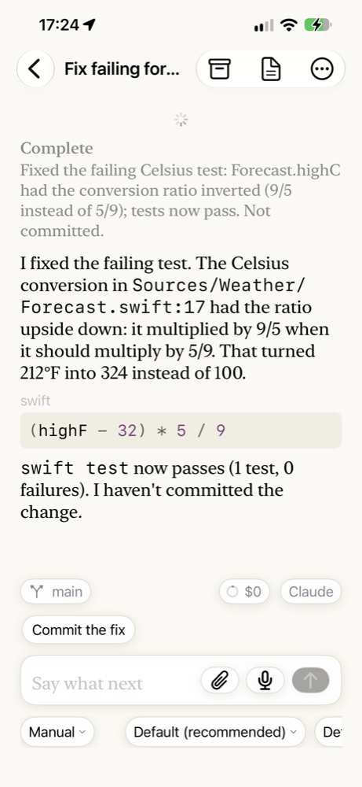
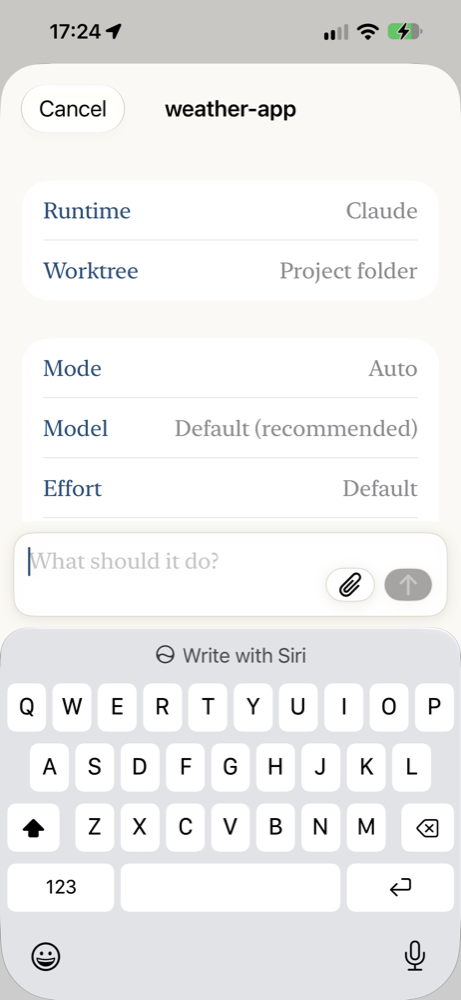
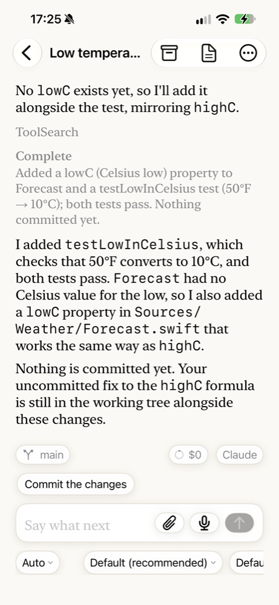

# Follow your agents from your iPhone

In this tutorial you put Agents on your iPhone, find the agent you started in
[Your first agent](first-agent.md), and start a second one from the phone. It takes about
ten minutes. The same steps work on an iPad.

**What you'll have at the end:** your Mac's projects and agents on your phone, and a second
agent started and finished from the phone without going back to the Mac.

{ width="300" }

## Before you start

- You have finished [Your first agent](first-agent.md), so your Mac has a project with an
  agent in it.
- Agents Host runs on your Mac, and the Agents window is paired with it. See
  [Set up Agents on this Mac](../how-to/set-up-on-this-mac.md).
- Your iPhone and your Mac are on the same Wi-Fi network.
- You have Xcode and a free Apple developer account, so that Xcode can put an app on
  your own phone.

## 1. Put Agents on your iPhone

Agents is not in the App Store yet, so you build it onto your phone from the same copy of
the source you built the Mac app from.

1. Connect your iPhone to your Mac with a cable, and unlock it.
2. In Xcode, choose the **Remote** scheme, then choose your iPhone as the destination.
3. Choose **Product ▸ Run**.

The first time, Xcode asks you to pick a team for signing. Pick your own. Your phone may
also ask you to trust the developer, under **Settings ▸ General ▸ VPN & Device
Management**.

You should see Agents open on your phone and say **Connect to your agents**.

## 2. Show a code on your Mac

The phone reaches your agents through your control plane, the one Agents Host runs on
your Mac. Only a device you have paired can reach it, and you pair it once, by scanning a
code.

In the Agents window on your Mac, open **Settings ▸ Control plane**, click **Show** beside
**Clients**, and click **Pair a Device…**.

You should see a code to scan, good for five minutes.

## 3. Pair the phone

On your phone, tap **Scan the Code** and point the camera at the code. The first time, the
phone asks to use the camera; allow it.

You should see your phone listed under **Clients** on the Mac, as a **Device**, and the
phone show **Projects**, with the project you made in the first tutorial.

## 4. Find your first agent

Tap your project.

You should see the agent from the first tutorial in the **Complete** group, with its
summary under its name.

{ width="300" }

Tap it to read the whole conversation, exactly as it is on the Mac: the summary, the
agent's explanation, and the fix it suggests you commit next.

{ width="300" }

## 5. Start an agent from the phone

1. Go back to the list, tap the project to unfold it, and tap **New session**, the first row under it.
2. Leave **Runtime** as it is. It is the runtime your Mac has set up. If you open the
   row, the runtimes are in two runs, **Available** and **Out**, with what is wrong with
   each out one said under its name, exactly as the Mac's own chooser shows them. An out
   one is still there to pick: a session on it takes the message and the runtime says no
   until its plan is back.
3. In **What should it do?**, type:

    ```text
    Add a test for the low temperature in Celsius, and run the tests.
    ```

4. Tap the arrow to start it.

{ width="300" }

You should see the new agent appear under **Working**, and its conversation fill in as it
reads the code.

## 6. Watch it finish, and answer it if it asks

Whether the agent stops to ask before it changes a file depends on **Mode** on the form.
With **Auto**, as in the picture above, Claude goes ahead with changes inside the project
without asking. With a mode that asks, a card appears in its conversation naming what it
wants to do, and you tap **Yes**, just as you clicked it on the Mac.

You should see the agent end in **Complete**, with what it added and a suggestion of what
to say next. On the Mac, the same agent shows the same conversation.

{ width="300" }

## 7. Take it with you

Away from home, the phone reaches the control plane at its address when it can. When it
cannot, because the control plane is on your Mac at home, it can go through the relay
instead, through your own iCloud account, and says **Away — slower, through iCloud**. In
this build Agents Host cannot switch the relay on yet; see
[How the phone and iPad reach your agents](../explanation/phone-and-ipad.md#at-home-and-away).

## Where next

- [Answer a question or a permission request](../how-to/answer-a-question.md), including from a
  notification when your Mac is not in use.
- [Start an agent in its own worktree](../how-to/start-in-a-worktree.md), so two agents in one project
  do not change the same files.
- [How the phone and iPad reach your agents](../explanation/phone-and-ipad.md).
