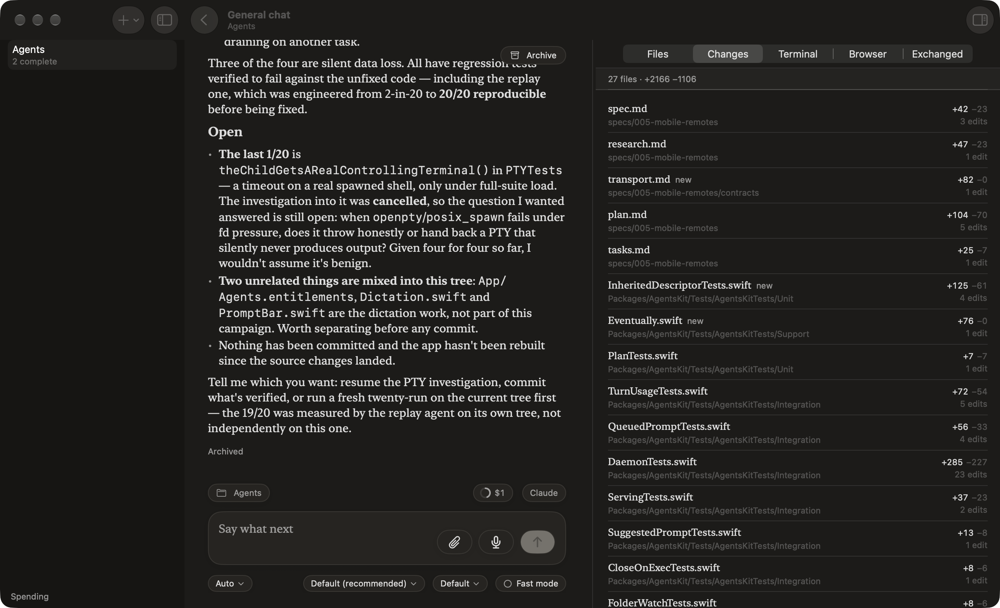
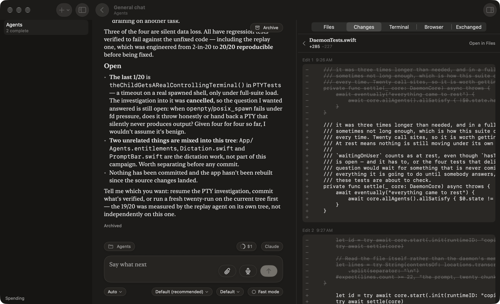
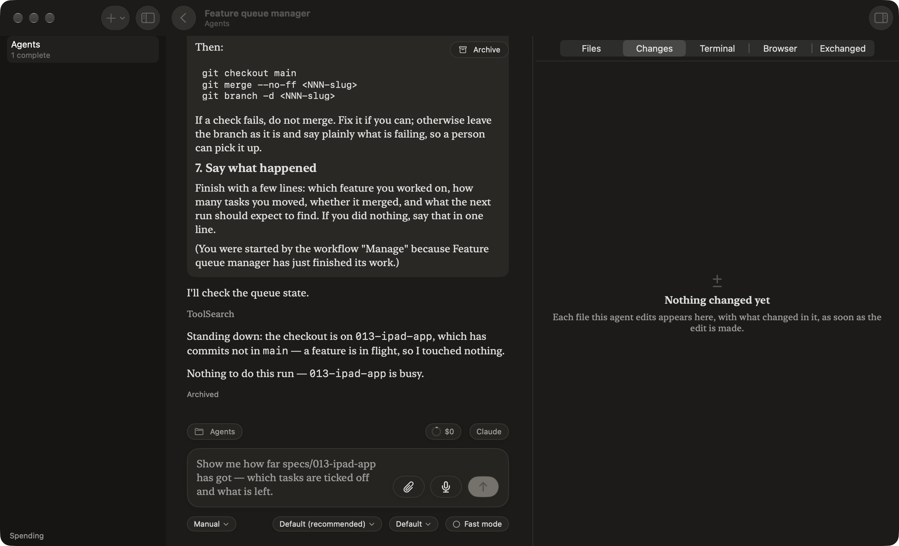
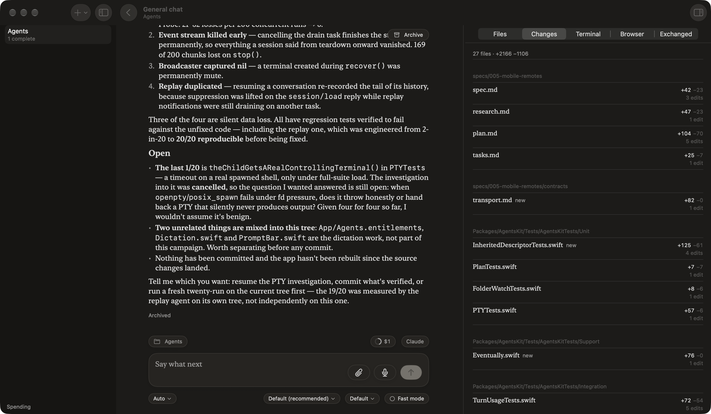

# 035 Changes pane — the T021 gate

These come from the built branch, running on a scratch daemon with two agents copied from the live
root. The list shows reported edits only. There's no git yet.

## The list

Files are in first-edit order, each with its folder, a `new` mark where it applies, the counts
shown by weight, and the number of edits. The total is at the top.

## A file

A back chevron, the name and counts, and **Open in Files**. Below that, every edit in order, each
headed by its number and time and drawn uncapped.

## Nothing changed

## Seen while running it

- **Counts on a new file mislead.** `InheritedDescriptorTests.swift` reads `new +125 −61`. The
  agent wrote the file and then edited it three times, and the counts add every edit's lines. Git
  gives the net change in Phase 5 and replaces them, but agents in folders without git will keep
  the summed counts.
- **Speed.** The first ask on a 6,305-line transcript took 0.8 s, cold. Later asks read only the
  new entries.
- **Wire detail.** `git` comes back as `{"unavailable":{"_0":{…}}}`, not the contract's
  `{"unavailable":{…}}`. Both ends are Swift, so this is cosmetic. I'll label the case in Phase 5.

## Settled

You chose **group by folder** and **two views (Edits · Whole file)**. The grouped list, built and
running:

