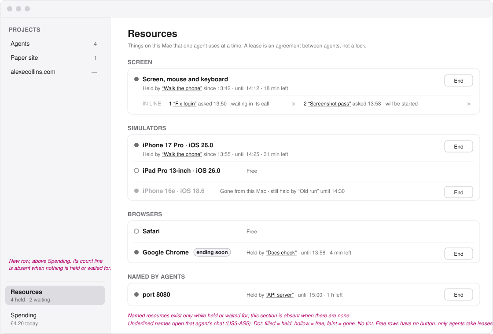
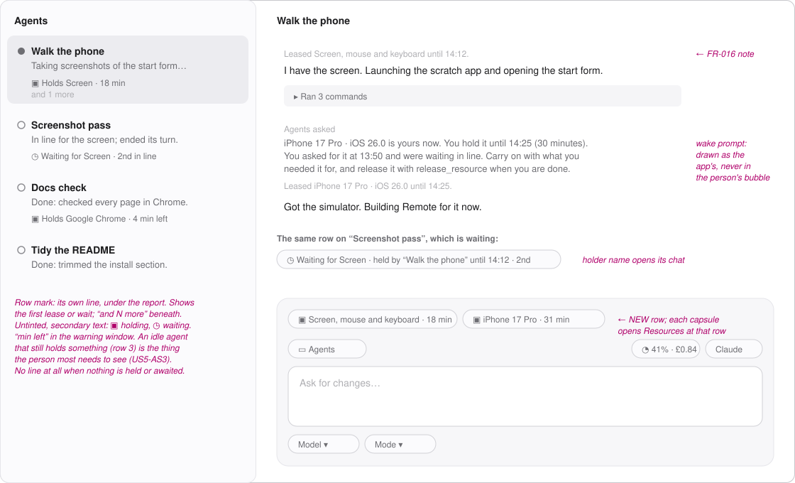
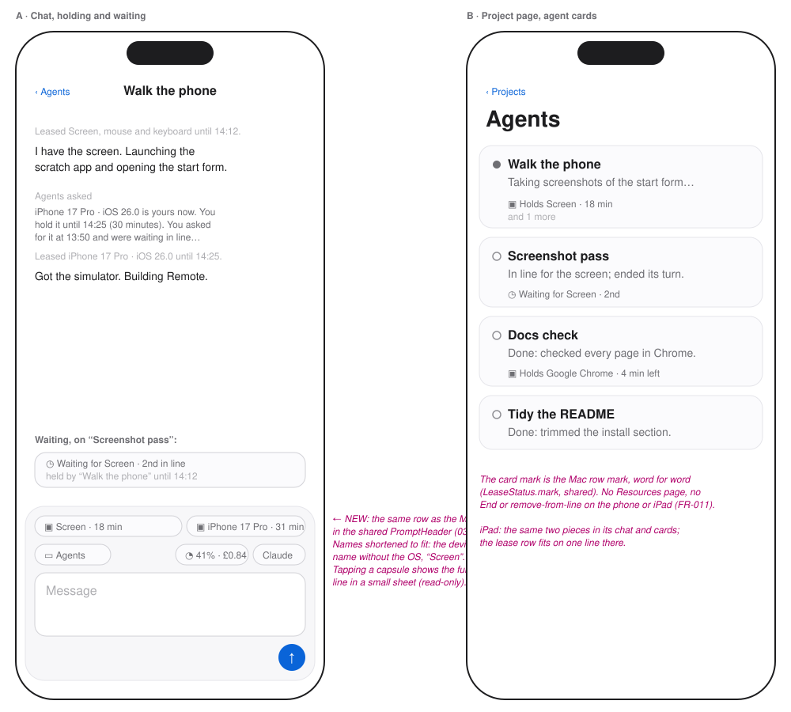

# Wireframes: Resource Leases

These are grey boxes for layout only. Type sizes follow the app's scale: `title`, `reading`,
`supporting`, `fine`. Pink italic text is a note, not UI.

All three show the same moment, 13:54:
- “Walk the phone” holds the screen and the iPhone 17 Pro simulator.
- “Fix login” is 1st in line for the screen, with its call still open.
- “Screenshot pass” is 2nd in line and has ended its turn.
- “Docs check” is idle but still holds Chrome, which is about to run out.

1. [Mac: the Resources page](#1-mac-the-resources-page)
2. [Mac: the chat status line and the row mark](#2-mac-the-chat-status-line-and-the-row-mark)
3. [Phone and iPad: status line and card](#3-phone-and-ipad-status-line-and-card)
4. [Colour](#4-colour)
5. [Decided here, not in the spec](#5-decided-here-not-in-the-spec)

## 1. Mac: the Resources page

- **Where it lives**: a new row in the sidebar's foot, above Spending, with the same shape.
  Under the name, a count line ("4 held · 2 waiting") that is absent when nothing is held or
  waited for.
- **Groups**: Screen, Simulators, Browsers, Named by agents, always in that order. The first
  three always show what the Mac has, free or not. Named by agents appears only while one of
  them is held or has a line (US6-AS2).
- **One row per resource**: a dot, the name, then who holds it, since when, until when, and the
  time left. Every agent name is a link to that agent's chat (US3-AS5).
- **The line** sits under the row it belongs to, in order. Each waiter shows when it asked and
  whether its call is still open ("waiting in its call") or it will be started again ("will be
  started"). ✕ removes that waiter from the line (US4-AS3).
- **Buttons**: **End** on a held resource, and ✕ on a waiter. Nothing else: only agents hold
  leases, so a free resource has no button, and there is no Take (spec, Clarifications). Nothing
  asks for confirmation first. Ending is recoverable because the agent is told and can ask
  again.
- **Ending soon** is a plain capsule inside the five-minute warning (US5-AS5).
- **Gone** is a simulator that has left the Mac while still held. Its row is faint and keeps its
  End button (spec, Edge Cases).

## 2. Mac: the chat status line and the row mark

- **Chat**: a new row of capsules directly above the existing header (folder · meter ·
  runtime), one capsule per lease or wait. Holding reads `▣ {name} · {n} min`. Waiting reads
  `◷ Waiting for {name} · held by “{holder}” until {HH:mm} · {ordinal}`. A capsule opens the
  Resources page at that row, and the holder's name opens the holder's chat. The row is absent
  when the agent holds and waits for nothing (FR-010).
- **Row mark**: a line of its own under the report line, because the title line already carries
  the workflow, starter and worktree marks. It shows the first lease or wait, with "and N more"
  beneath when there are more.
- **Transcript**: the FR-016 notes appear as ordinary runtime notes. The wake prompt is drawn
  under "Agents asked", never in your bubble.
- **An idle agent still holding something** ("Docs check") is exactly what this mark is for
  (US5-AS3).

## 3. Phone and iPad: status line and card

- **The same two pieces, not phone versions of them.** The lease row goes in the shared
  `PromptHeader` that 033 moved into `Shared/UI/Chat/PromptPieces.swift`, so the Mac and the
  phone draw one view. The card mark is the same `LeaseStatus.mark` as the Mac row.
- **Narrow screens**: the row wraps rather than scrolling sideways, and names shorten
  ("Screen", the device name without the OS). Tapping a capsule shows the full line in a small
  read-only sheet.
- **Not on the phone or iPad** (FR-011): the Resources page, End, and removing someone from a
  line.

## 4. Colour

None of this is tinted. The app's colours are a closed set, and each one means one thing
(`Shared/UI/StateTint.swift`): orange means a person is needed, red means broken, green means the
agent said it was done. Holding an agreement or waiting for one is none of those, so:
- The mark and the capsules use the surface's own secondary grey. ▣ means holding and ◷ means
  waiting.
- "Ending soon" is a word in a plain capsule, not a warning colour.
- On the page, a filled dot means held, a hollow dot means free, and a faint dot means gone.

## 5. Decided here, not in the spec

These came up while drawing. Each is small, but the spec doesn't say it:

| Decision | Why |
|---|---|
| The lease row goes in the **shared PromptHeader** | 033 moved the header into `Shared/`. The plan's file list has been updated to match. |
| Tapping a capsule on the phone opens a **read-only sheet** | The short capsule can't hold the holder and the place in line. |
| **Nothing changes on the start form** | No lease is chosen when a chat starts, on any platform or through `start_agent` (FR-017). The agent leases what it needs, when it needs it. |
| **No confirmation** on End or ✕ | Both are recoverable, and one click matters most when an agent is holding the screen. |
| The wait limit shows as "**waiting in its call**" or "**will be started**" | This is the one thing the spec's Line entity records per waiter (callOpen). You need it to know whether ending a lease wakes someone now or later. |
