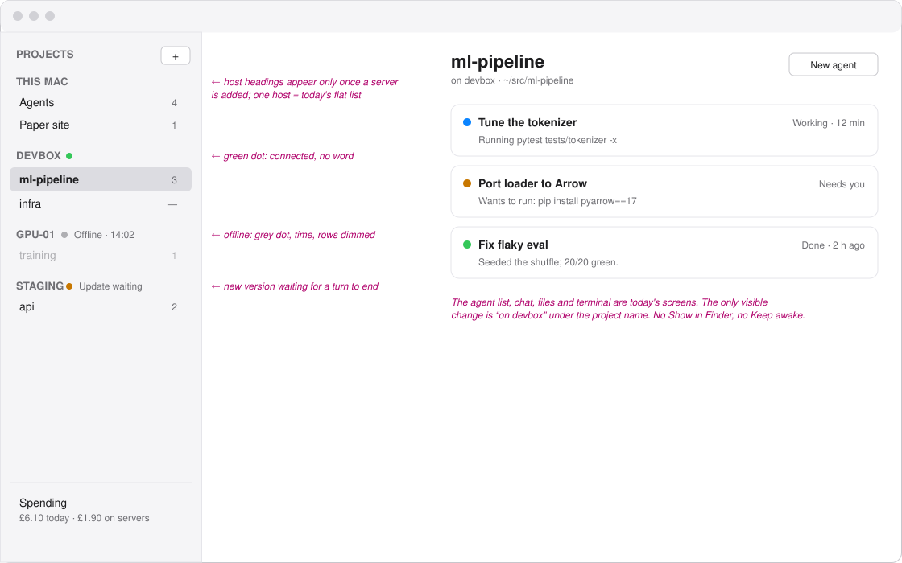
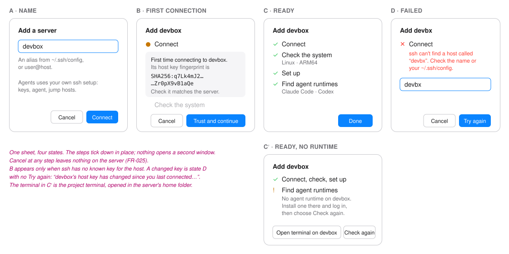
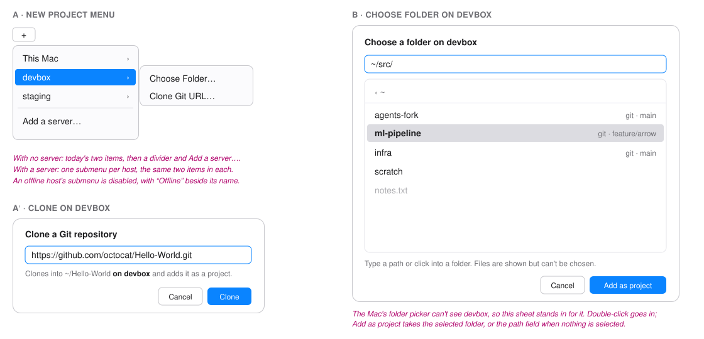
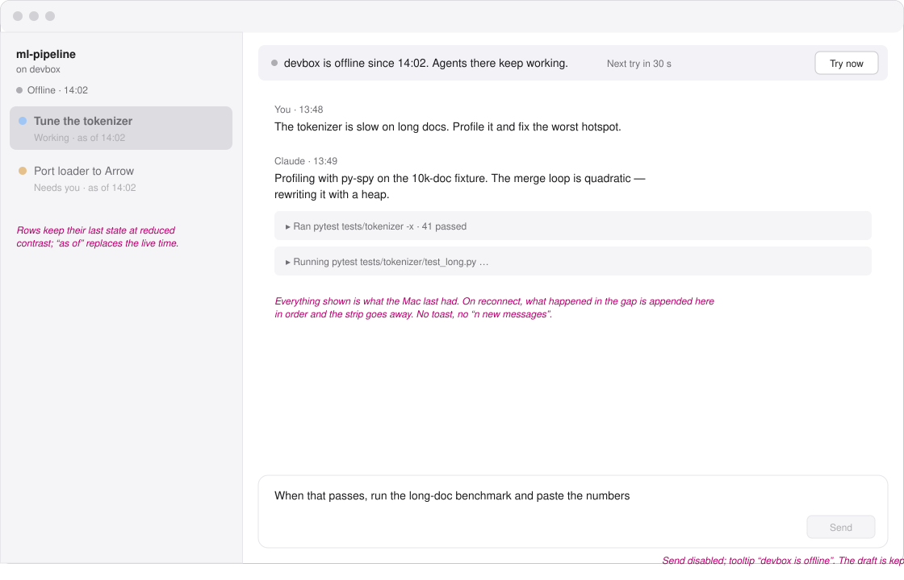
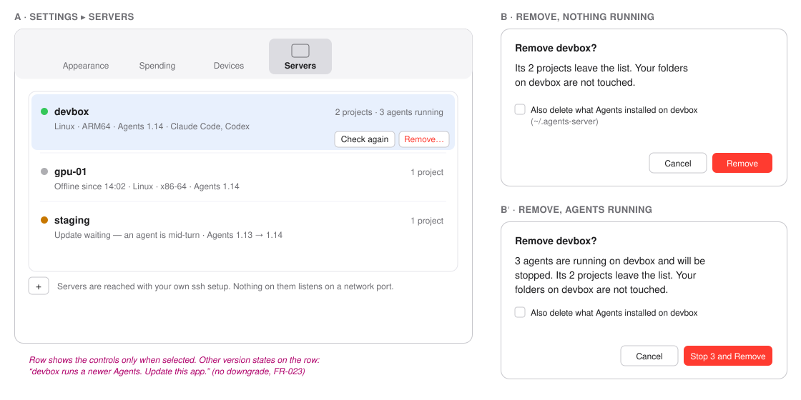

# Wireframes: Cloud Agents

These are grey boxes for layout only. Type sizes follow the app's scale: `title`, `reading`,
`supporting`, `fine`. Colour is used only for state, never for decoration. Pink italic notes are
not part of the screen.

1. [Mac: one project list, grouped by host](#1-mac-one-project-list-grouped-by-host)
2. [Mac: adding a server](#2-mac-adding-a-server)
3. [Mac: a new project on a server](#3-mac-a-new-project-on-a-server)
4. [Mac: a server that has gone away](#4-mac-a-server-that-has-gone-away)
5. [Mac: Settings → Servers, and removing one](#5-mac-settings--servers-and-removing-one)
6. [Words](#6-words)

## 1. Mac: one project list, grouped by host

- The project list gets a heading per host, **only once there is more than one host**. Someone
  with no server sees today's list, unchanged.
- The heading carries the host's state: a dot and a word. Green dot and no word when connected;
  grey `Offline · 14:02` when not; orange `Update waiting` when a new version is waiting for a
  turn to end.
- A server project row looks like any other row. It is marked by the group it sits in, not by a
  badge on every row.
- **Show in Finder** and **Keep awake** are not in a server project's menus (FR-016).
- The agent list and chat for a server project are the same screens as a local one. The one
  change is a single `fine` line under the project name in the detail header: `on devbox`.

## 2. Mac: adding a server

- Reached from **New project ▸ Add a server…** and from **Settings ▸ Servers ▸ +**.
- One field: the name you use with `ssh`. Below it, in `fine`: `An alias from ~/.ssh/config, or
  user@host.` Nothing else is asked for.
- After **Connect** the sheet becomes a short checklist that ticks down: *Connect*, *Check the
  system*, *Set up*, *Find agent runtimes*. Each step is one line; the current one has a spinner.
- **First connection**: the checklist stops at *Connect* with the host key card. The fingerprint
  is shown in full, in monospace. Two buttons: **Trust and continue**, **Cancel**. Cancel leaves
  nothing behind.
- **Ready**: the runtimes found on the server are listed by name. If none, the list is replaced by
  `No agent runtime on devbox. Install one there and log in, then choose Check again.` with an
  **Open terminal on devbox** button and **Check again**.
- **Failed**: the step that failed turns red with one sentence under it (see [Words](#6-words)).
  The sheet stays open with the name still in the field so it can be corrected and tried again.

## 3. Mac: a new project on a server

- The **New project** menu grows one level when there is a server: each host is a submenu holding
  the same two items as today, **Choose Folder…** and **Clone Git URL…**. With no server, the menu
  is today's menu plus **Add a server…** at the bottom.
- **Choose Folder…** on a server cannot use the Mac's folder picker, so it opens a sheet of its
  own: a path field starting at the server's home folder, and the folders under it. Clicking a
  folder goes into it; **Add as project** takes the folder shown in the path field.
- **Clone Git URL…** on a server is today's clone sheet with one line changed: `Clones into
  ~/Hello-World on devbox and adds it as a project.`
- The clone and the project appear under that server's heading in the list.

## 4. Mac: a server that has gone away

- The project's group heading turns grey: `Offline · 14:02`.
- The chat keeps showing what it last knew, with a strip across the top of the conversation:
  `devbox is offline since 14:02. Agents there keep working. Reconnecting…` When the app has
  given up retrying quickly it says `Next try in 30 s` and offers **Try now**.
- Agent rows keep their last state but are drawn at reduced contrast, with `as of 14:02` in place
  of their live time.
- The prompt bar stays visible so what you are typing is not lost, but **Send** is disabled and
  says why in its tooltip: `devbox is offline`. Permission and question cards are shown but their
  buttons are disabled for the same reason.
- On reconnect the strip disappears, rows return to full contrast, and anything that happened
  while away arrives in the chat in order. No toast.

## 5. Mac: Settings → Servers, and removing one

- A **Servers** tab in Settings, beside **Devices**.
- One row per server: name, state, system (`Linux · ARM64`), version, projects count, and the
  runtimes found. **+** adds a server (section 2).
- Selecting a row shows **Check again** and **Remove…**.
- **Remove…** with nothing running asks once: `Remove devbox? Its 2 projects leave the list. Your
  folders on devbox are not touched.` A checkbox, off by default: `Also delete what Agents
  installed on devbox (~/.agents-server)`.
- With agents running, the question starts with the number: `3 agents are running on devbox and
  will be stopped.` The button reads **Stop 3 and Remove**.
- A version mismatch appears on the row: `Update waiting — an agent is mid-turn`, or `devbox runs
  a newer Agents. Update this app.`

## 6. Words

| Where | Text |
|---|---|
| Add sheet field hint | An alias from ~/.ssh/config, or user@host. |
| Unknown host | ssh can't find a host called “devbx”. Check the name or your ~/.ssh/config. |
| Login refused | devbox refused the login. Is your key added to ssh-agent? |
| Locked key | Your key needs its passphrase. Run `ssh-add` in Terminal, then try again. |
| Changed host key | devbox's host key has changed since you last connected. Agents won't connect until you check it. |
| Unsupported system | devbox is macOS on ARM64. Agents servers need Linux on x86-64 or ARM64. |
| Disk full | There isn't room on devbox to set up Agents. |
| No runtimes | No agent runtime on devbox. Install one there and log in, then choose Check again. |
| Offline strip | devbox is offline since 14:02. Agents there keep working. Reconnecting… |
| Send disabled tooltip | devbox is offline |
| Detail header | on devbox |
| Update waiting | Update waiting — an agent is mid-turn |
| Server newer | devbox runs a newer Agents. Update this app. |
| Remove, idle | Remove devbox? Its 2 projects leave the list. Your folders on devbox are not touched. |
| Remove, busy | 3 agents are running on devbox and will be stopped. |
