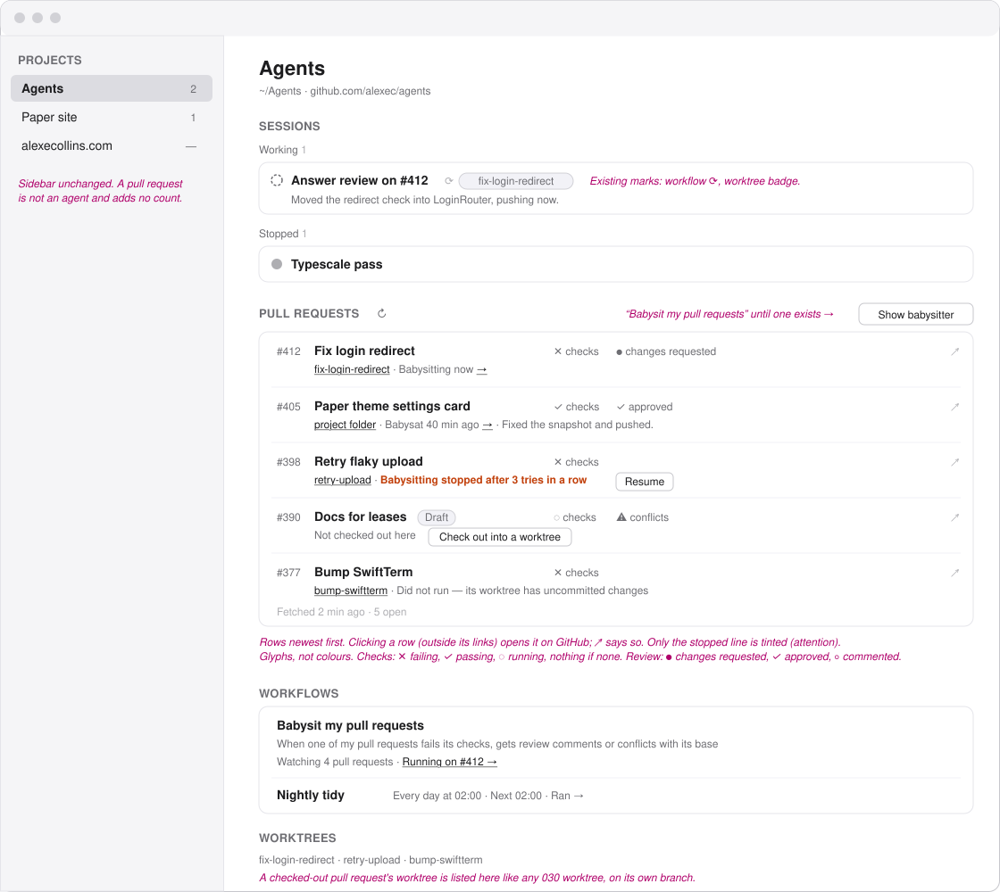
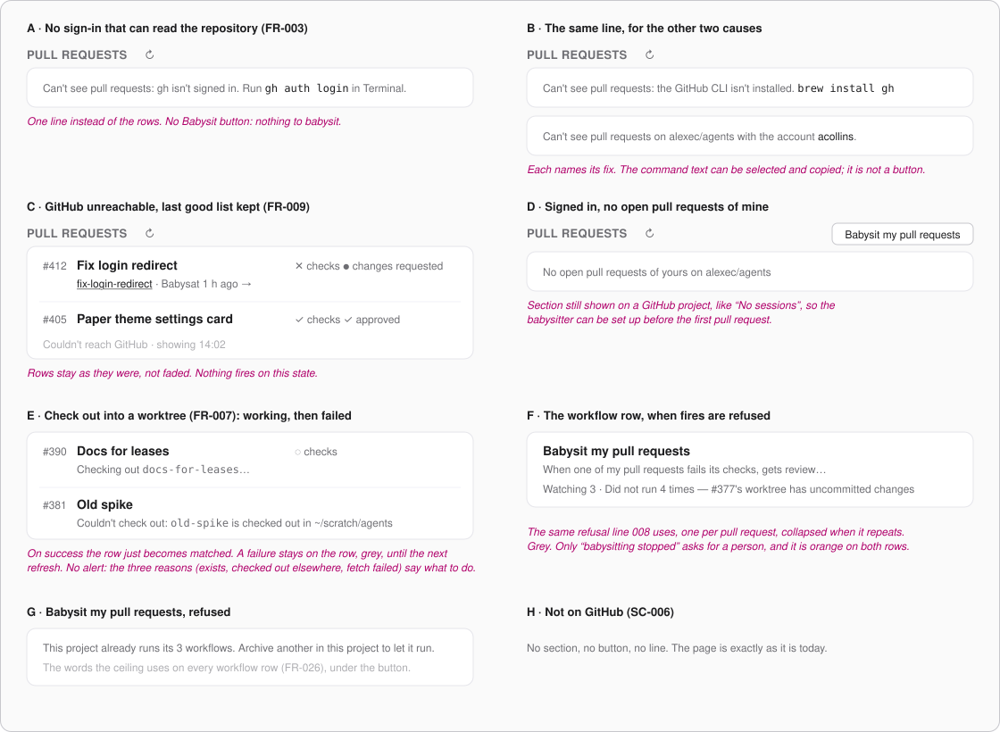
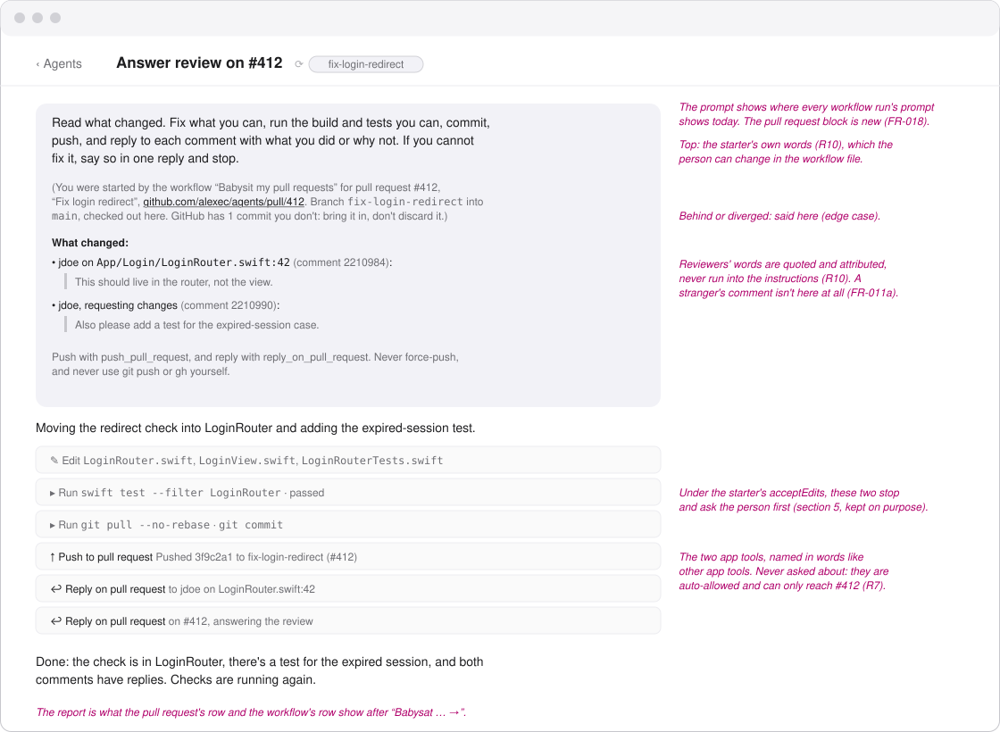

# Wireframes: My Pull Requests, Babysat

These are grey boxes, for layout only. Type sizes follow the app's scale: `title`, `reading`,
`supporting`, `fine`. Pink italic text is a note, not part of the UI.

Everything here is on the Mac. The phone and iPad get no Pull requests section in this version
(FR-010). They see a babysitting agent in the agent list like any other agent.

Every drawing shows the same moment on the Agents project (`github.com/alexec/agents`):
- **#412** has a review asking for changes, and is being babysat now.
- **#405** was babysat 40 minutes ago, and is approved.
- **#398** has a check no commit can fix, and babysitting has stopped.
- **#390** is a draft that isn't checked out anywhere.
- **#377**'s worktree has uncommitted changes, so its fire was refused.

1. [Mac: the project page](#1-mac-the-project-page)
2. [Mac: the section's other states](#2-mac-the-sections-other-states)
3. [Mac: a babysitting agent's chat](#3-mac-a-babysitting-agents-chat)
4. [Colour](#4-colour)
5. [The starter's permission mode](#5-the-starters-permission-mode)
6. [Decided here, not in the spec](#6-decided-here-not-in-the-spec)

## 1. Mac: the project page

- **Where it goes**: a new section between Sessions and Workflows, in the same card column. The
  order goes: what is happening, then what it is happening to, then what will happen. The
  section appears only on a GitHub project.
- **Header**: the heading, ↻ (refresh now, FR-008), and on the right **Babysit my pull
  requests**. That button becomes **Show babysitter** once a workflow with a pull-request
  trigger exists (US4-AS2).
- **Each row has two lines.**
  - Line one: the number, the title, a Draft capsule, then two fixed columns, checks and
    review, so the states line up down the list. ⚠ conflicts goes after them. ↗ marks that
    clicking the row opens it on GitHub (FR-005).
  - Line two: where the pull request is checked out, then what babysitting last did.
- **Where it is checked out**: a worktree's name, or "project folder". Either one leads to the
  agents working there (FR-006). An unmatched pull request says "Not checked out here" and has
  **Check out into a worktree** (FR-007).
- **What babysitting did**, the last of these (FR-019):
  - "Babysitting now →" while a run is in flight.
  - "Babysat 40 min ago →", then the run agent's report.
  - The refusal line, as on a workflow row: "Did not run — its worktree has uncommitted
    changes".
  - "Babysitting stopped after 3 tries in a row", with **Resume** (FR-023).
  → leads to the run's agent.
- **Footer**: "Fetched 2 min ago · 5 open".
- **The babysitting agent** is an ordinary card in Sessions. It carries the workflow mark ⟳
  and the worktree badge it already has. Its title comes from the agent, as it does for every
  agent.
- **The workflow row** reads its triggers in plain words (FR-016). Its "next" text is
  "Watching 4 pull requests", the number that are matched and not stopped. After that comes the
  latest run on any pull request, with the pull request's number.
- **Worktrees**: a checked-out pull request's worktree is listed with the others, on its own
  branch (R5).

## 2. Mac: the section's other states

- **A, B: can't see pull requests** (FR-003). One line instead of the rows, naming the fix:
  - gh isn't signed in.
  - gh isn't installed.
  - This account can't read the repository.

  The command is text you can select, not a button: the app never runs `gh auth` for you.
  There is no Babysit button here.
- **C: GitHub unreachable** (FR-009). The last good rows stay, at full strength, and the footer
  says "Couldn't reach GitHub · showing 14:02". Nothing fires on this state.
- **D: no open pull requests.** The section stays, with its button, so the babysitter can be set
  up before the first pull request. This mirrors "No sessions".
- **E: Check out.** While it works, the row says "Checking out `branch`…". On success the row just
  becomes matched. A failure stays on the row, grey, with the daemon's reason, until the next
  refresh. There is no alert.
- **F: refusals on the workflow row.** They use 008's line ("Did not run 4 times — …"), naming
  the pull request, and repeats collapse for each pull request.
- **G: over the ceiling.** Babysit my pull requests is refused with the ceiling's own words
  (US4-AS3), shown under the button.
- **H: not on GitHub.** Nothing at all (SC-006).

## 3. Mac: a babysitting agent's chat

- **The prompt** shows in the well every workflow run's prompt uses today. First comes the
  starter's own words, then R10's block:
  - A sentence saying which workflow started it, for which pull request, with the link.
  - The branches, and a line if the branch is behind or has diverged.
  - "What changed:", then each reviewer's words as a quote, with author, file, line and
    comment id.
  - The rule against pushing any other way.
- **The two app tools** are rows like any other app tool, in words: "Push to pull request" and
  "Reply on pull request", each with the daemon's reply. They are never asked about (R7).
- **The report** at the end is what both rows show after "Babysat … →".

## 4. Colour

Only one thing is tinted: **"Babysitting stopped after 3 tries in a row"**, in the attention
orange. On the workflow row it also turns the status icon orange ("Needs attention"). It is the
one state that waits for the person (`needsAPerson`, data-model).

Everything else is grey, following `StateTint`'s rule that each colour means one thing:
- Red means broken, and a failing check is the pull request's state, not the app's, so it isn't
  red.
- Green means an agent vouched for its work, so an approval isn't green.
- Checks and reviews are glyphs: ✕ ✓ ◌ for checks, ● ✓ ◦ for reviews.

## 5. The starter's permission mode

R10 writes the starter with `permission-mode: acceptEdits`, so reviewers' words never reach an
agent that can run anything without asking. Drawing the chat showed the cost:
- The agent edits files freely, but asks before running the tests, `git pull` and `git commit`.
- So an unattended run stops at its first question. SC-002 only promises the agent starts, which
  still holds.
- The question reaches the phone, so you can answer it from anywhere.

**Alex's choice (2026-09-24): keep `acceptEdits`.** The starter's prompt file carries a comment
saying how to make it hands-off:
- allow those commands in the project's own Claude settings, or
- change `permission-mode` in the workflow file, knowingly.

## 6. Decided here, not in the spec

| Decision | Why |
|---|---|
| The section goes **between Sessions and Workflows** | Already in the contract. Drawing it confirmed it: the babysitting agent is just above its pull request, and its workflow is just below. |
| **Two fixed columns** for checks and review | So five pull requests can be compared down the list at a glance. |
| **No section on phone or iPad**, and no count in the sidebar | FR-010. A pull request is not an agent. |
| **Glyphs, not colours**, for checks and reviews | Section 4. |
| The **refusal wording is 008's** ("Did not run — …") on both rows | One vocabulary for why nothing ran. |
| **"No open pull requests of yours"** keeps the section and its button | So the babysitter can be added before it has anything to do. |
| **Check-out failures stay on the row**, with no alert | Each of the three reasons says what to do, and none of them is urgent. |
| **Fix commands are selectable text**, not buttons | The app never signs in to GitHub for the person (FR-002). |
| The workflow row's "next" text is **"Watching N pull requests"** | A pull-request trigger has no next time, and the count is the useful fact. |
