# 041 diff look gate (T043): edits and Whole file

Taken 2026-09-25 on a scratch root, in a git project. A real Claude agent made three edits:
"Sold" → "Rang" in `sample.swift`, a new `refund_all` in `sample.py`, and two numbers 400 lines
apart in a 600-line `long.swift`. Captured from the Changes pane, which draws edits with the
same view the conversation uses.

## One word changed

Three unchanged lines either side, one removed line (struck, faded, on a faint wash), one added
line (bold). The changed word has a stronger neutral wash on both sides, over its syntax
colour. Before this change the same edit was drawn as every old line struck, then every new line.

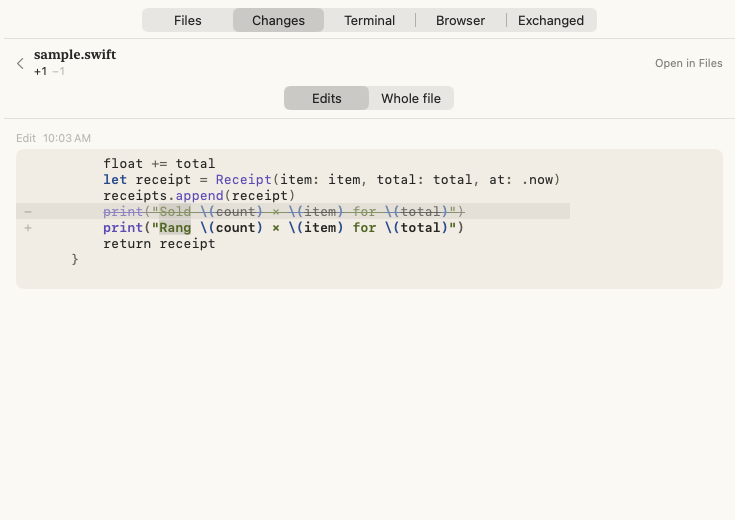

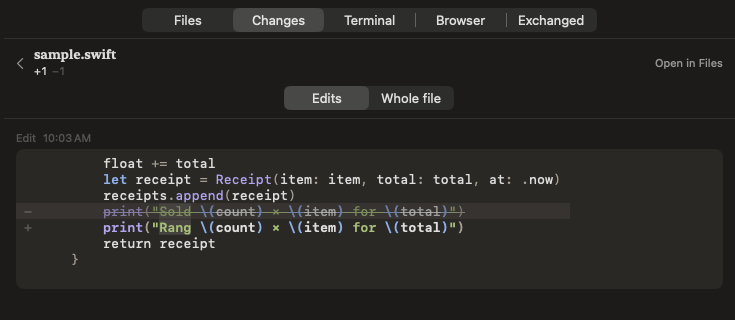

## A new function

Every line added, nothing struck, no word marks.

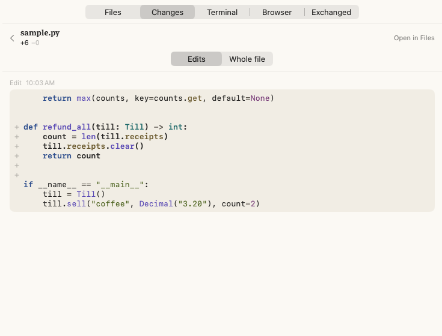

## Whole file: two changes 400 lines apart

Folded to the changes and three lines either side, each fold saying how many lines it hides.
Line numbers are the file's as it stands; removed lines have none. The arrows in the header are
Previous and Next change.

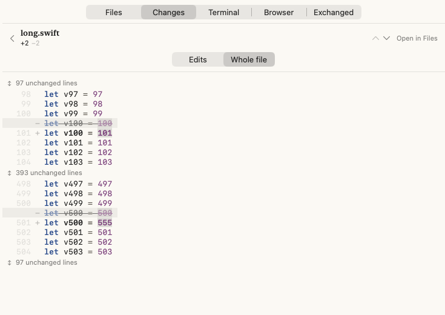

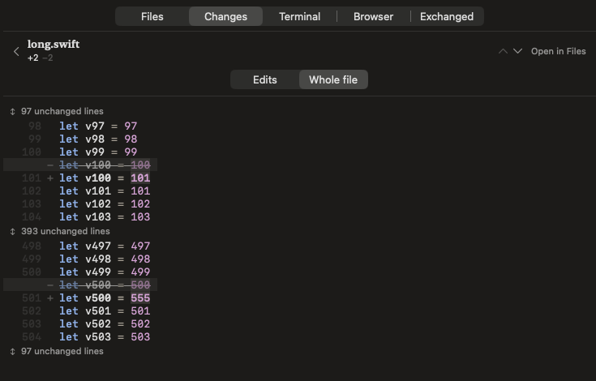

Opening the last fold shows its lines in place, and nothing above moves:

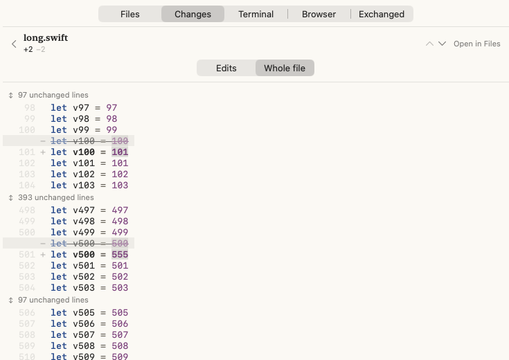

## Found and fixed during the walk

- **A crash.** A diff row carried two accessibility labels, one on the line and one on the
  row. Any accessibility query (VoiceOver, or the walk's own tool) overflowed AppKit's stack
  and the app died. Each row is now one element, read as "Added: …" or "Removed: …".
  Re-walked: no crash.
- **Colour stopped at line 200** in Whole file. A row drawn before its colour document
  existed never asked for it again. Rows now ask when the document arrives too; the same
  fix is in the files pane.
- **Fold labels wrapped** to a word a line inside the sideways scroll. They're now one line.

## Worth your eye

- **The changed-word wash in dark** is clear on numbers (`101`, `555`) but faint on the
  words in the Swift edit. Ink at 14% on the dark well may want to be stronger.
- **A removed line's wash** covers its text, not the pane's full width, because the diff
  scrolls sideways and a row has no width to fill.
- **Added lines are bold throughout**, as 035 had them. With syntax colour on top, that may
  now be more weight than a change needs.

---

# 041 look gate (T024): the files pane in colour

Taken 2026-09-25 on a scratch root (`/tmp/run-041`) from branch `041-rich-files-and-changes`.
Each file was shown by a real Claude agent calling `show_file`, as it is in real use. The
pane was captured from behind the other windows. Light is the Paper theme on System (light
here); dark is the same window relaunched with `--appearance dark`.

## Light

The whole window, for scale: `sample.swift` shown at line 20, which keeps its highlight.

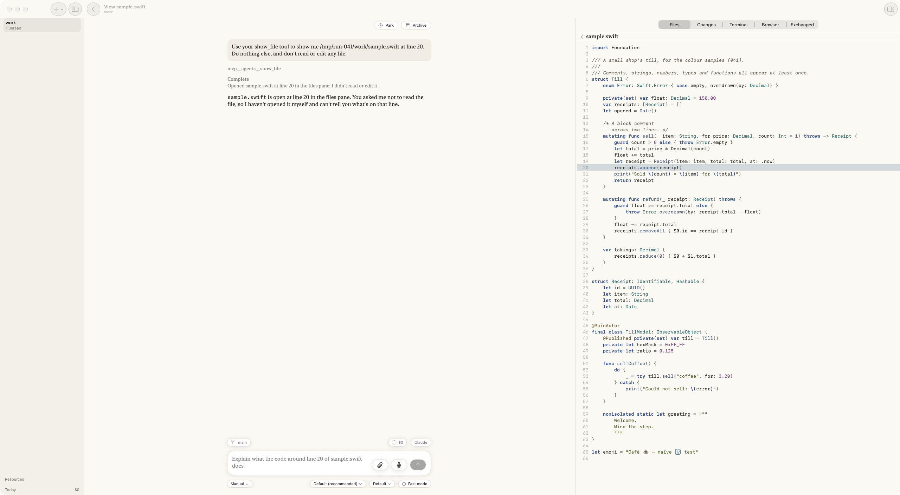

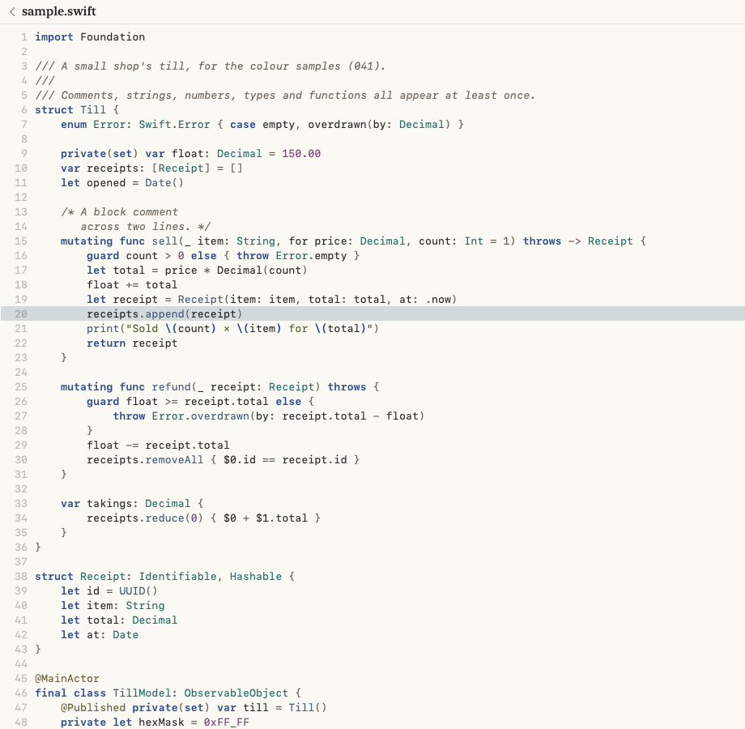

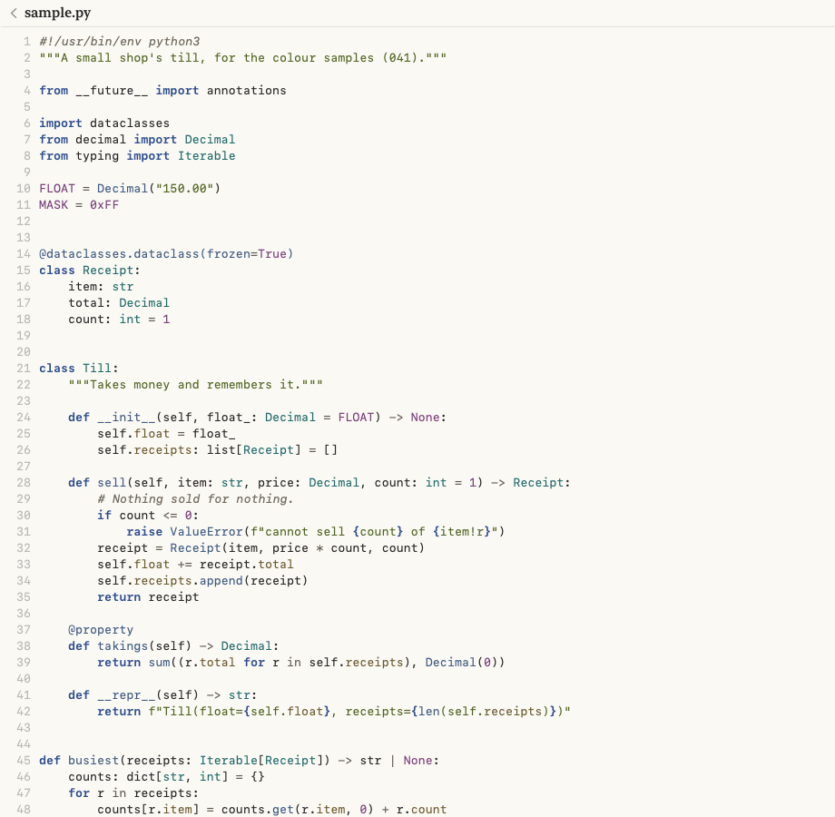

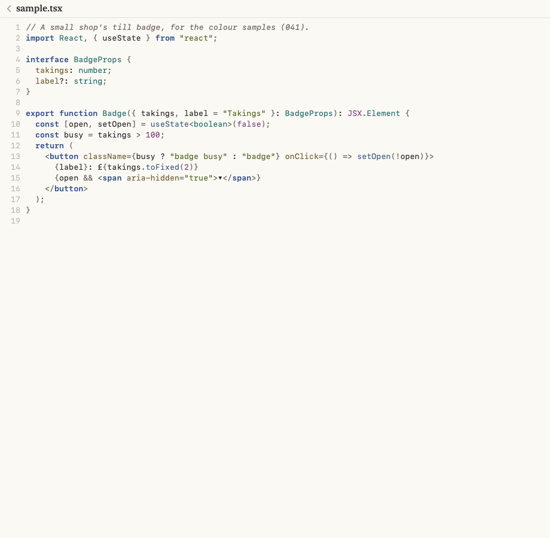

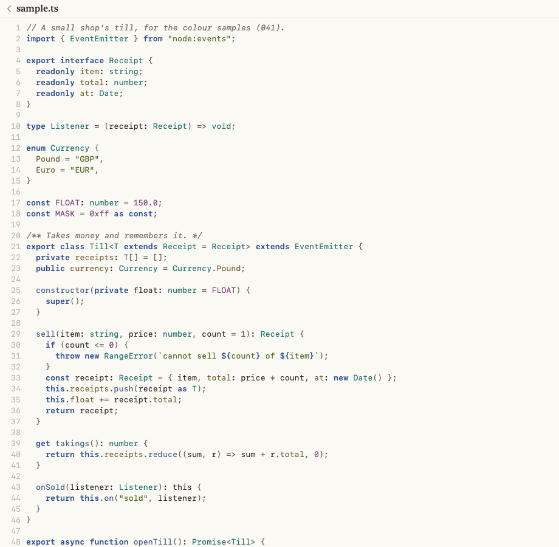

A kind of file the app doesn't know stays plain, with no message:

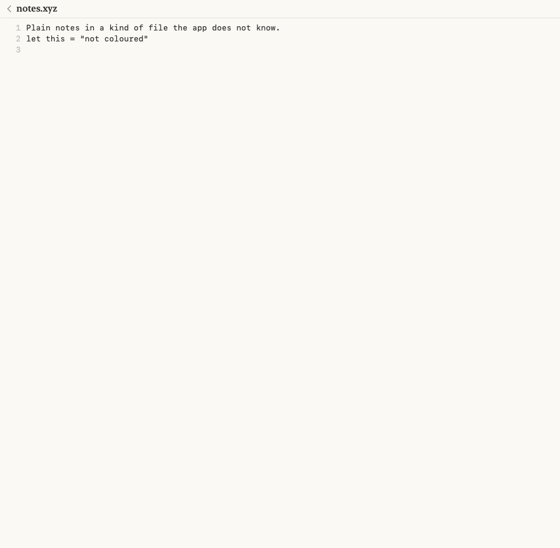

## Dark

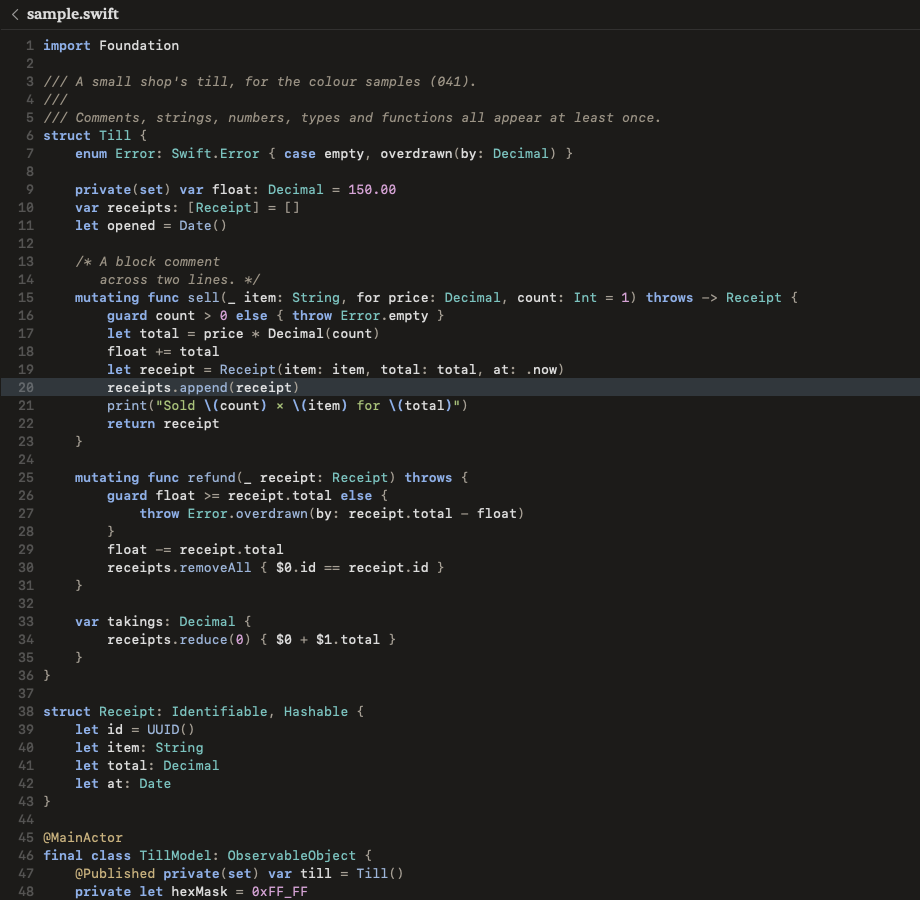

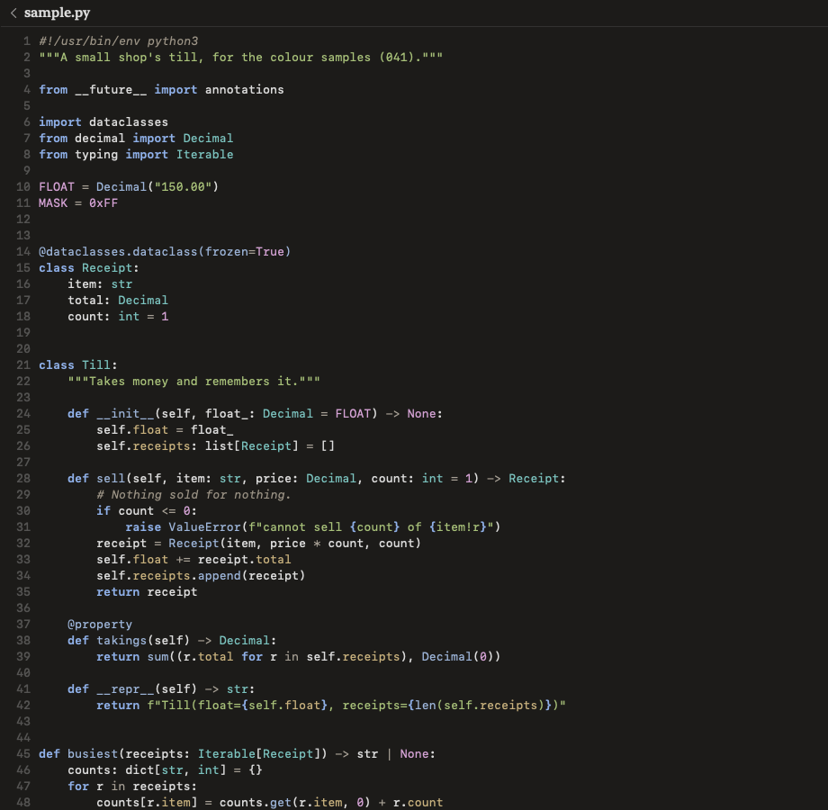

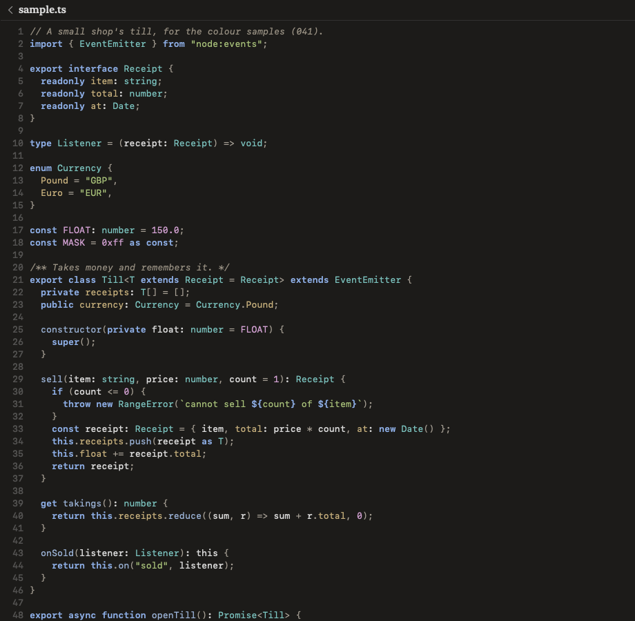

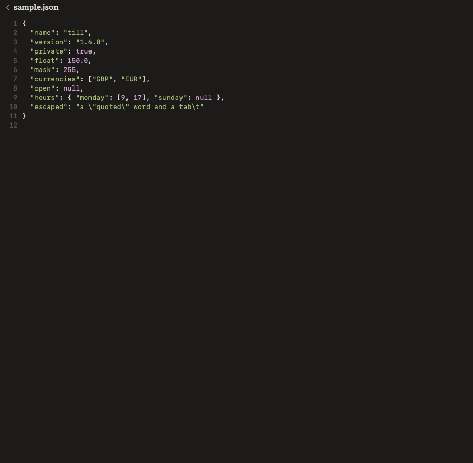

## What to look at

| Role | Light | Dark | Seen as |
|---|---|---|---|
| keyword | `#2B4C8C` semibold | `#8FB0E8` semibold | clear in both |
| string | `#4E6420` | `#A9C27A` | clear |
| comment | `#6E675B` italic | `#9C9486` italic | clear; doc and block comments both |
| number | `#7A3E7A` | `#D5A3D5` | clear |
| type | `#1F6A6A` | `#7CC4C0` | clear |
| function | `#3D5A80` | `#9DB5D9` | **too close to the ink in light**: `sell`, `append` barely differ from plain (checked: they are coloured) |
| property | `#6B5A2E` | `#C9B27E` | TypeScript enum members and object keys |
| punctuation | `#5F5A52` | `#A8A196` | reads as plain, on purpose |

Also:
- The name being declared in Swift (`struct Till`) is not coloured. That's the Swift grammar's
  query, not ours, so it's the same in any tree-sitter app. TypeScript and Python colour it.
- Line numbers, wrapping, the named line's highlight and selection are unchanged.
- The family emoji on the last Swift line is drawn by the system's monospaced fallback font,
  the same as before this change.
