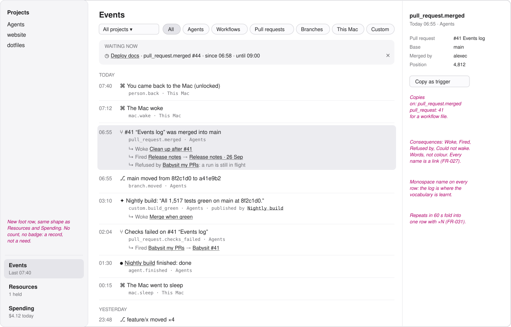
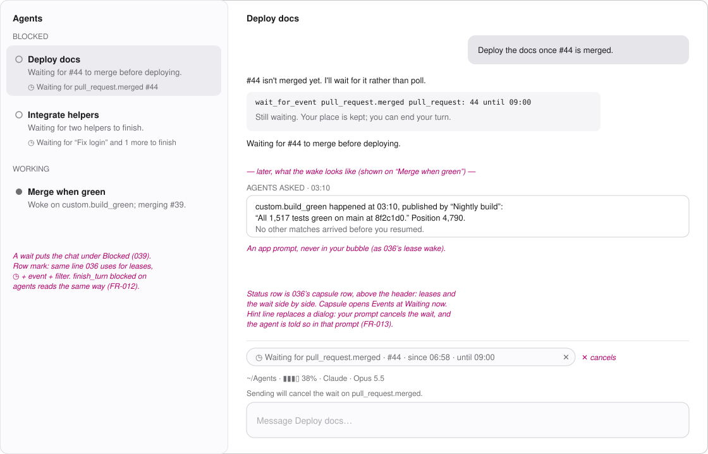
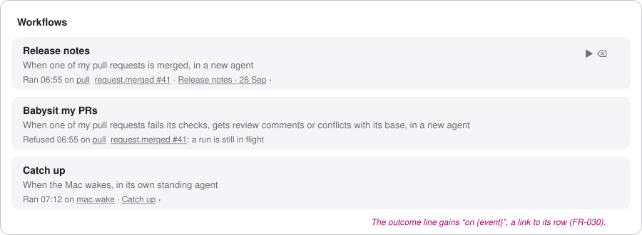
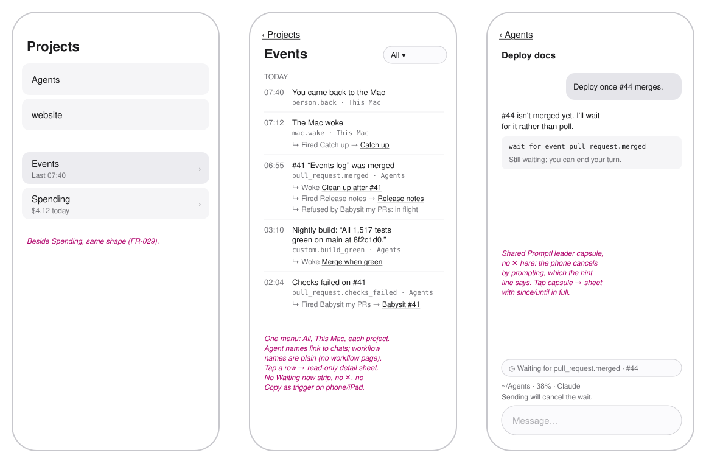

# Wireframes: Events and Waiting

These are grey boxes for layout only. Type sizes follow the app's scale: `title`, `reading`,
`supporting` and `fine`. Pink italic text is a note, not part of the UI.

Every frame shows the same moment: 07:42 on Friday morning, just after the person has unlocked the Mac.
- At 23:30 “Merge when green” waited on `custom.build_green`. At 03:10 “Nightly build” published it, which woke the waiting agent.
- At 02:04 the checks on #41 failed. The babysitting workflow fired.
- At 06:55 #41 was merged. That woke “Clean up after #41” and fired the “Release notes” workflow.
- “Deploy docs” is still waiting on `pull_request.merged` for #44, until 09:00.
- The Mac slept at 00:15 and woke at 07:12. Waking fired the “Catch up” workflow.

1. [Mac: the Events page](#1-mac-the-events-page)
2. [Mac: a waiting chat, and the wake](#2-mac-a-waiting-chat-and-the-wake)
3. [Mac: the workflow row leads to its event](#3-mac-the-workflow-row-leads-to-its-event)
4. [Phone and iPad](#4-phone-and-ipad)
5. [Colour](#5-colour)
6. [Decided here, not in the spec](#6-decided-here-not-in-the-spec)

## 1. Mac: the Events page

- **Where it lives**: a new row in the sidebar's foot, above Resources and Spending, with the
  same shape. The line under it shows when the last event happened ("Last 07:40"). There is no
  unread count: the log is something you read, not something asking for attention.
- **Filters**: a project menu (All, This Mac, then each project), and one capsule per subject:
  Agents, Workflows, Pull requests, Branches, This Mac and Custom (FR-028). Filters combine.
- **Day headings**, newest first: Today, Yesterday, then dates. The page updates live. A new
  event comes in at the top without moving what you are reading, and a "1 new" capsule
  appears if you have scrolled down (FR-028).
- **One row per event**: the time, then the sentence in `reading` size, then the event's name
  in `fine` monospace with its scope ("Agents" or "This Mac"). The name is shown because it
  is what you would write in a workflow or a wait. The page is also where you learn the
  names.
- **Consequences** are indented under their event, each starting with ↳: *Woke* an agent,
  *Fired* a workflow, *Refused by* a workflow with its reason, and *Could not wake* an agent
  with its reason (FR-027). Every agent or workflow name is a link.
- **Repeats** show a count on the row ("×4"), not four rows (FR-031).
- **Click a row** to open its details on the right: every detail the event carries, the
  publisher for a custom event, its position in the log, and a **Copy as trigger** button that
  copies `on: pull_request.merged` with the pull request number as a filter, ready to paste into
  a workflow.
- **Waiting now** is a strip at the top of the page listing every agent that is waiting, what
  it is waiting on, and until when, each with ✕ (FR-013). It is the answer to "why hasn't this
  agent moved?", and it sits next to the answer to "what happened?". The strip is absent when
  nobody is waiting.

## 2. Mac: a waiting chat, and the wake

- **Chat status line**: 036 added a row of capsules above the prompt header. A wait goes in
  that same row, next to any leases, as
  `◷ Waiting for {event} · #44 · since {HH:mm} · until {HH:mm}`, with ✕ to cancel it. Clicking
  the capsule opens the Events page with "Waiting now" in view.
- **Row mark**: the same line 036 uses under the report. A wait shows as
  `◷ Waiting for pull_request.merged #44`. The chat is grouped under **Blocked** (039, FR-012).
  `finish_turn blocked` on agents is shown the same way: `◷ Waiting for “Fix login” to finish`.
- **Transcript**: the wait is an ordinary tool call whose result is shown. For example:
  "Still waiting. Your place is kept; you can end your turn." The wake is an *Agents asked*
  prompt, never in your bubble. It names the event, its time and its details, and "1 more
  match arrived before you resumed" when there were more.
- **A publish** is an ordinary tool call too. Its result says who, if anyone, was woken and
  which workflows fired. That way the publishing agent learns the consequences as well.
- **Your prompt cancels the wait.** The prompt bar shows a one-line hint above it while the
  agent waits: "Sending will cancel the wait on pull_request.merged." This is the only
  warning. There is no confirmation dialog.

## 3. Mac: the workflow row leads to its event

- The workflow's latest-outcome line gains the event that caused it. Before, it read
  "Ran 06:55 ›". Now it reads "Ran 06:55 on pull_request.merged #41 ›". The event is a link to
  its row on the Events page (FR-030). The run link still goes to the agent.
- **Trigger sentences** stay in plain words ("When one of my pull requests is merged"). Old
  file names like `agent-finished` show exactly as they do today (FR-022).
- An **event this Mac doesn't know yet** reads as it does today: "Waits for “x.y”, which this
  version does not know about yet".

## 4. Phone and iPad

- **Where it lives**: an **Events** row under the project list, next to Spending, with the
  same shape (FR-029). On iPad the list goes in the detail column.
- **The same rows**: time, sentence, name and scope, with consequences underneath. A
  consequence is a link to that chat. The workflow names are plain text, because the phone
  has no workflow page.
- **Filtering** is one menu at the top: All, This Mac, then each project. There are no
  capsules for subjects on a narrow screen.
- **Tap a row** to see its details in a sheet, read-only. There is no Copy as trigger.
- **The waiting capsule** is in the shared `PromptHeader`, so it looks the same as on the Mac.
  It has **no ✕ on the phone**: cancelling is done by sending a prompt, and the same hint
  line says so (spec, Assumptions: the phone reads).
- **Not on phone or iPad**: the Waiting now strip, subject filters, Copy as trigger, and ✕.

## 5. Colour

Following 036, none of this is tinted. The app's colours are a closed set
(`Shared/UI/StateTint.swift`), and an event is a fact, not a state:
- Rows, glyphs and consequences use the surface's own greys. ◷ means waiting. Each subject has
  a monochrome glyph: agent ●, workflow ⟳, pull request ⑂, branch ⎇, Mac ⌘, custom ✦.
- *Refused by* and *Could not wake* are words, not red. A refusal is the safety rules working.
  If the agent it concerns needs a person, it already shows its own orange where it lives.
- A waiting chat takes Blocked's existing look from 039. This feature adds no new tint.

## 6. Decided here, not in the spec

| Decision | Why |
|---|---|
| **Events sits in the sidebar foot**, above Resources and Spending | It is machine-wide like them. A per-project log would split the one story the person wants to read after a night away. |
| **No unread badge** | Events are a record, not a need. Orange is kept for needs. |
| **A Waiting now strip** at the top of the Events page | "What happened" and "who is still waiting on something to happen" answer the same question. Leases already have their own page, so waits live here rather than getting a page of their own. |
| **The event's name is shown on every row** | The log is how people learn the vocabulary for workflows and waits (FR-024). |
| **Copy as trigger** on the Mac detail | This is the shortest route from "that happened" to "do something next time it does". It is harmony you can click. |
| **A hint line, not a dialog**, when a prompt would cancel a wait | FR-013 already makes this safe: the agent is told and can wait again. |
| **The phone cancels only by prompting** | This keeps the phone read-only, as the spec says, without leaving a waiting agent out of reach. |
