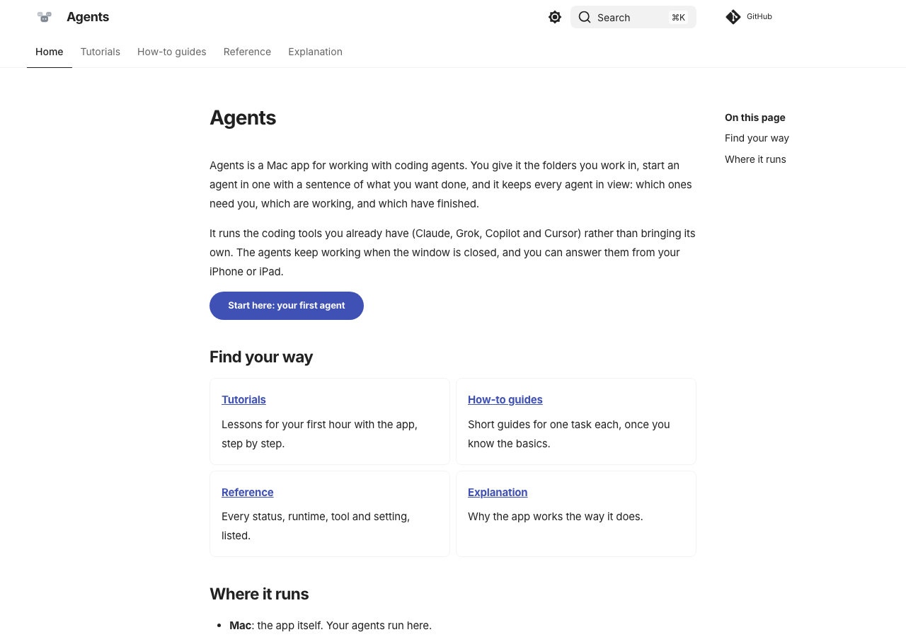
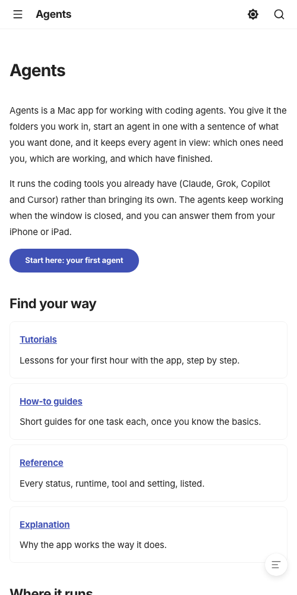
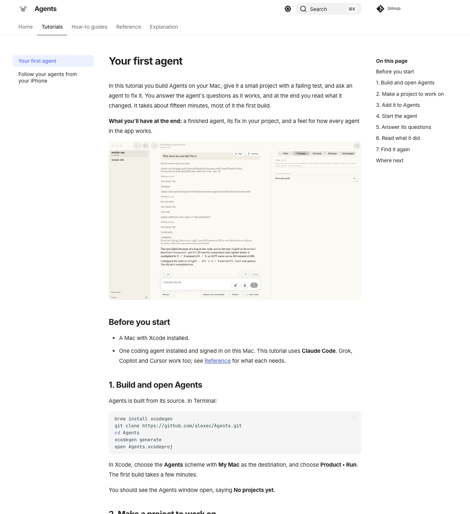

# 044 walk: the look gate (T016)

This is the site as built on 2026-09-25, served locally from `site/` and captured with headless Chrome. The home
page and *Your first agent* are real. The other three sections are empty indexes until you've approved this
layout, tone and depth.

## Home

At phone width it fits without sideways scroll (captured at 500 px, the narrowest headless Chrome would draw):

## Your first agent

The tutorial was walked for real on a scratch copy of the app (`/tmp/run-044`, built from this branch):
- The first shot is the one project page with the prompt.
- The agent was given "Why does the test fail? Fix it." in `weather-app`, which has a Fahrenheit/Celsius bug and one
  failing test.
- Claude asked three times (read and run the tests, edit `Forecast.swift`, run them again). The card's buttons
  are **Yes**, **Yes, and don't ask again…** and **No**.
- It ended in **Complete** as "Fix failing Forecast test", with a one-line fix and "Commit the fix." offered next.

The five pictures in the tutorial come from that run.

## Found along the way

- **No way to install but Xcode.** There are no releases, so the tutorial's first step is clone, `xcodegen`, build
  (your choice, 2026-09-25).
- **The iPhone tutorial needs `agents-bridge` started by hand**, and the bridge itself says it has no pairing and
  no encryption on the LAN. The draft says so in a warning box. It has no pictures yet; they are yours (T014).
- **A fresh worktree does not build** until `App/Resources/servers/` exists. It is gitignored (037's Linux
  binaries). The build copies it as a folder and fails if it is missing. An empty folder was enough here.

## The gate's answer

Approved by Alex on 2026-09-25: the other pages follow this layout, tone and depth. The question about the iPhone
tutorial's bridge warning went unanswered, so it is published as drafted, with the warning box.

## The content (T017–T040)

Written by three agents in parallel on 2026-09-25, one per section, each checked against the source and the shipped
specs. I reviewed a page from each section before committing (`293a990`). What they found, and how the pages handle it:

- **manage_workflows says it asks first, but the daemon writes without asking.** The tool's description tells agents
  it asks the person before writing a workflow, but the daemon writes it straight away. `reference/agent-tools.md`
  documents what the code does. The mismatch is a bug in the app, not the docs.
- **There is no project lead agent.** The README's opening says each project has a lead, but nothing in the app
  implements one, so no guide describes it. The README line is out of date.
- **Question tools are kept.** My brief to the explanation agent said a runtime's question tool is taken away. The
  code and README keep it on purpose, and `explanation/scoped-tools.md` follows the code.
- **Copilot sessions without the app's tools.** This was seen live during 036 and is stated as seen, not as a rule.
- **Answering from away.** Spec 021 describes answering a notification on a mobile network, but the code only
  reaches the Mac on the local network and notifications have no answer button. The phone page says you must be
  back on the Mac's network. It also says notifications wait while the hand-started bridge is not running.

## Passes (T050–T052)

- **Privacy (T050):** `docs-check.py` covers the text of all 28 pages. I looked at all five pictures. They show
  only the scratch app's made-up projects. One, `first-agent-01.png`, shows the scratch folder's path
  (`/private/tmp/…/weather-app`) inside the agent's "Asked: Edit …" line. It is not a real or personal path. It
  differs from the tutorial's `~/Demo/weather-app`; retake it from a demo folder under a neutral path if that
  matters.
- **Phone width (T051):** the home page, the statuses table (the widest) and the Linux server guide fit at 500 px,
  the narrowest headless Chrome draws, with no sideways scroll of body text. Reading on a real iPhone is yours.
- **Quickstart (T052):**
  - V1: `scripts/docs.sh check` is ok on 28 pages and 5 pictures, with a clean strict build.
  - V2: the self-test caught all 7 breaks.
  - V3: served and read at desktop and narrow widths.
  - V4: walked on the scratch app (Complete, one-line fix).
  - V5: each reference page was written from its source files by the reference agent.
  - V6: done above.
  - V7 waits for the merge.

## First publish (T049)

Merged into main as `cc37074` on 2026-09-25, and main was pushed. That push carried the 250 local commits, rescanned
first with no secrets found. The `docs-publish` run built, checked and deployed in 39 s (23:39:18 to 23:39:57 UTC),
well inside SC-005's 10 minutes. `docs-check` passed on the same commit. https://alexec.github.io/Agents/ serves
the home page, pages from every section and the tutorial pictures.

Two things to tidy in the workflows, neither blocking:
- **Node 20 deprecation.** GitHub warns that `actions/checkout@v4`, `configure-pages@v5` and `setup-uv@v6` target
  Node 20.
- **uv cache.** `setup-uv` warns that its cache has no lock file to key on. It could be turned off.

## Still to do after the gate

- Alex's: the iPhone pictures for the second tutorial (T014), a timed run of the first tutorial by someone new to the app (SC-001), and reading the site on the iPhone (SC-007).
