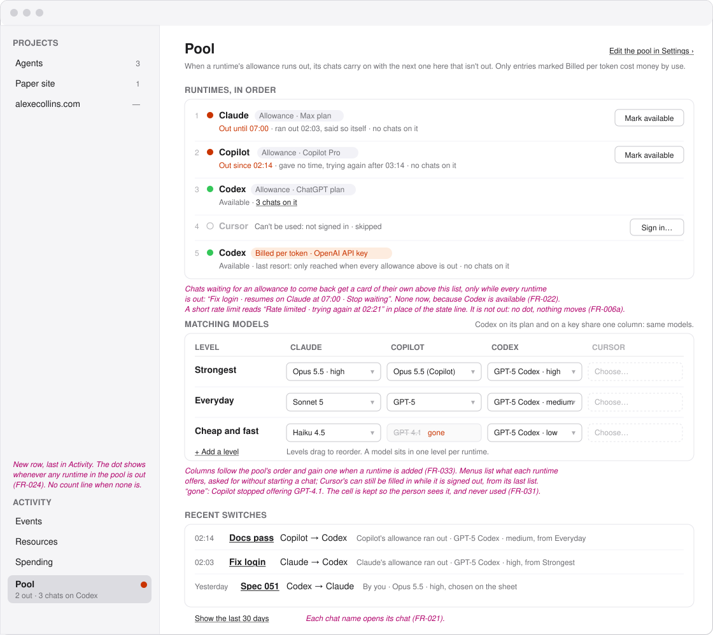
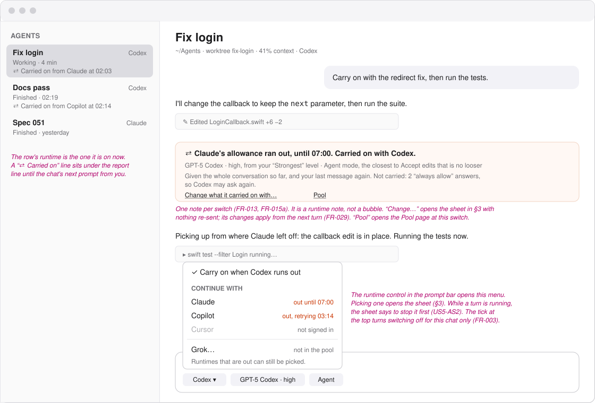
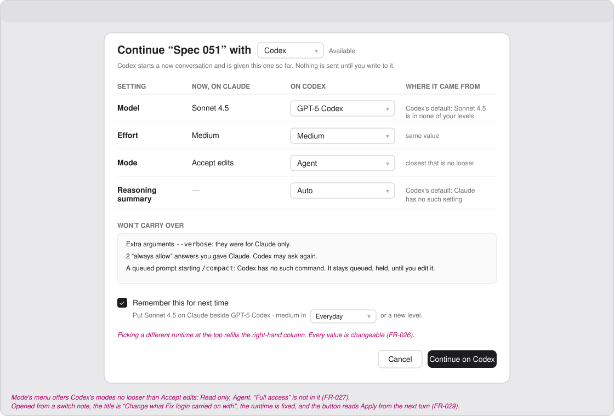
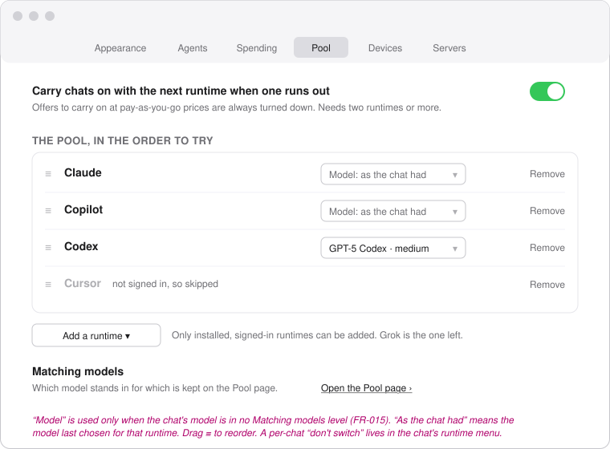
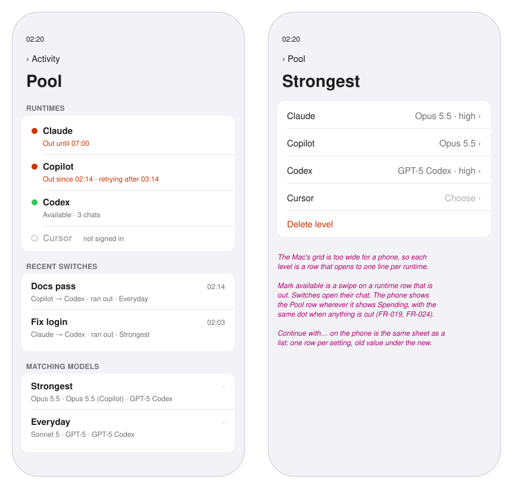

# Wireframes: Carry On When a Runtime Runs Out

These are grey boxes for layout only. Type sizes follow the app's scale: `title`, `reading`,
`supporting`, `fine`. Pink italic text is a note, not UI. Model names are illustrations.

Every screen shows the same moment, 02:20:
- The pool is Claude, then Copilot, then Codex, then Cursor.
- Claude ran out at 02:03 and said it is back at 07:00. "Fix login" carried on with Codex.
- Copilot ran out at 02:14 and gave no time. "Docs pass" carried on with Codex.
- Cursor is in the pool but is not signed in.
- Codex on an OpenAI API key is last, billed per token, as a last resort nobody has reached.
- Codex has the three chats, so nothing is waiting.

1. [Mac: the Pool page](#1-mac-the-pool-page)
2. [Mac: a chat that carried on](#2-mac-a-chat-that-carried-on)
3. [Mac: the Continue with sheet](#3-mac-the-continue-with-sheet)
4. [Mac: setting up the pool](#4-mac-setting-up-the-pool)
5. [Phone: the Pool page](#5-phone-the-pool-page)
6. [Decided here, not in the spec](#6-decided-here-not-in-the-spec)

## 1. Mac: the Pool page

- **Where it lives**: a new row, last in the sidebar's Activity section after Spending, in the same
  shape. It has a count line ("2 out · 3 chats on Codex") and a dot whenever any runtime in the
  pool is out (FR-019, FR-024).
- **Runtimes, in order**: one row per pool entry, in the order they are tried. The state is in
  words, never only a colour:
  - *Out until 07:00* when the runtime gave a time;
  - *Out since 02:14 · trying again after 03:14* when it did not;
  - *Can't be used: not signed in* when it cannot be used at all.

  Each entry has a capsule saying how it is paid for: grey **Allowance · <plan>**, or orange
  **Billed per token · <key>** (FR-001a). The same runtime can appear twice, as Codex does here.
  A short rate limit replaces the state line with *Rate limited · trying again at 02:21*. That
  has no dot and moves nothing, because it is not "out" (FR-006a).

  "3 chats on it" opens the project list filtered to those chats. **Mark available** appears only
  on runtimes that are out, and asks nothing first, because a wrong mark only costs one failed
  turn (FR-023).
- **Waiting chats** get a card above the list only while every runtime is out. The card names
  the chat, the runtime it will resume on, and when, and has a **Stop waiting** button (FR-022).
- **Matching models**: the grid from Story 6.
  - There is one column per runtime in pool order, and one row per level. Levels drag to reorder.
  - Two entries for the same runtime share one column, because the models are the same.
  - Each cell is a menu of what that runtime offers. A dashed cell is empty.
  - A struck-through **gone** cell is kept but never used (FR-031).
  - Choosing a model already used in another level moves it, because a model sits in one level
    per runtime (FR-032).
- **Recent switches**: newest first, one line each: time, chat, runtime to runtime, and why,
  including where the model came from. The chat name opens the chat. The list shows the last
  day, and **Show the last 30 days** opens the rest (FR-021, FR-025).

## 2. Mac: a chat that carried on

- **The switch note** is a runtime note with a warm tint so that it stands out on a scroll back.
  It says, in order:
  - what happened and until when;
  - the runtime the chat is on now;
  - model, effort and mode, and where each came from;
  - what it was handed;
  - what did not carry over.

  **Change what it carried on with…** opens the sheet in §3, and **Pool** opens the Pool page at
  that switch (FR-013, FR-015a, FR-029). A switch onto a keyed entry adds a line in the same
  orange: "Now billed per token on your OpenAI API key" (US2-AS5).
- **The agent row** shows the runtime the chat is on now, with a "⇄ Carried on from Claude at
  02:03" line. The line stays until the person's next prompt, the way a report line does.
- **The runtime control** in the prompt bar becomes a menu:
  - **Carry on when Codex runs out** at the top is the per-chat switch (FR-003).
  - **Continue with** lists the other pool runtimes with their state. A runtime that is out can
    still be picked, because the person may know better.
  - Runtimes outside the pool follow under a rule.

  Picking one opens the sheet.

## 3. Mac: the Continue with sheet

- **Title and runtime**: "Continue “Spec 051” with [Codex ▾]", with that runtime's state beside
  it. Changing the runtime refills the right-hand column.
- **Four columns**: the setting, its value now, its value on the new runtime (a menu), and where
  that value came from. There is one row for every option the new runtime offers, including ones
  the old runtime never had ("Reasoning summary"), which show "—" on the left (FR-026).
- **Mode's menu** only holds modes no looser than the current one (FR-027).
- **Won't carry over** is a plain list, and the section is absent when the list is empty.
- **Remember this for next time** is on by default. It says exactly which level it will write
  to, and has a menu for "or a new level" (FR-028). When both models are already in a level
  together, it reads "Already in Strongest" and cannot be ticked.
- **From a switch note** the same sheet opens with the runtime fixed, the title "Change what Fix
  login carried on with", and the button **Apply from the next turn** (FR-029).
- **While a turn runs** the button is replaced by "Stop the turn first" and a Stop button
  (US5-AS2).

## 4. Mac: setting up the pool

- **A new Settings tab, Pool**, between Spending and Devices. It has the app-wide switch, the
  ordered list (drag ≡), a fallback **Model** per entry, and **Add a runtime** (FR-001–FR-003).
- **How it is paid for** is a capsule on every entry. **Add a runtime** lists allowances only. A
  keyed entry comes from a separate, orange **Add one billed per token…** that says it costs money
  and is never suggested (FR-001a, US2-AS4).
- **Model per entry** is used only when the chat's model is in no level. "As the chat had" is the
  default: the model last chosen for that runtime (FR-015).
- **Matching models are not edited here**: one grid, on the Pool page, and a link to it.

## 5. Phone: the Pool page

- **The same page**, reached wherever the phone lists Spending, with the same dot (FR-019).
- **Runtimes and switches** are grouped lists. The paid-for capsule sits under each name, as on
  the Mac (not drawn). Mark available is a swipe action on a runtime that
  is out.
- **Matching models** are rows, one per level, that open to one line per runtime. The Mac's grid
  does not fit a phone.
- **Continue with** on the phone is the same sheet laid out as a list: one row per setting, with
  the old value under the new.

## 6. Decided here, not in the spec

- The pool is edited on its own **Settings ▸ Pool** tab, not inside Settings ▸ Agents.
- The Pool row goes **last** in Activity.
- Levels are named by the person, with no presets. The grid starts empty and fills from
  Remember.
- Switch notes are **tinted**. Other runtime notes are not.
- Continue with lives in the **prompt bar's runtime control**, not in the chat's title menu.
- A runtime that is out **can** be picked by hand.
- Remember is **on** by default.
