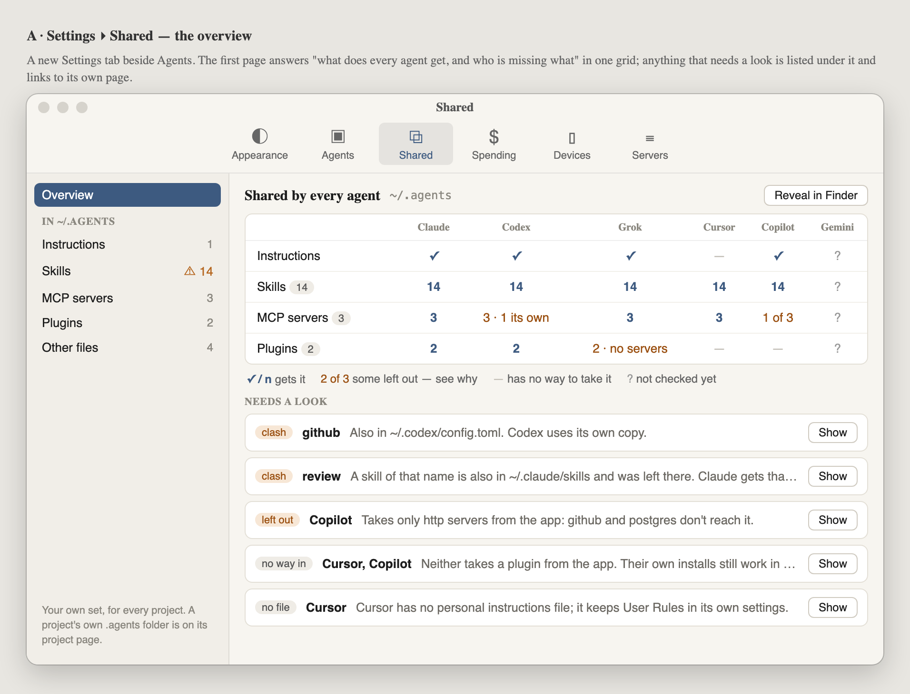
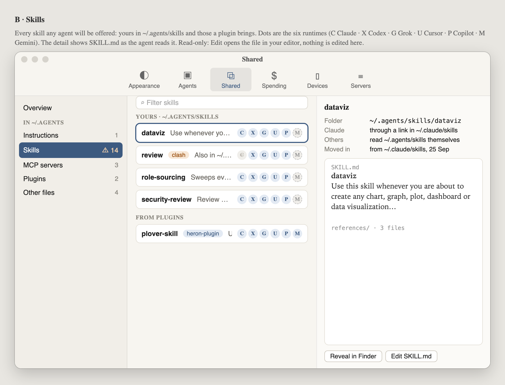
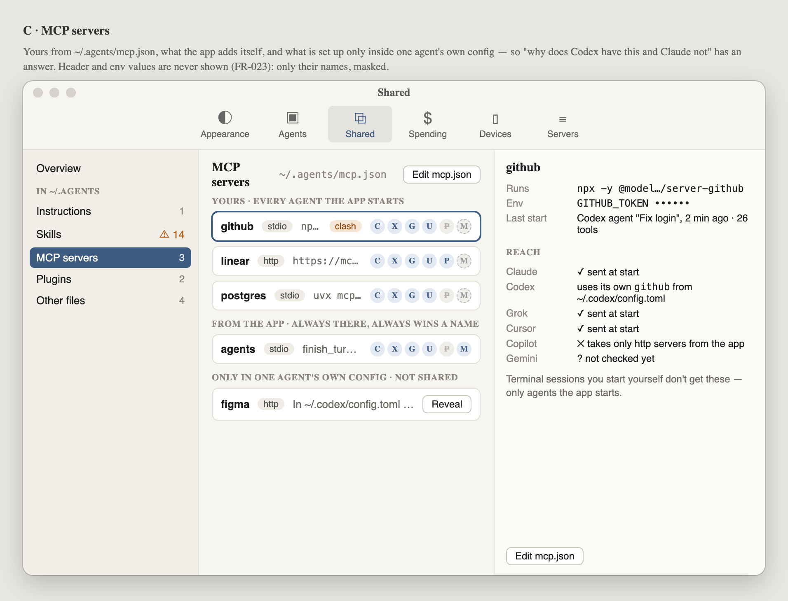
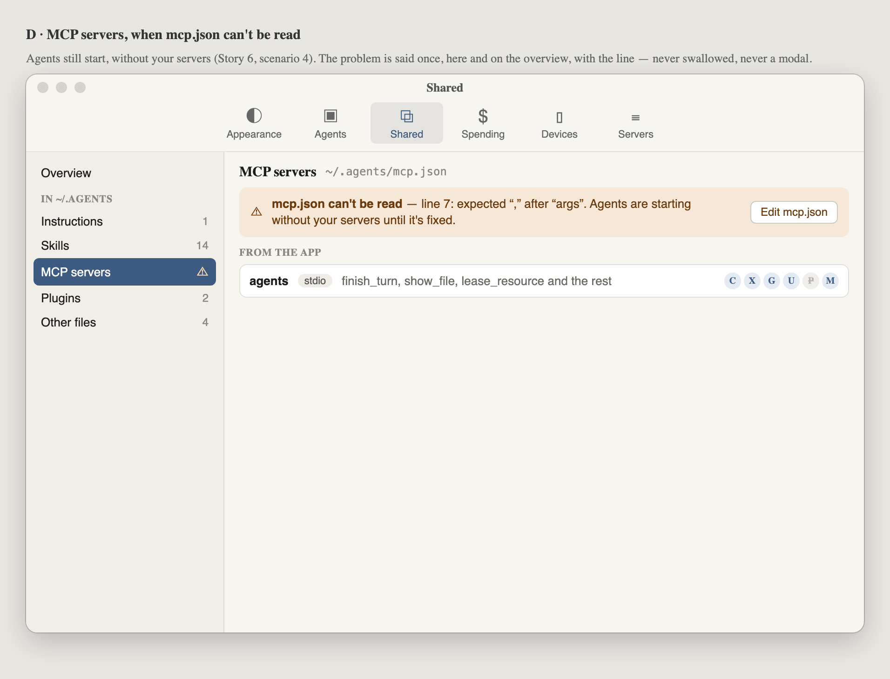
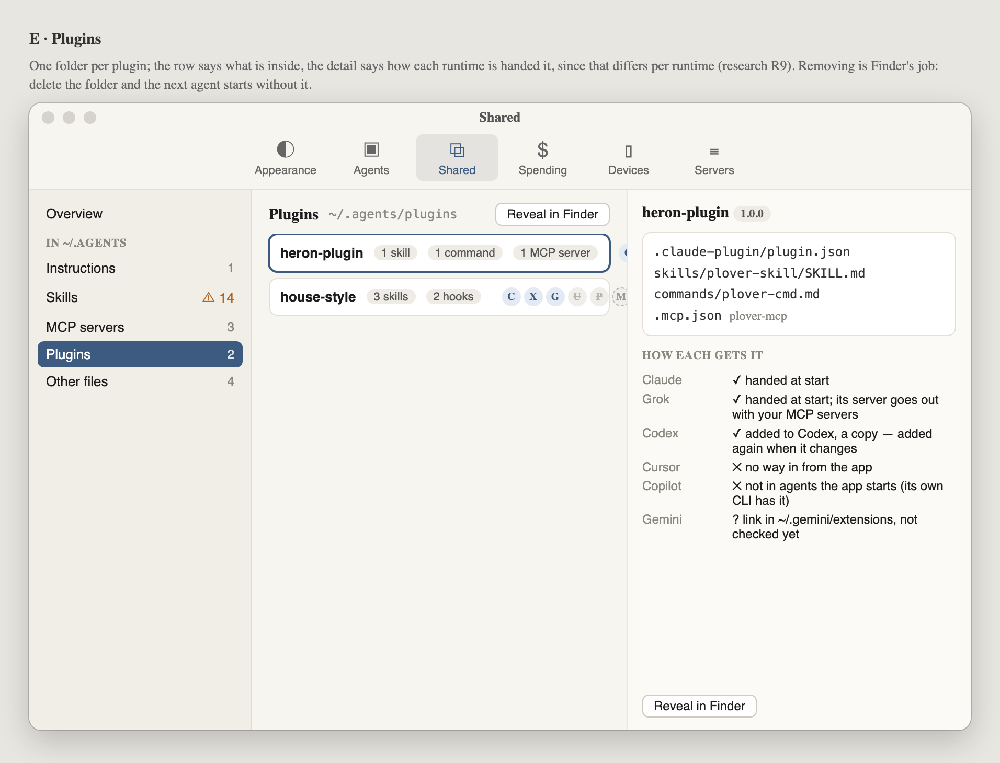

# 054 · Wireframes: what every agent shares

**Approved by Alex, 2026-09-26.** This is the look gate for the Settings ▸ Shared tab.

A place to **see** what is in `~/.agents` — instructions, skills, MCP servers, plugins and
anything else — and which runtime actually gets each. It replaces the spec's small read-only
"Your skills" section (FR-016, FR-024) with a Settings tab of its own, because four kinds of
thing across six runtimes no longer fit in a section under the runtime list.

It is **read-only**. Every change is made in the files themselves: *Edit* opens the file in the
person's editor and *Reveal in Finder* opens the folder. The app lays out the folder and reports
on it; it does not become an editor for `mcp.json`.

The reach shown in every frame is what the ACP probe measured ([research R9](../research.md)),
not a guess. The six runtime dots are **C** Claude · **X** Codex · **G** Grok · **U** Cursor ·
**P** Copilot · **M** Gemini. A struck-through dot means that runtime can't get the item, and a
dashed dot means not checked yet.

Source: [wireframes.html](wireframes.html). Open it with `#a` to `#h` to see one frame.

## A · Overview

One grid answers "what does every agent get". Under it, **Needs a look** lists every
exception: two copies of one name (a clash), something a runtime refuses, a runtime with no way
in. Each row opens its own page. Every exception in this frame is real and measured, apart from
the names.

## B · Skills

Your own skills, then those a plugin brings. The detail shows `SKILL.md` as the agent reads it,
and how Claude gets it (a link) compared with the others (they read the folder themselves).

## C · MCP servers

Three groups: **yours** (`~/.agents/mcp.json`), **the app's own** (always sent, always wins a
name), and **only in one agent's own config**, so "why does Codex have this and Claude not" has
an answer. Env and header values are never shown, only their names (FR-023). The detail's
reach says what happens to *this* server on each runtime, clash included.

## D · When `mcp.json` can't be read

Agents keep starting, without your servers. The problem is given once, with its line number,
here and on the overview. It never appears as a modal.

## E · Plugins

Each row shows what the plugin contains. The detail shows how each runtime gets it, since that
differs for every one of them.

## F · Instructions · G · Other files · H · Nothing shared yet

Not rendered to PNG; they are in [wireframes.html](wireframes.html#f):

- **F**: the one `AGENTS.md`, and a row per runtime saying which file it reads, whether that is
  our link or the person's own file left alone, and Cursor's "no file".
- **G**: everything else in `~/.agents` (personas, a README, a `.git`), each with what uses it,
  or "not read by any agent".
- **H**: the empty state: what goes where, and one button to reveal the folder.

## What the frames decide, and what they leave open

- **A tab, not a section.** Settings ▸ **Shared** sits beside Agents. The spec's FR-016/FR-024
  need rewording to match.
- **Personal only.** A project's own `.agents` folder belongs on its project page, which is a
  separate piece of work.
- **Mac only.** Nothing on the phone.
- **Decided (Alex, 2026-09-26): Copilot gets stdio servers through a local http bridge.**
  Copilot refuses every stdio server sent over ACP (R9), so the app serves them to it over
  local http. That also gives Copilot agents the app's own tools, so frames A and C should
  show Copilot as reached once the bridge is built.
- **Decided (Alex, 2026-09-26): the app re-adds a plugin to Codex whenever the plugin
  changes**, since Codex keeps a copy. Frame E's Codex line says so.
