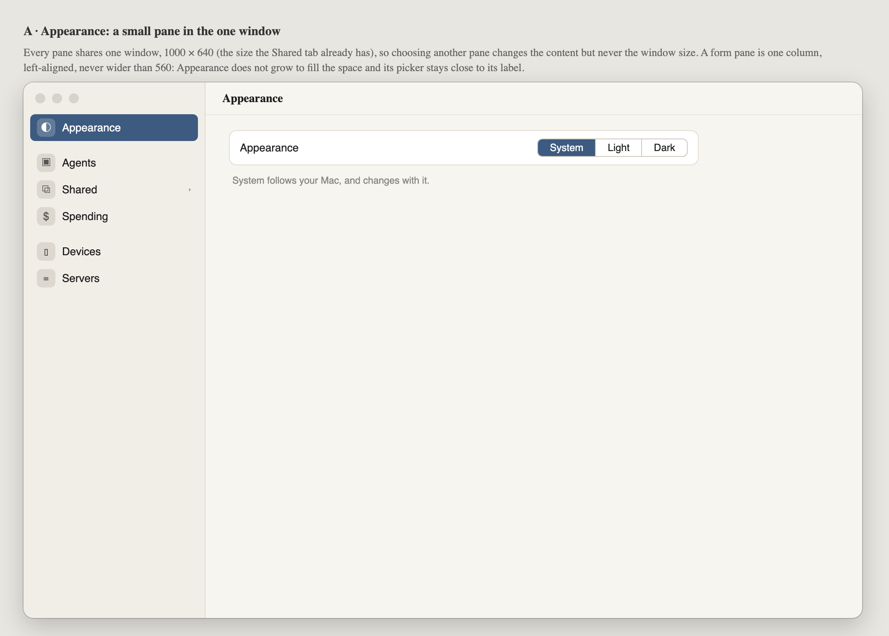
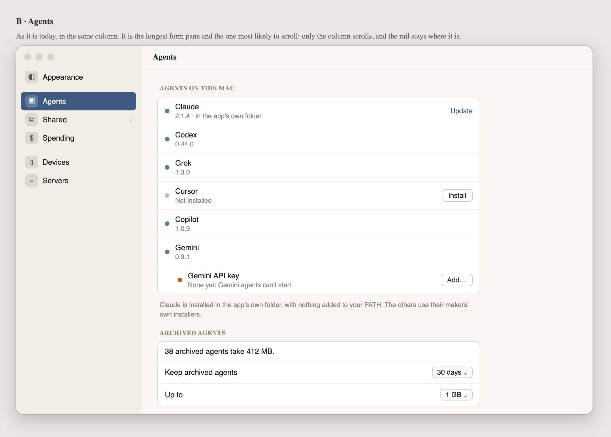
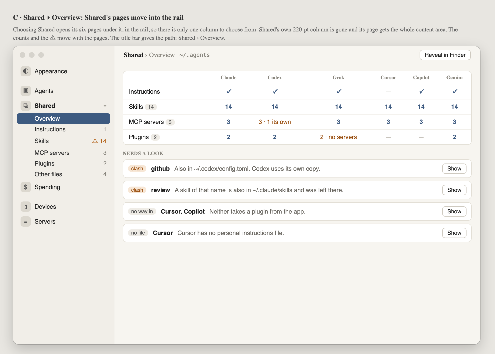
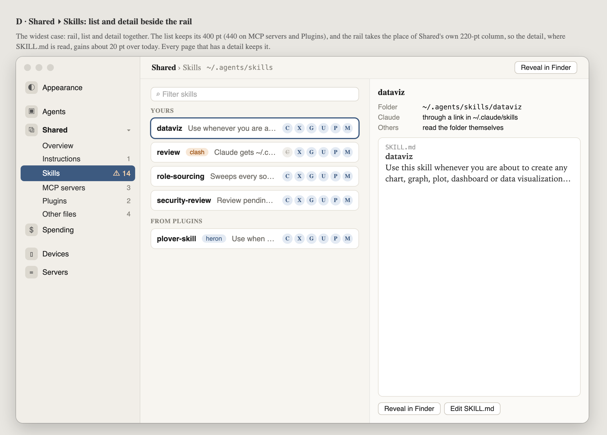
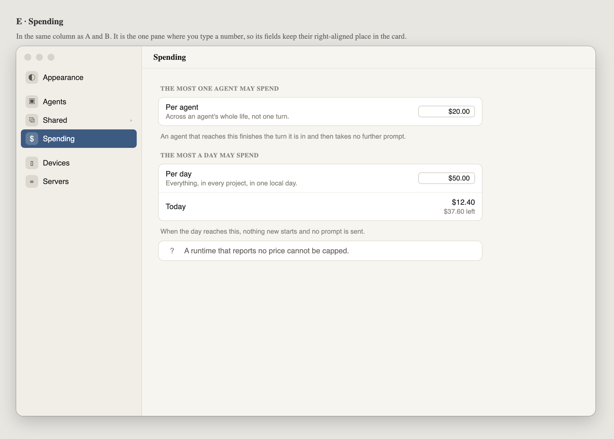
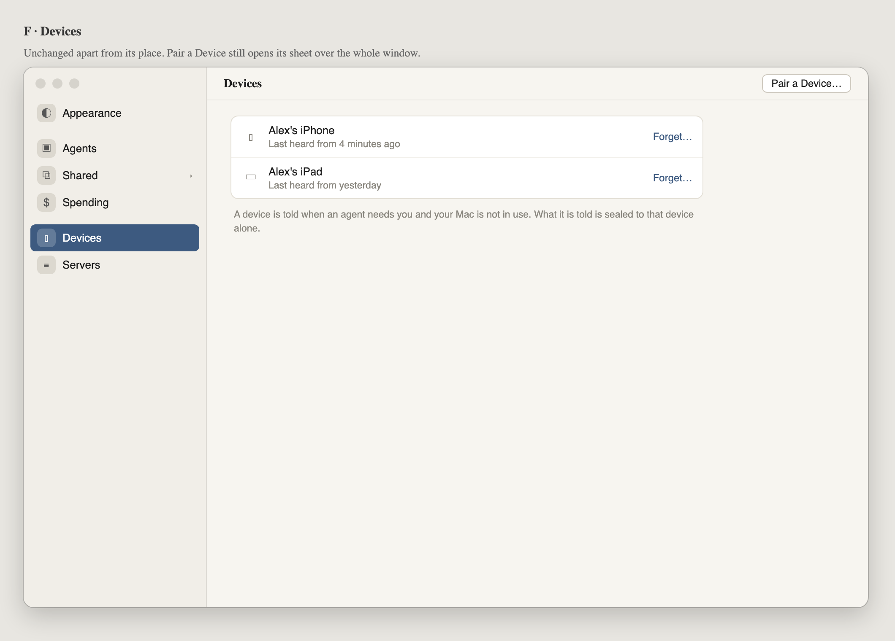
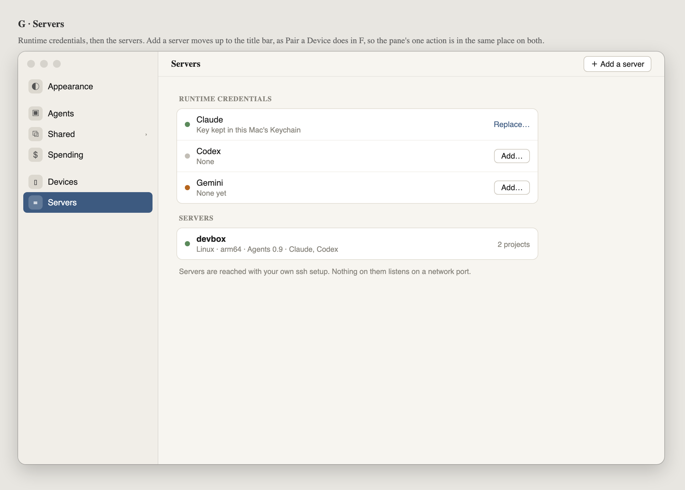
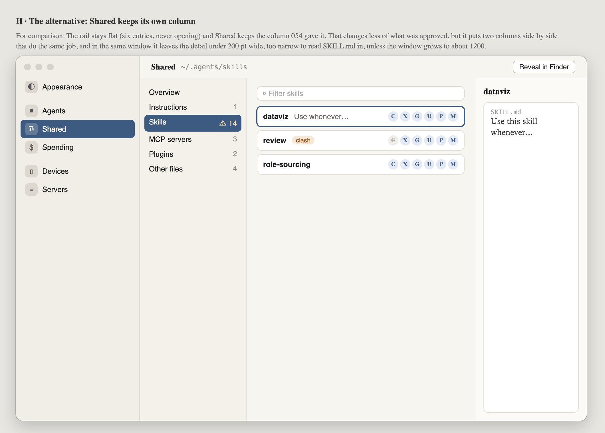

# 055 · Wireframes: Settings on one rail

**Waiting for Alex to look.** This is the look gate for moving Settings from tabs across the
top to a rail down the left.

Today Settings is six tabs (Appearance, Agents, Shared, Spending, Devices, Servers). Two things
don't sit well:

- **The window changes size between tabs.** Appearance and Spending are 460 wide, Servers 440,
  Shared 1000 × 640, so the window jumps every time you switch.
- **Shared has a rail of its own inside a tab.** Its six pages sit in a 220-pt column under the
  tab bar: two ways of choosing, one inside the other.

A single rail fixes both and has room for more panes. macOS System Settings is laid out this way.

Source: [wireframes.html](wireframes.html). Open it with `#a` to `#h` to see one frame.

## A · Appearance

One window, **1000 × 640** (Shared's present size), for every pane. A form pane is one column,
left-aligned, at most 560 wide; it doesn't stretch to fill the window.

The rail has three groups: Appearance on its own; the panes about agents (Agents, Shared,
Spending); and the ways to reach this Mac from elsewhere (Devices, Servers).

## B · Agents

Unchanged, in the same column. It's the longest form pane, so it's the one that scrolls. The
rail doesn't scroll with it.

## C · Shared ▸ Overview

Choosing **Shared** opens its six pages under it, in the rail, with their counts and ⚠. Shared's
own column is gone. The title bar gives the path (*Shared › Overview*) and keeps
*Reveal in Finder*.

## D · Shared ▸ Skills

This is the widest case: rail, list and detail together. The list keeps its 400 pt (440 on MCP
servers and Plugins). The rail takes the place of Shared's 220-pt column, so the detail gains
about 20 pt over today.

## E · Spending · F · Devices · G · Servers

The same column. Each pane's single action (*Pair a Device…*, *Add a server*) moves to the
title bar, so it's in the same place on every pane.

## H · The alternative: Shared keeps its own column

Here the rail stays flat and Shared keeps the column 054 approved. This changes less of 054, but
it puts two columns doing the same job side by side. In a 1000-wide window it also leaves the
detail under 200 pt, too narrow to read SKILL.md; the window would have to grow to about 1200.

## What the frames decide, and what they leave open

- **Proposed: C/D over H.** Shared's pages go into the rail. That changes the chrome of 054's
  approved frames A–H but none of their content.
- **Proposed: one fixed size, 1000 × 640.** Open: whether the window may also be resized
  larger, with only the detail (on Shared) or nothing (on form panes) taking the extra space.
- **Proposed: actions move to the title bar** (F, G). This is optional and separable. Without it,
  they stay at the foot of their cards as today.
- **Open: remember the last pane** across launches, as System Settings does. ⌘, opens there.
- **Not in these frames:** a search field at the top of the rail. Six panes don't need one yet.
- **Mac only.** The Remote has no Settings.
