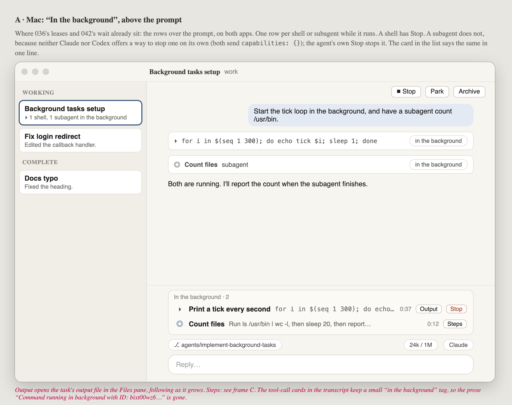
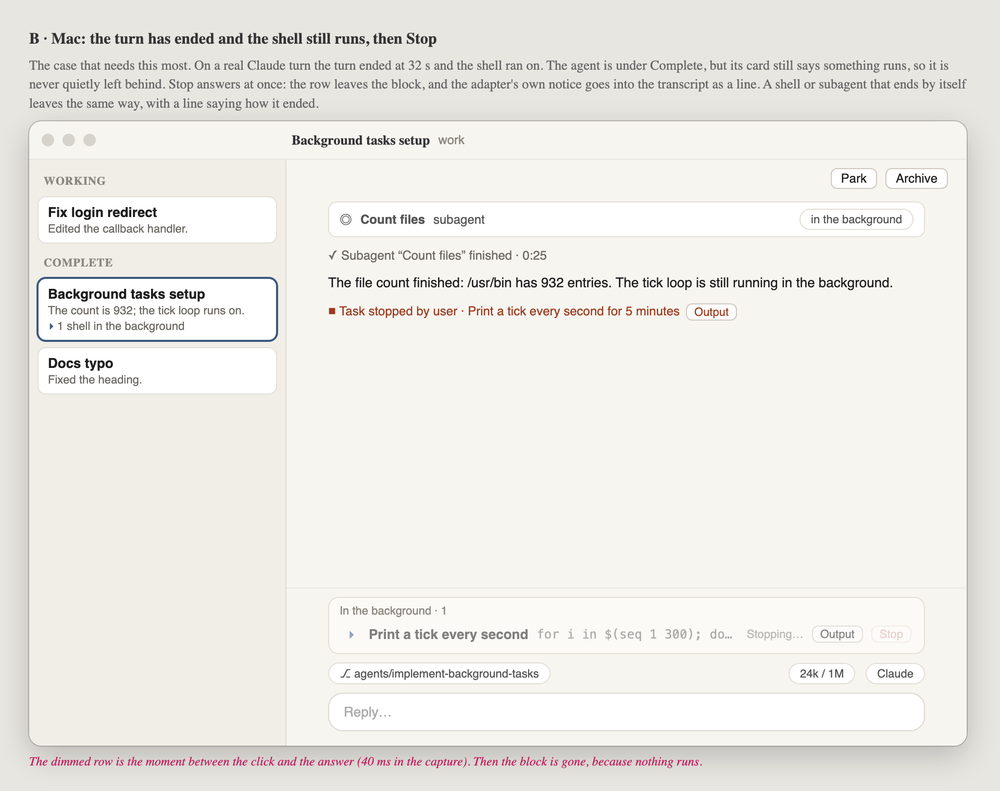
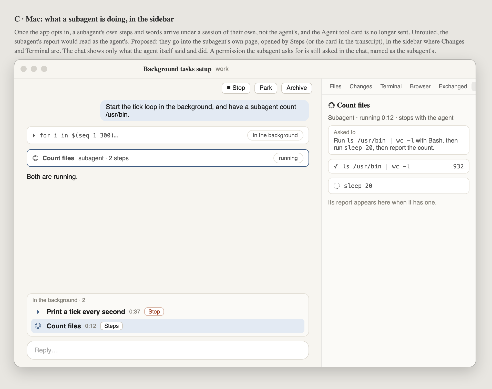
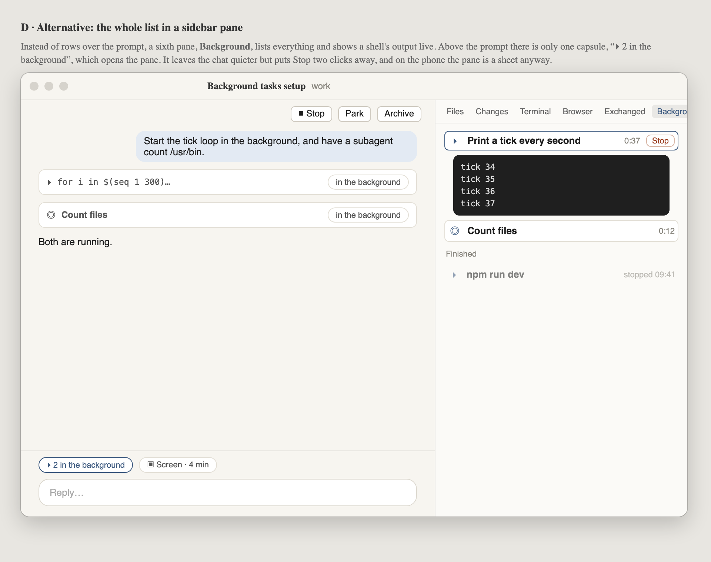
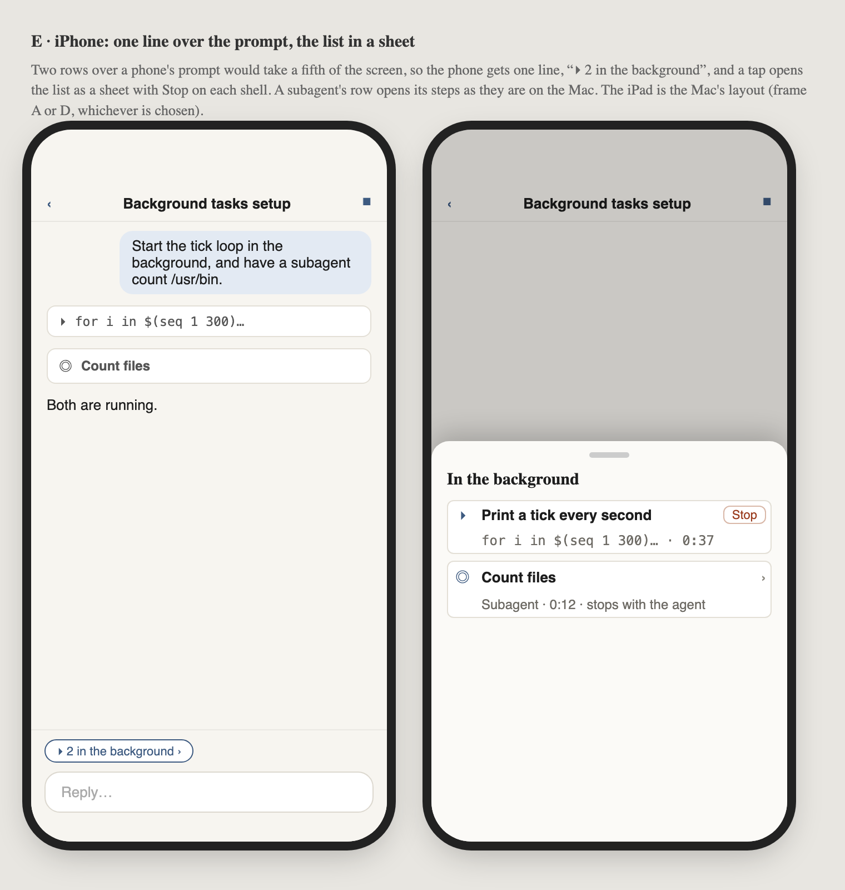

# 057 · Wireframes: background tasks and subagents

**Look gate, waiting for Alex.** Nothing is built yet: no capability is advertised and no code has
changed.

The goal is for a person to see the shells and subagents an agent has running in the background as
a list, each shell with a Stop button, instead of reading about them in prose.

Claude and Codex both send this when the client opts in through JetBrains "AIR"
(`clientCapabilities._meta.jetbrains.air {version: 1, capabilities: ["asyncTasks",
"nativeSubagentSessions"]}`). Research:
[acp-vendor-extensions.md](../../../.agents/research/acp-vendor-extensions.md), item 3 of "Worth
supporting".

Source: [wireframes.html](wireframes.html). Open it with `#a` to `#e` to see one frame.

## What a real turn sends

Captured on 2026-09-26 against `claude-agent-acp` 0.81.2, the app's pinned version, with a
standalone probe. No daemon was used, real or scratch. The probe opted in to `asyncTasks` and
`nativeSubagentSessions` only. The wire log is
[probe/claude-0.81.2-wire.jsonl](../probe/claude-0.81.2-wire.jsonl), with the account lines
removed, and the script is [probe/probe.py](../probe/probe.py).

| t (s) | What arrived | Why it matters |
| --- | --- | --- |
| 3.2 | `async_task_spawned {asyncTaskId: "bixt00wz6", name: "Print a tick every second for 5 minutes", taskType: "shell", showInTranscript: false, canStop: true}` | The row. `name` is Claude's own short title for the command. |
| 3.2 | `async_task_progress {toolCallId}`, then `{outputFilePath: …/tasks/bixt00wz6.output}` | Links the task to the Bash card and to a file whose output grows. |
| 3.2 | The Bash card's final `tool_call_update` carries `_meta.jetbrains.air.asyncTasks.backgrounded: true` | The card can be tagged "in the background" by capability, not by runtime. |
| 5.5 | `subagent_spawned {subagentSessionId: "a9fc7de39cd11c2dd", name: "Count files", task: "<its prompt>", capabilities: {}}` | The row. **No `tool_call` for the Agent tool ever arrives**; only a stray `tool_call_update` for it. |
| 7.3–30.4 | The subagent's tool calls, **its permission request**, and its final words, all under `sessionId: "a9fc7de39cd11c2dd"`, not the agent's | Today the app ignores `sessionId` on updates. Unrouted, the subagent's report would read as the agent's own. |
| 30.4 | `subagent_state_update {state: "completed"}` | Leaves the list. |
| 32.5 | `session/prompt` answers `end_turn` | **Claude holds the turn open until its background subagents finish.** A subagent only outlives a turn if the turn is cancelled. |
| 32.5 → | The shell keeps running after the turn | **The case this is for**: an agent under Complete with something still running. |
| 40.6 | `_session/async_task/stop` → `{stopped: true}` in 10 ms, preceded by `async_task_state_update {state: "stopped"}` **twice** and `notice {title: "Task stopped by user", description: "<name>."}` | The notice path already exists (`notices` is advertised). The duplicate state update means the model has to take a repeat without harm. |
| 40.8 | A second stop of the same task → `{stopped: false}` | This is not an error. The button is simply already done. |

Read in source, and not exercised on the wire:

- **Codex** (`codex-acp` upstream `bf37821`) sends the same five kinds and the same stop method.
  It announces background terminals as `taskType: "shell"`, and its subagents also carry
  `capabilities: {}`.
- **No runtime can stop a subagent on its own.** Claude's `AsyncTaskRuntime` marks
  `local_agent` tasks `ignored`, so `async_task/stop` answers `stopped: false`, and neither
  adapter sets `capabilities.cancel` on `subagent_spawned`. The agent's own Stop
  (`session/cancel`) ends every subagent and publishes `cancelled` for each one. The rows use
  `capabilities.cancel` when a runtime starts sending it, and show no Stop until then.
- `async_task_progress` can also carry `summary`, `lastToolName` and `usage {totalTokens,
  toolUses, durationMs}` for workflow and monitor tasks. A row can show them as a second line
  when they are present.

## A · Mac: "In the background", above the prompt (proposed)

The list goes where 036's leases and 042's wait already sit, in the rows over the prompt that both
apps draw from `PromptHeader`. There is one row per running item:

- A **shell** row has the name, the command, how long it has run, **Output** and **Stop**.
- A **subagent** row has the name, what it was asked, how long it has run, and **Steps**.

The agent's card in the list gets one line in the style of `LeaseMark`: "▸ 1 shell, 1 subagent in
the background". The tool cards in the transcript keep a small "in the background" tag.

## B · The turn ended and the shell still runs, then Stop

The agent sits under Complete, but its card still says something is running, so a shell is never
quietly left behind. Pressing Stop dims the row until the answer comes back. The row then leaves,
and the adapter's notice becomes a line in the transcript. An item that ends on its own leaves the
same way, with a line saying how it ended.

## C · A subagent's own steps, in the sidebar

Once the app opts in, a subagent's steps arrive under a session of their own, so they need
somewhere to go. The proposal is a **Background** pane in the sidebar that shows the subagent's
task, its steps and its report. The chat keeps only what the agent itself said and did. A
permission the subagent asks for is still asked in the chat, named as the subagent's.

## D · Alternative: the whole list in a sidebar pane

Here the list lives in the Background pane and shows a shell's output live. Above the prompt
there is only a capsule, "▸ 2 in the background", which opens the pane. The chat is quieter, but
Stop is two clicks away instead of one.

## E · iPhone

On the phone there is one line over the prompt. It opens a sheet with the list, and each shell in
the sheet has Stop. A subagent's row opens its steps. The iPad uses the Mac's layout.

## What the frames decide, and what they leave open

- **Keyed on capability.** The app advertises the opt-in to every runtime and draws whatever
  arrives. It never checks which runtime it is talking to. Advertising turns on in the same
  change that routes, draws and stops. Once it is on, the prose "Command running in background
  with ID…" stops arriving, and so does the Agent tool card.
- **Subagents must be routed if they are opted into.** This is not optional. The alternative is
  to opt in to `asyncTasks` only, for now. Subagents then stay the Agent tool card they are
  today, and since Claude holds the turn for them they rarely outlive it. That is noticeably
  smaller, but it leaves subagents out of the list.
- **Finished items leave the list** and leave a line in the transcript. There is no history in
  frame A. Frame D keeps a short "Finished" group.
