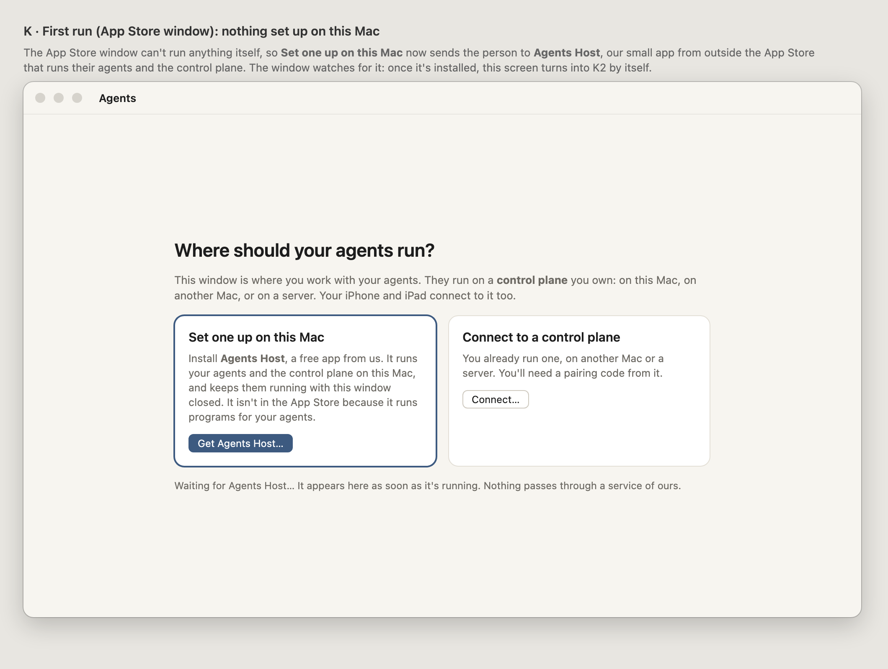
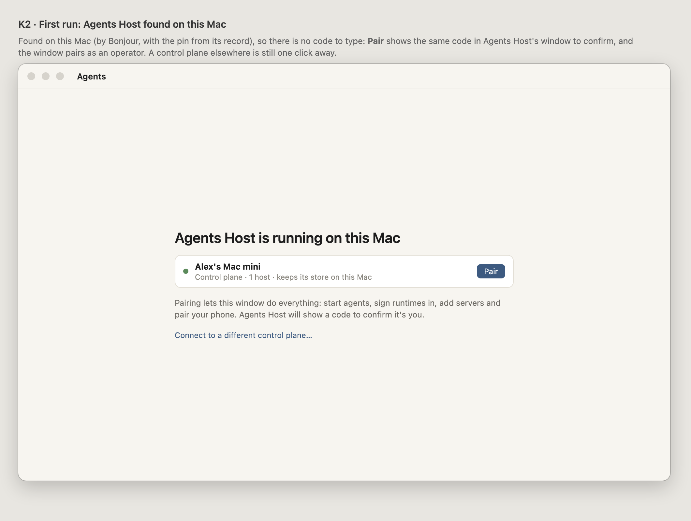
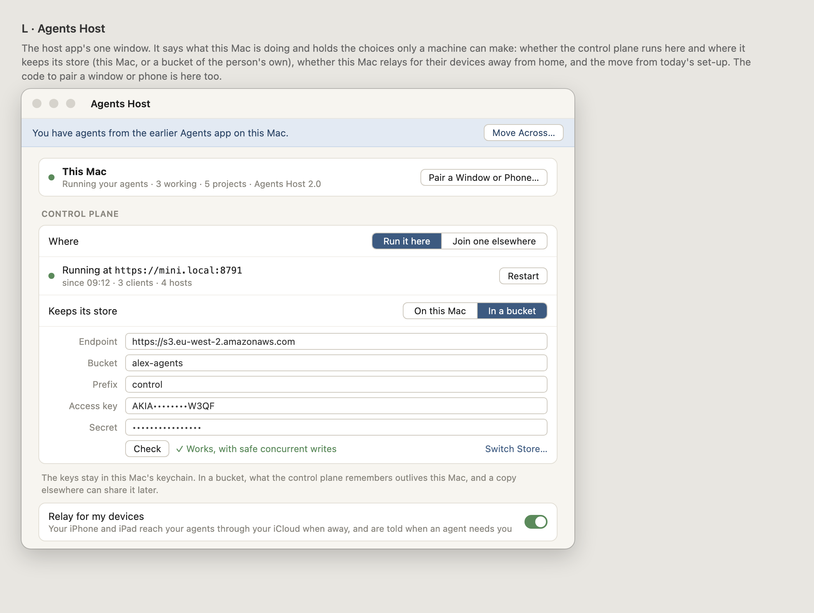
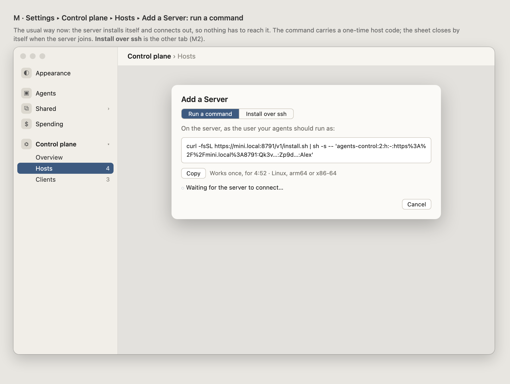
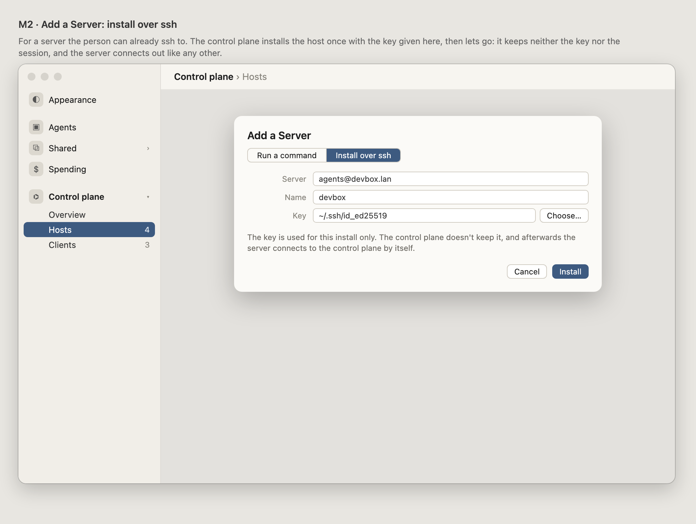
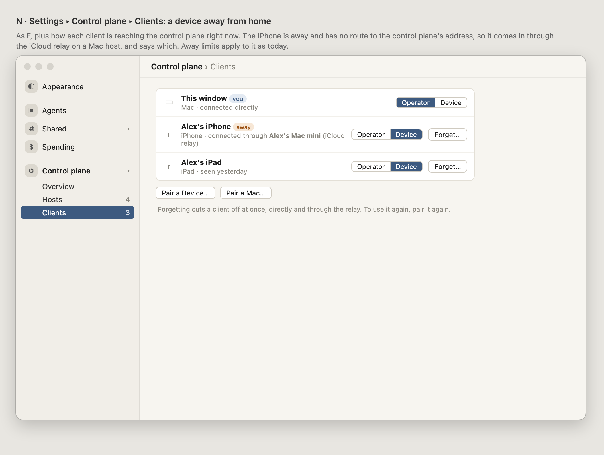

# 058 · Wireframes: the control plane

**Approved by Alex 2026-09-26:** D/E/F over J, the name stays "Control plane", and This Mac's
host has no buttons for now. This was the look gate for 058.

The window stops starting a daemon and becomes a client of a **control plane**, like the
iPhone and iPad already are of the bridge. These frames cover what the person sees of that:
the first run, Settings for hosts and clients, the window when the control plane is away, and
moving today's set-up across.

Source: [wireframes.html](wireframes.html). Open it with `#a` to `#j` to see one frame.

## A · First run

With nothing set up, the window asks one question and shows nothing else. **Run one on this
Mac** is marked as the usual choice. It says plainly that agents stop while the Mac sleeps.

## B · Run one on this Mac

These are the steps, with nothing to download. macOS may ask to allow two background items
(Login Items), and the step says where.

## C · Connect to a control plane

Control planes on the network are listed by name. A code is still needed, because it decides
what the window may do.

## D · E · F · Settings ▸ Control plane

Devices and Servers fold into one rail group, **Control plane**, which opens like Shared does
(055): Overview, Hosts and Clients.

- **Hosts** is today's Servers pane with This Mac added. It also says, for each host, whether
  it connects out or is reached over ssh.
- **Clients** is today's Devices pane with the window added, plus a grant per client.

## G · Pair a Mac… / Pair a Device…

This is today's pairing sheet with the grant chosen first. It shows the code as text for a
Mac, which has no camera to scan a QR code with.

## H · The control plane can't be reached

Every host's projects stay listed, greyed out. One strip names where the window expected the
control plane.

## I · Moving today's set-up across

This happens once, only when chosen, and says what is kept.

## J · The alternative: two flat panes

Here Devices becomes Clients and Servers becomes Hosts, with no overview. It changes less, but
there is nowhere to say where the control plane runs.

## What the frames decide, and what they leave open

- **Decided: D/E/F over J.** One opening group, matching Shared.
- **Proposed: the window pairs as operator only with an operator code.** A second Mac can be
  paired as Device if the person wants a read-and-answer screen.
- **Decided: the name** is "Control plane".
- **Decided: This Mac's host has no buttons** in Hosts for now.
- **Not in these frames:** the Remote's host headers (they follow H's sidebar), and the Add a
  Server sheet, which is 037's, unchanged apart from being run by the control plane.

---

# Re-plan, 2026-09-28: frames K–N

**Approved by Alex 2026-09-28**, all of K–N as drawn, and the name **Agents Host**. These frames cover what changes once the Mac window is an App Store
app and the agents run in **Agents Host**, a separate app from outside the Store. Open
[wireframes.html](wireframes.html) with `#k`, `#k2`, `#l`, `#m`, `#m2` or `#n`.

## K · First run, nothing on this Mac

It asks the same question as A, but *Set one up on this Mac* now points to the Agents Host
download, and says in one sentence why that isn't in the App Store. The window watches for the
host app and turns into K2 by itself.

## K2 · First run, Agents Host found

Found on this Mac, so there is nothing to type. **Pair** asks Agents Host to show a code to
confirm, then pairs the window as operator.

## L · Agents Host

The host app's one window, holding the choices only a machine can make:
- whether the control plane runs here or this Mac joins one elsewhere;
- where the control plane keeps its store: *On this Mac* or *In a bucket* (FR-024a). *Check*
  tests the bucket before it's saved, and *Switch Store…* moves between the two later;
- relaying for the person's devices away from home;
- the move from the earlier app, offered in a strip.

## M · Add a Server: run a command

The usual way now: one command with a one-time host code. The server installs itself and
connects out. The sheet closes when it joins.

## M2 · Add a Server: install over ssh

The other tab. The key is used for this install only; the control plane keeps neither the key
nor the session.

## N · Clients, with a device away from home

As F, plus how each client reaches the control plane now. A device coming in through the iCloud
relay says which Mac is relaying for it, and is marked *away*.
