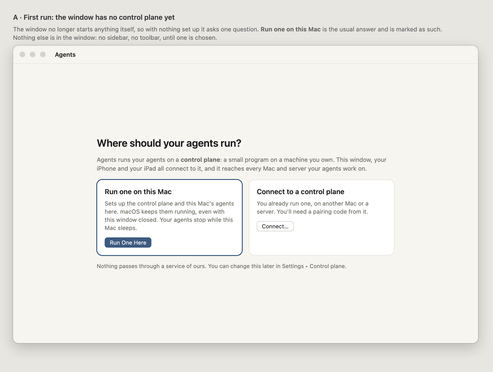
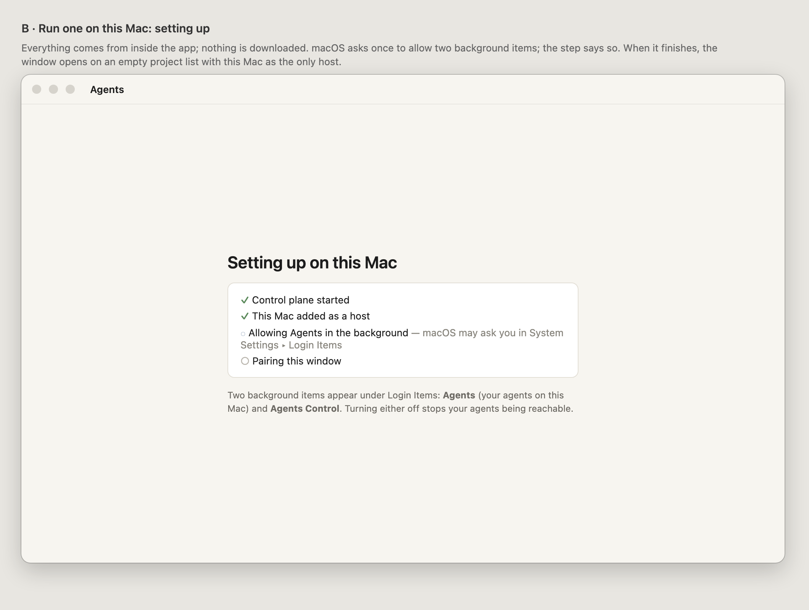
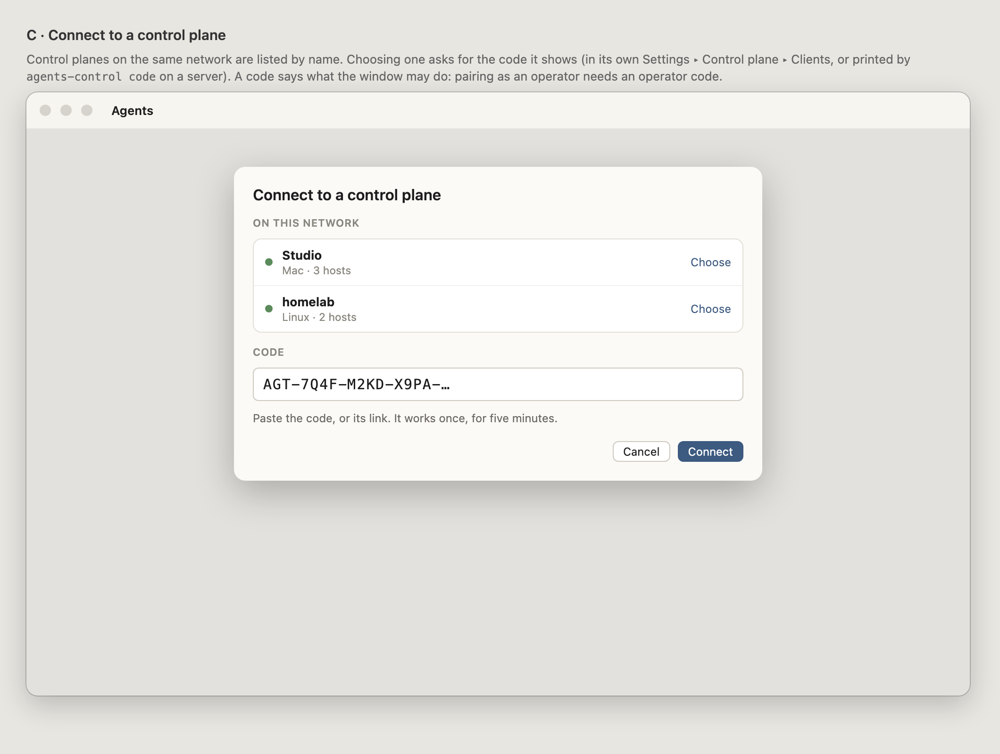
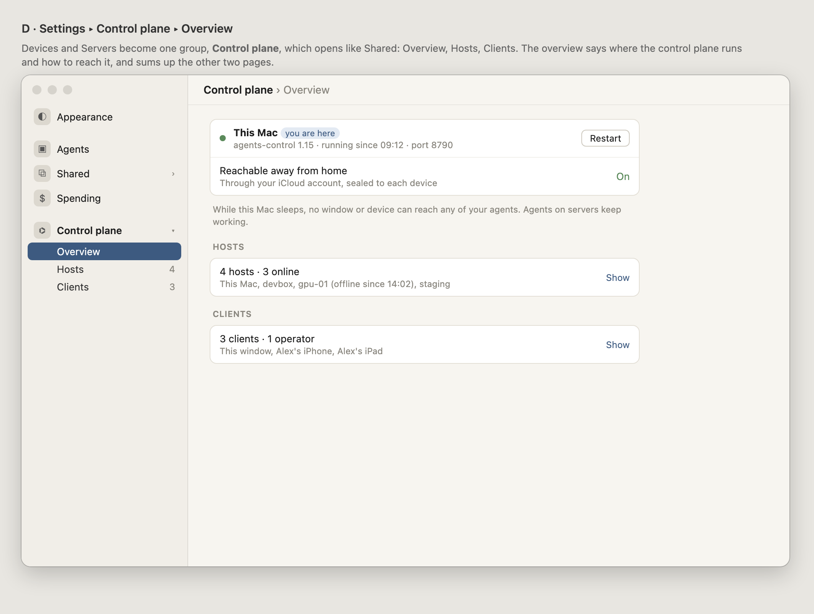
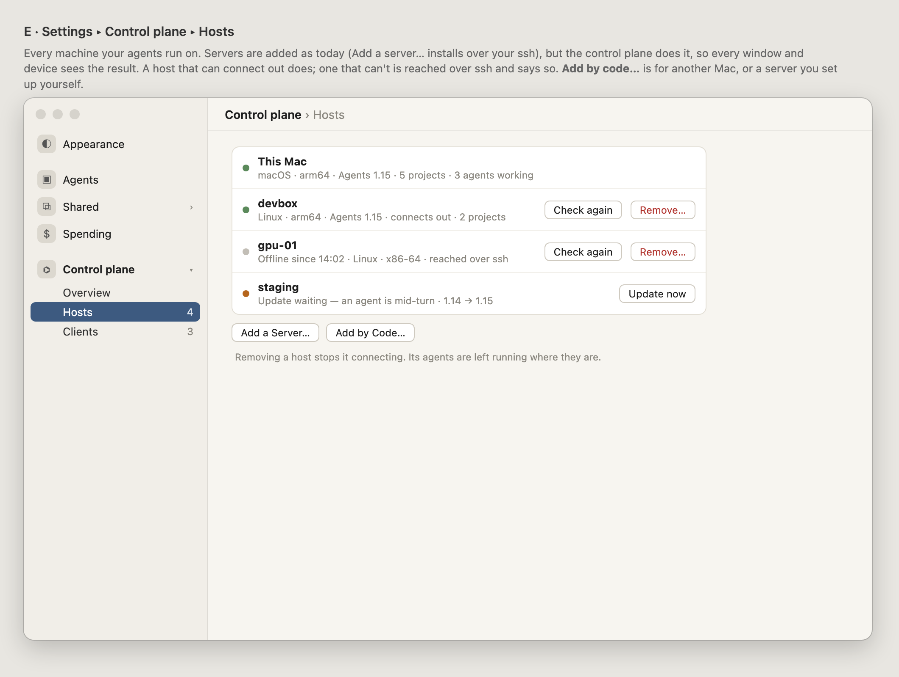
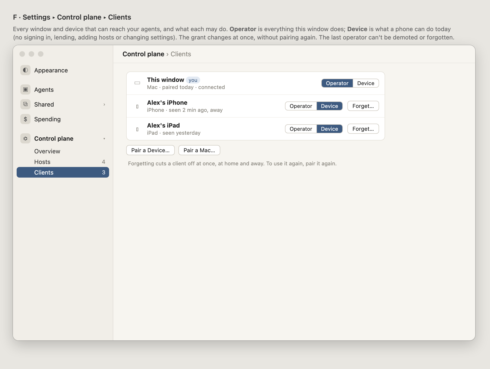
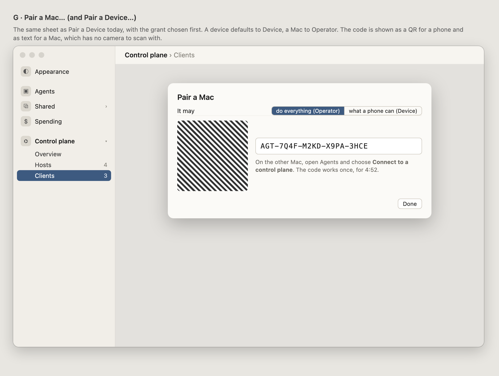
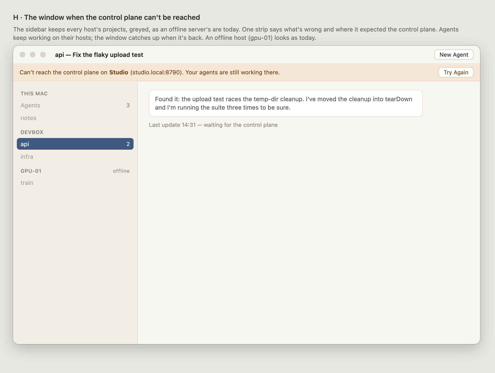
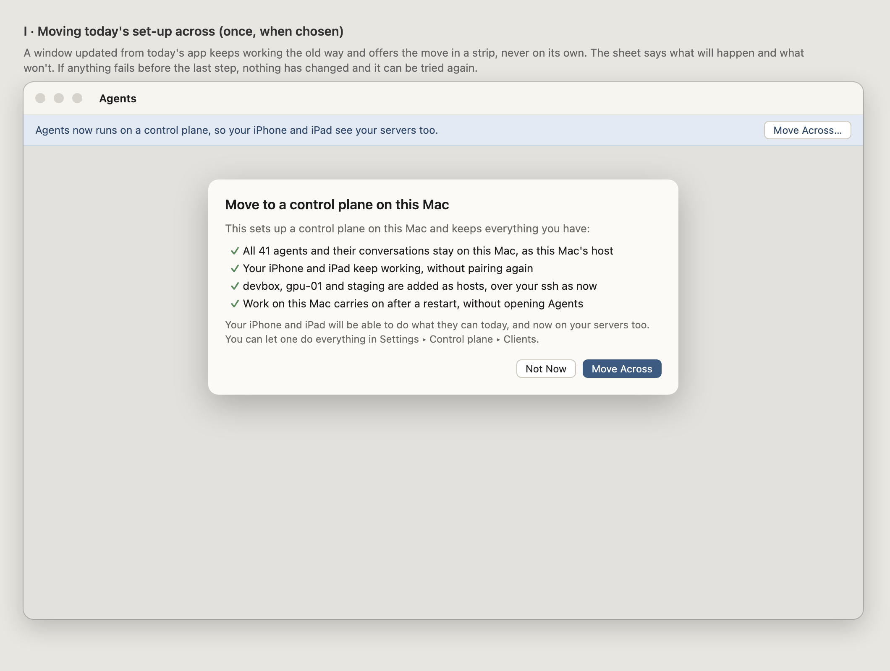
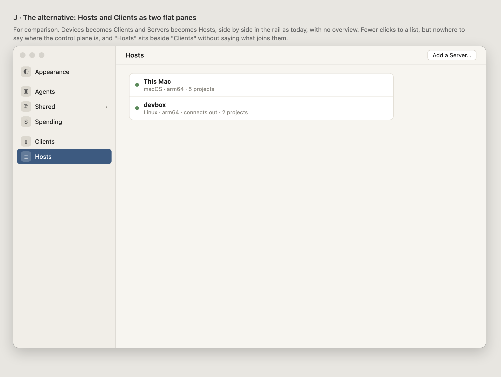

# 058 · Wireframes: the control plane

**Waiting for Alex's approval.** This is the look gate for 058. No code is written before it.

The window stops starting a daemon and becomes a client of a **control plane**, like the
iPhone and iPad already are of the bridge. These frames cover what the person sees of that:
the first run, Settings for hosts and clients, the window when the control plane is away, and
moving today's set-up across.

Source: [wireframes.html](wireframes.html). Open it with `#a` to `#j` to see one frame.

## A · First run

With nothing set up, the window asks one question and shows nothing else. **Run one on this
Mac** is marked as the usual choice. It says plainly that agents stop while the Mac sleeps.

## B · Run one on this Mac

These are the steps, with nothing to download. macOS may ask to allow two background items
(Login Items), and the step says where.

## C · Connect to a control plane

Control planes on the network are listed by name. A code is still needed, because it decides
what the window may do.

## D · E · F · Settings ▸ Control plane

Devices and Servers fold into one rail group, **Control plane**, which opens like Shared does
(055): Overview, Hosts and Clients.

- **Hosts** is today's Servers pane with This Mac added. It also says, for each host, whether
  it connects out or is reached over ssh.
- **Clients** is today's Devices pane with the window added, plus a grant per client.

## G · Pair a Mac… / Pair a Device…

This is today's pairing sheet with the grant chosen first. It shows the code as text for a
Mac, which has no camera to scan a QR code with.

## H · The control plane can't be reached

Every host's projects stay listed, greyed out. One strip names where the window expected the
control plane.

## I · Moving today's set-up across

This happens once, only when chosen, and says what is kept.

## J · The alternative: two flat panes

Here Devices becomes Clients and Servers becomes Hosts, with no overview. It changes less, but
there is nowhere to say where the control plane runs.

## What the frames decide, and what they leave open

- **Proposed: D/E/F over J.** One opening group, matching Shared.
- **Proposed: the window pairs as operator only with an operator code.** A second Mac can be
  paired as Device if the person wants a read-and-answer screen.
- **Open: the name.** "Control plane" is accurate but technical. "Hub" is the alternative the
  copy could use.
- **Open: whether This Mac's host can be turned off** from Hosts. If it could, this Mac would
  be a client only. The frames leave it without buttons.
- **Not in these frames:** the Remote's host headers (they follow H's sidebar), and the Add a
  Server sheet, which is 037's, unchanged apart from being run by the control plane.
