# 058 · #61 · Move to another machine (T126)

**Approved by Alex 2026-10-01**, as drawn, with forwarding limited to 30 days. The look gate for Agents Host's *Move to another machine…*:
moving the running control plane from this Mac to a machine elsewhere, with every window,
phone and server staying paired (research R16). The way back, *Run It Here Again…* (T127),
uses the same sheet in the other direction and is drawn once these are settled.

Source: [wireframes.html](wireframes.html), in frame L's style. Open it with `#o` to `#t` to
see one frame. The PNGs beside it are rendered from it with headless Chrome.

## O · The way in

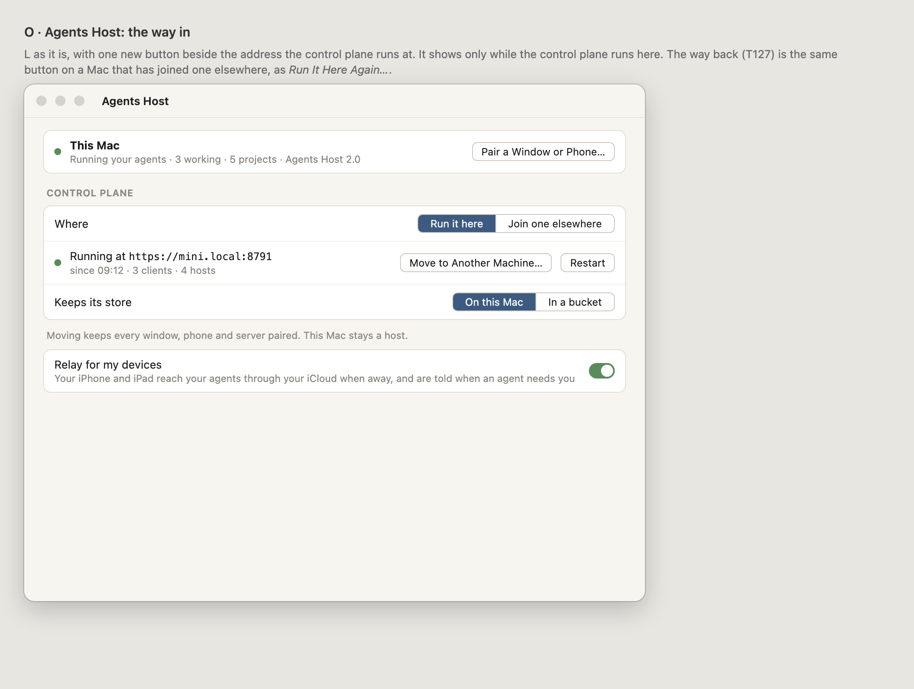

One new button, beside the address the control plane runs at, shown only while it runs here.

## P · 1. The key

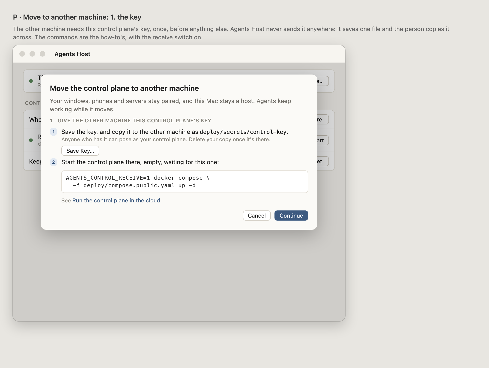

The other machine needs this control plane's key first. Agents Host saves it as one file and
the person copies it across: it is never sent anywhere (Alex's choice, R16). The command
starts the other machine empty, waiting for this one.

## Q · 2. Check the other machine

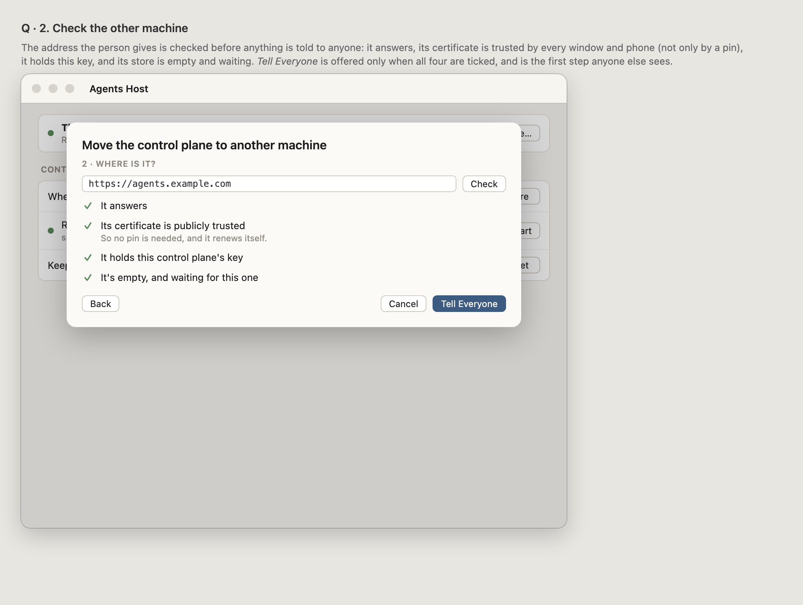

Four checks before anything is told to anyone. The certificate must be publicly trusted:
a pin at a domain name would be refused by the window and the Remote (R15).

## Q2 · A check that fails

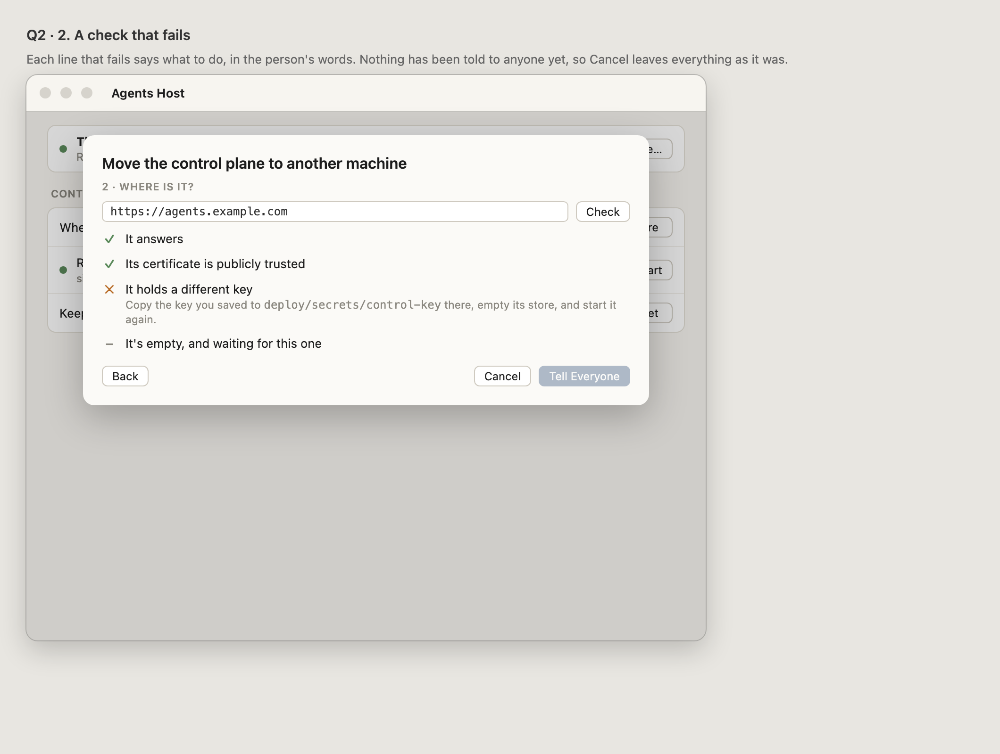

Each failure says what to do. Nothing has changed yet.

## R · 3. Tell everyone, and who knows

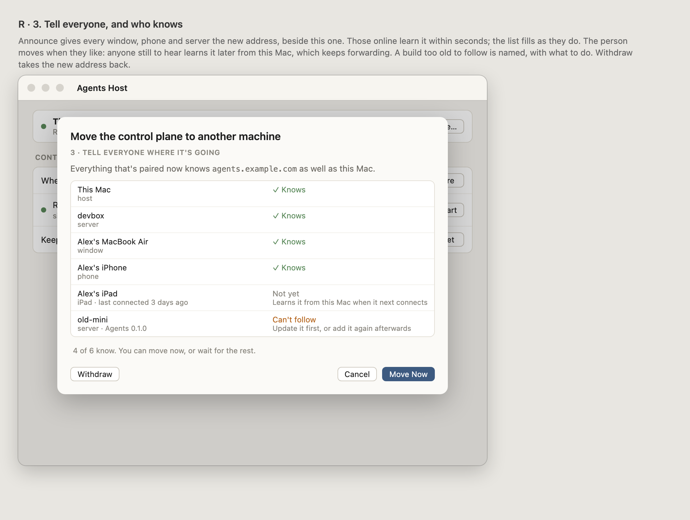

*Tell Everyone* gives every member the new address beside this one. The list fills as they
reconnect. The person moves when they like (Alex's choice): anyone still to hear learns later
from this Mac. A build too old to follow is named. *Withdraw* takes the address back.

## S · 4. Moving

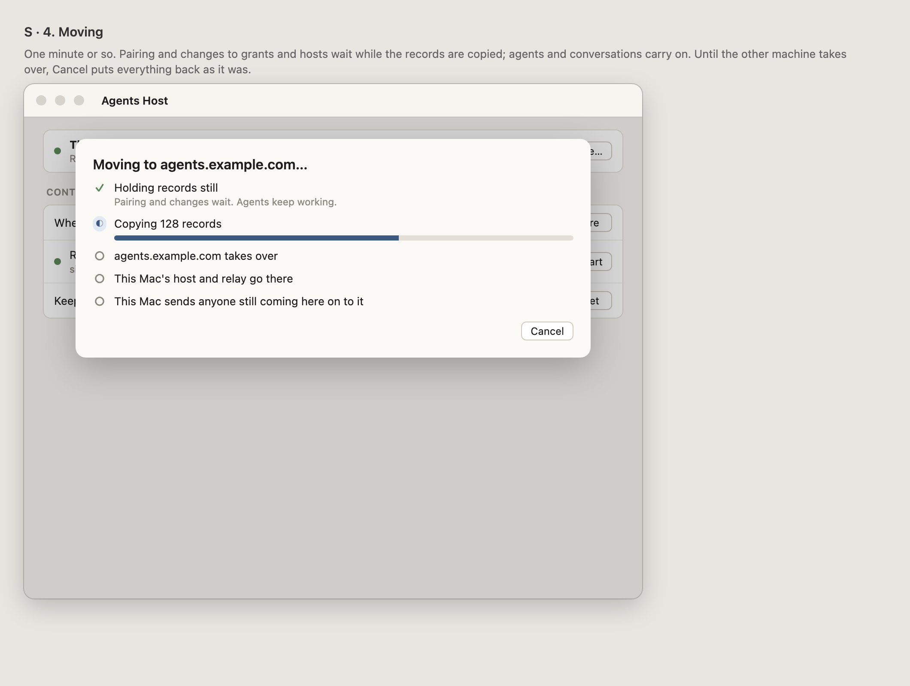

About a minute. Pairing and changes wait; agents carry on. *Cancel* puts everything back until
the other machine takes over.

## T · Afterwards

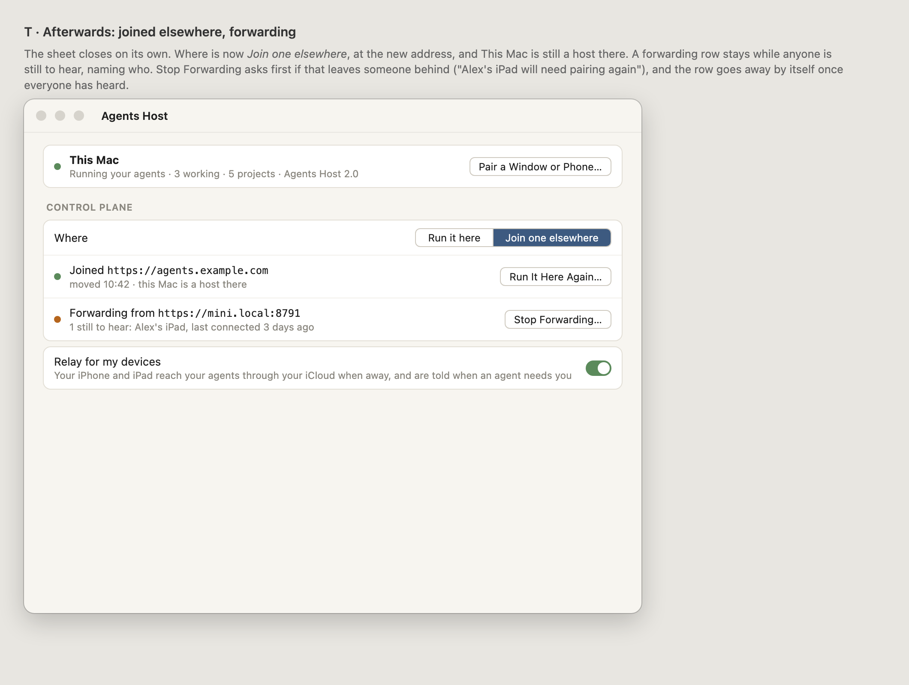

This Mac has joined the control plane elsewhere and is still a host there. A forwarding row
stays while anyone is still to hear, and goes by itself once everyone has.

## Decided

- **Forwarding stops after 30 days** (Alex, 2026-10-01), or sooner when everyone has heard or
  the person stops it. T's row says when: "Forwarding until 31 October · 1 still to hear".
  Anyone still to hear after that pairs again.
- **Old builds can't follow** (R16 default): they are listed, and pair again afterwards.

# The way back: Run It Here Again… (T127)

**For Alex's approval.** Frames U–Y, the same sheet the other way: the control plane comes
back from the cloud machine to this Mac, and every window, phone and server follows without
pairing again.

## U · The way back in

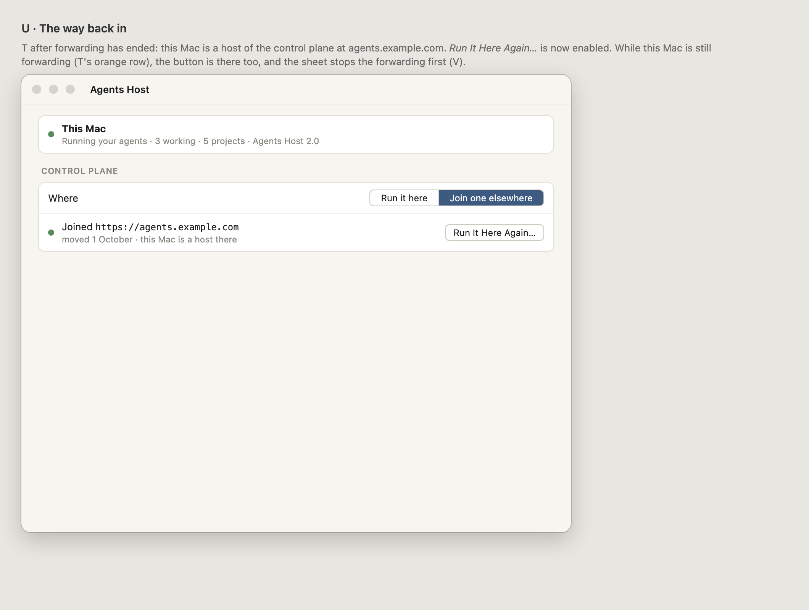

T, once forwarding has ended; *Run It Here Again…* is enabled. While this Mac is still
forwarding, the button is there too, and the sheet stops the forwarding first.

## V · 1. Check both ends

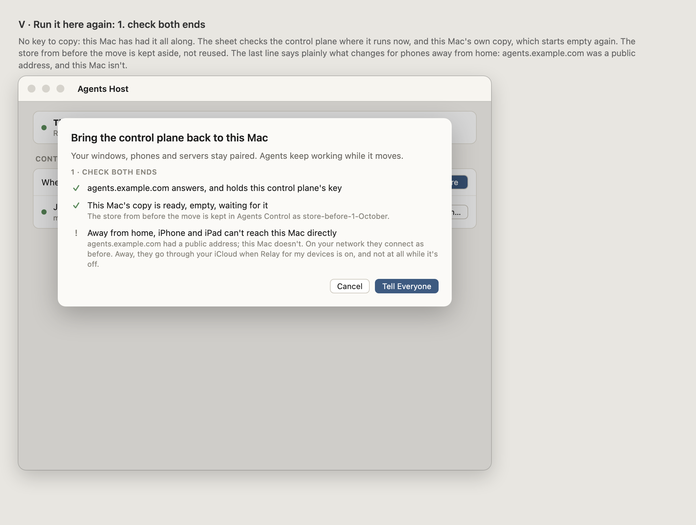

No key step: this Mac has had the key all along. This Mac's copy starts empty again, and the
store from before the move is kept aside. The last line says what changes for phones away
from home, because this Mac has no public address.

## V2 · A check that fails

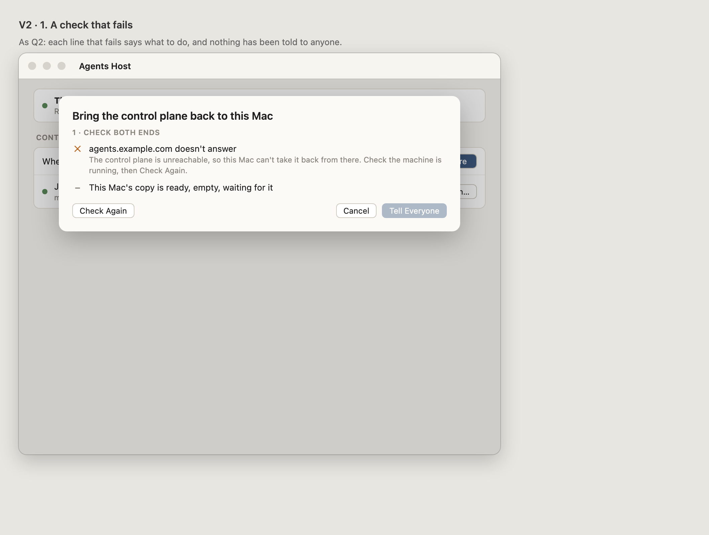

## W · 2. Tell everyone, and who knows

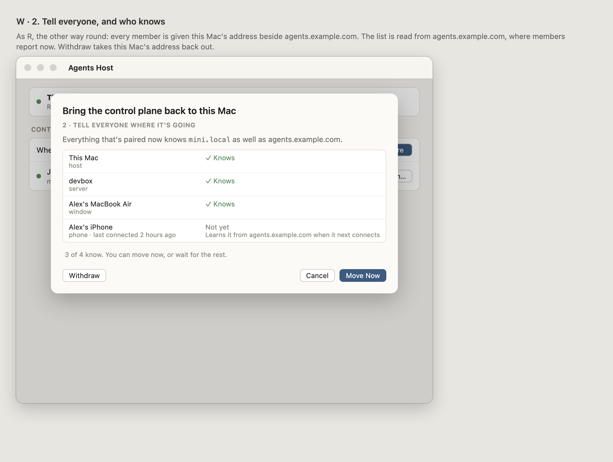

As R, read from agents.example.com, where members report now.

## X · 3. Moving back

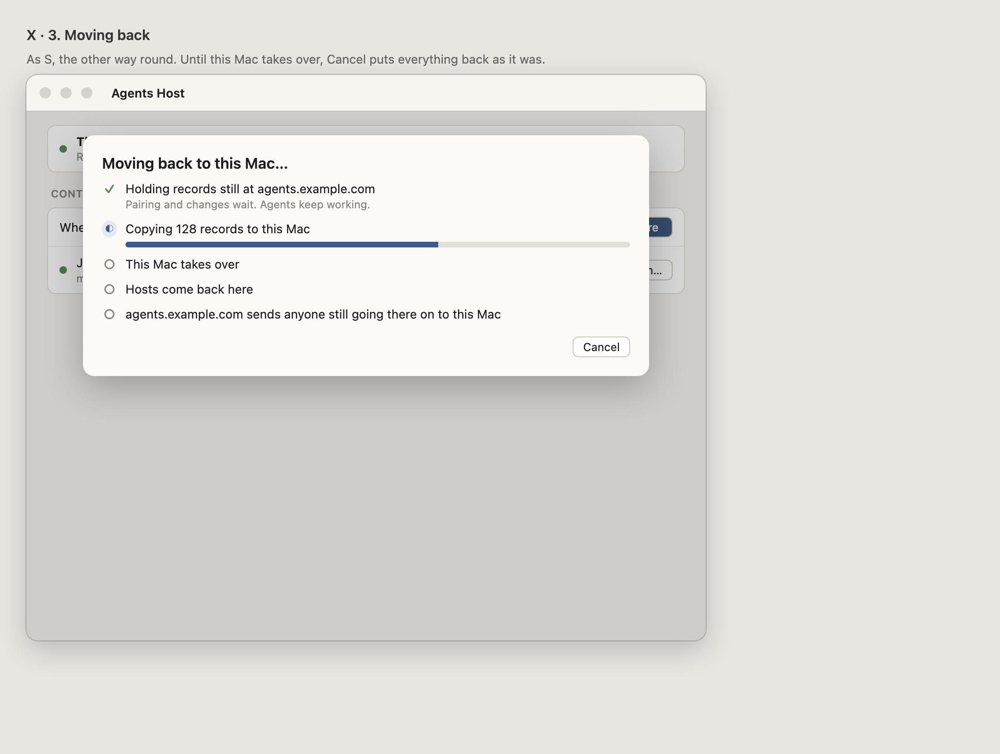

## Y · Afterwards

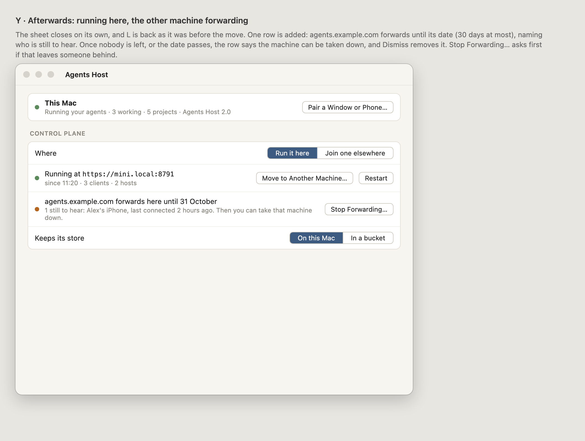

L as it was before the move, plus one row while agents.example.com forwards (30 days at
most). When nobody is left to hear, the row says the machine can be taken down.

## Open for Alex

- **Phones away from home** after moving back: this Mac has no public address, and the relay
  isn't in this build yet, so until it is they reach this Mac only on your network. V says so
  before anything happens.
