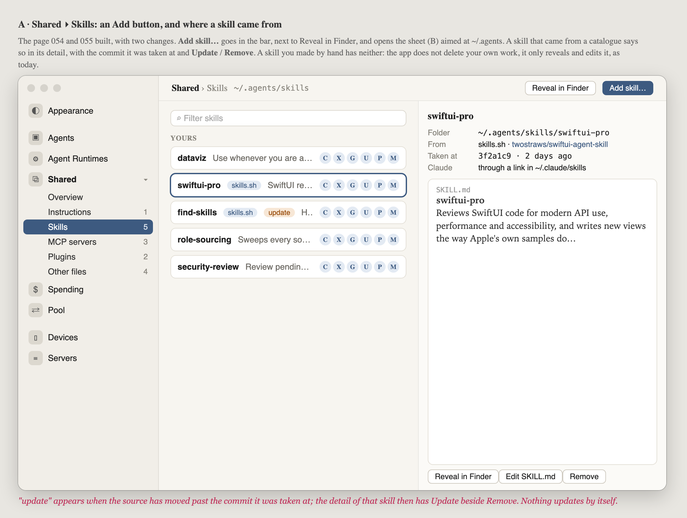
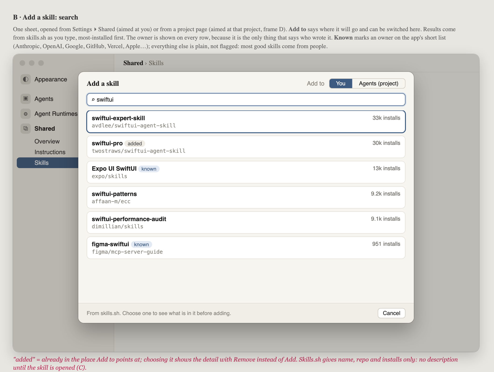
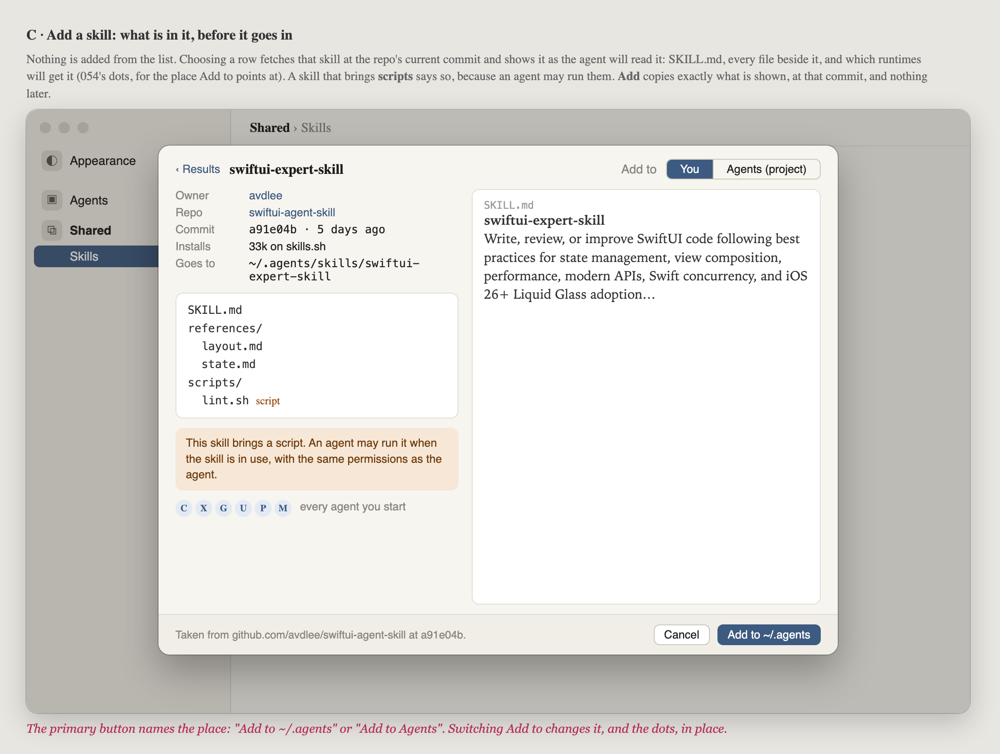
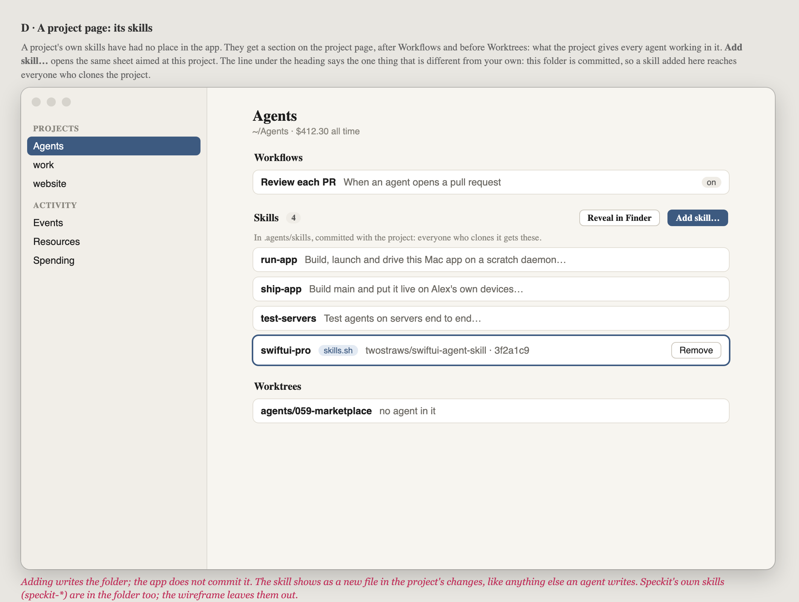
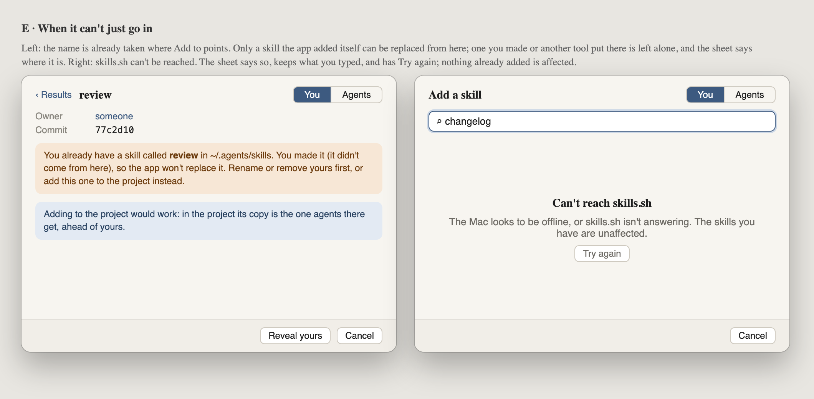

# 059 · Wireframes: search a catalogue and add a skill

**Waiting for Alex's approval.** This is the look gate for 059, and nothing gets built until it is
approved. Feasibility: [install-from-catalogues.md](../../../.agents/research/install-from-catalogues.md)
(in the main checkout, not committed).

**What this adds.** The person can search a public catalogue from inside the app, look at what
they found, and add it either to **their own** config (`~/.agents`) or to **a project's**
(`<project>/.agents`). From there, 054 gets it to every agent. This first slice covers skills
only, from [skills.sh](https://skills.sh). MCP servers and plugins will reuse the same sheet later.

Source: [wireframes.html](wireframes.html). Open it with `#a` to `#e` to see one frame.

## A · Shared ▸ Skills: Add, and where a skill came from

Two changes to the page 054 and 055 built.

- **Add skill…** goes in the bar and opens the sheet, set to add to `~/.agents`.
- A skill that came from a catalogue shows its source and the commit it was taken at, plus
  **Remove**. When the source has moved on, it also shows **Update**.

A skill the person made by hand keeps today's buttons only (Reveal, Edit). The app never deletes
work it didn't put there.

## B · The Add sheet: search

- Opened from Settings, the sheet adds to **You**. Opened from a project page, it adds to that
  project. **Add to** switches between the two.
- Results come from skills.sh, most installed first.
- Every row shows the owner and repo. **known** marks an owner on a short list (Anthropic,
  OpenAI, Google, GitHub, Vercel, Apple…). Other owners are not marked as a risk, because most
  good skills are written by individuals.
- **added** marks a skill that is already in the place Add to points at.

## C · The Add sheet: one skill, before it goes in

Nothing gets added straight from the list. Choosing a row fetches the skill at the repo's current
commit and shows:

- SKILL.md;
- every file that comes with it;
- which runtimes will get it (054's dots).

Scripts are called out, because an agent may run them. **Add** copies exactly what is shown, at
that commit. The button names the destination: "Add to ~/.agents" or "Add to Agents".

## D · A project page: its skills

Until now a project's own skills have not appeared anywhere in the app. They get a **Skills**
section on the project page, between Workflows and Worktrees, with Reveal and **Add skill…**. The
line under the heading gives the one difference from your own config: this folder is committed,
so anyone who clones the project gets these skills.

The app writes the folder but does not commit it. The new skill shows up in the project's changes
like any other file an agent writes.

## E · When it can't just go in

- **Clash:** a skill with the same name is already where Add to points. The app replaces only a
  skill it added itself. It never replaces one the person made or another tool put there; instead
  it says where that skill is, and points out that adding to the project instead would work.
- **Offline:** if skills.sh can't be reached, the sheet says so, keeps the search text and offers
  Try again.

## To decide at this gate

1. **Where Add sits.** In the bar (A) and in the project section's heading (D), or in a single
   place such as a toolbar button on the main window.
2. **The known-owner mark.** Keep it, or drop it and show only install counts.
3. **The project section.** Skills only for now, or lay out the whole "what this project gives
   agents" section at once, with MCP servers and plugins greyed out until their slices land.
