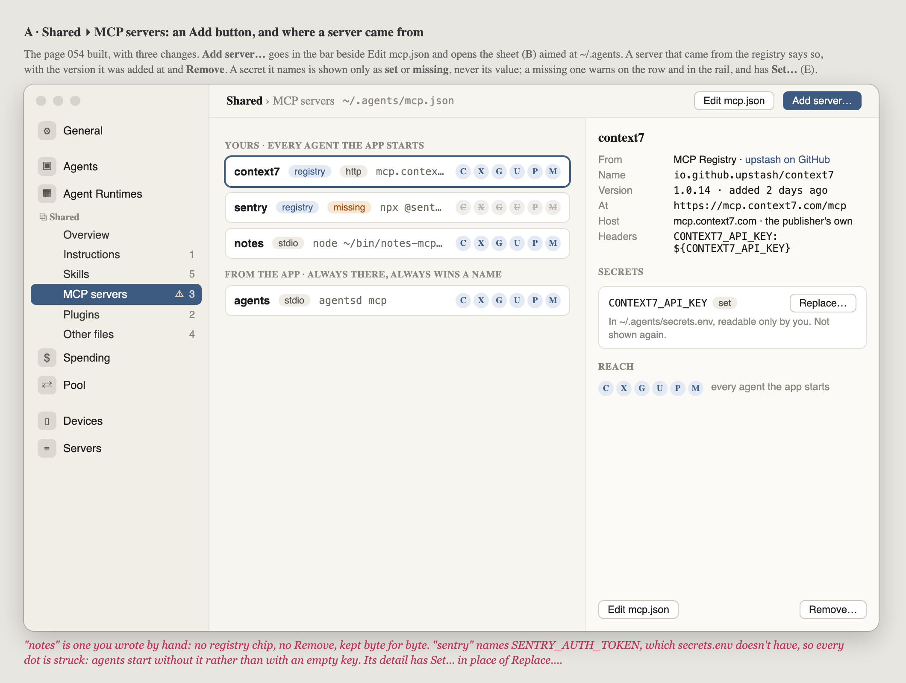
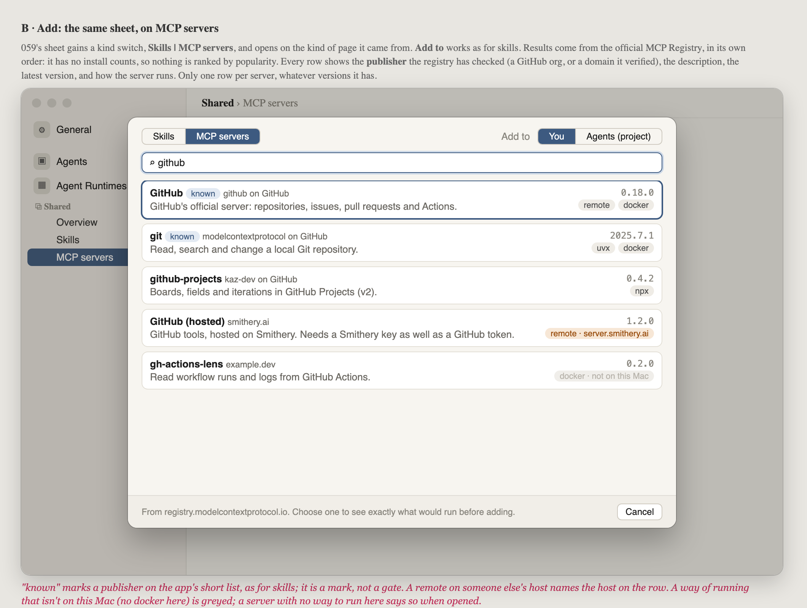
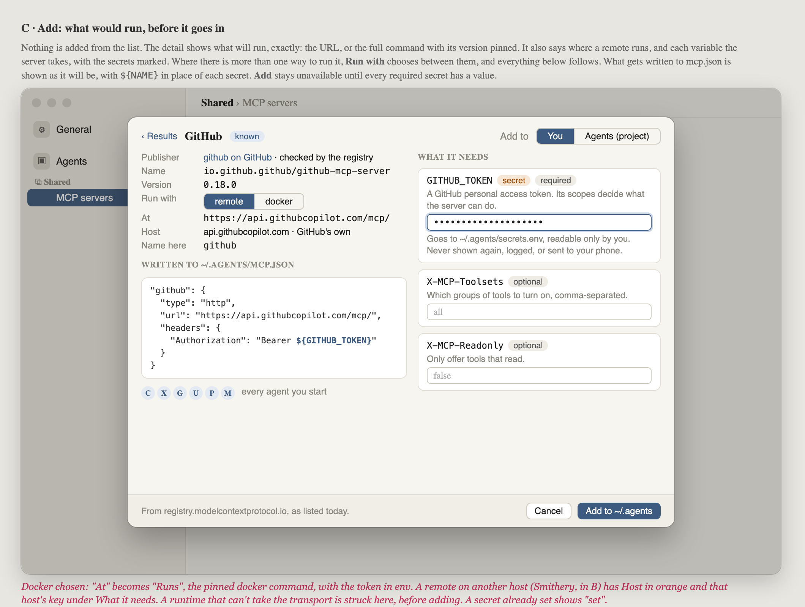
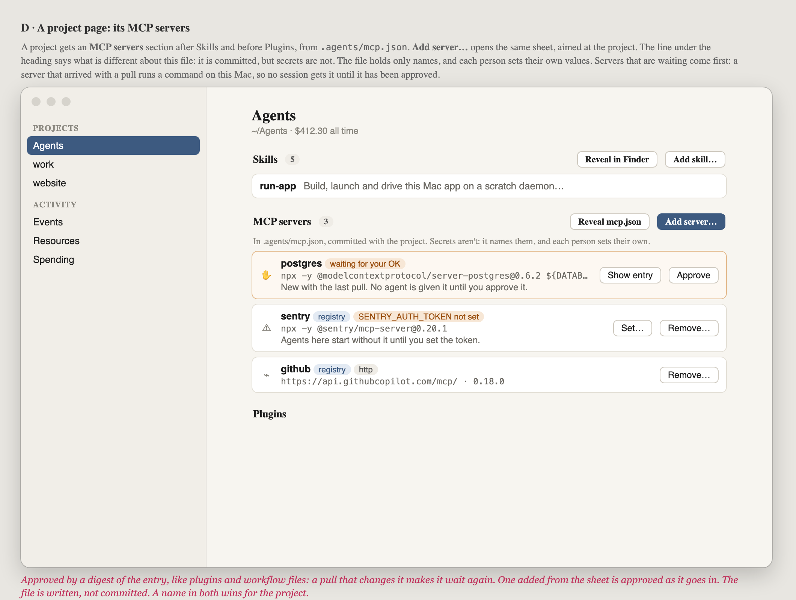
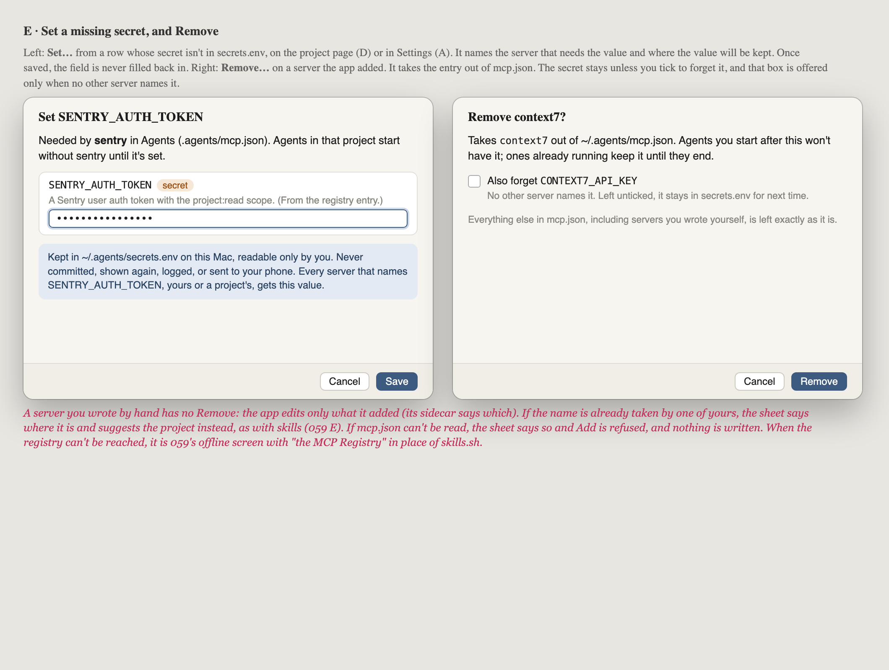

# 060 · Wireframes: search the MCP Registry and add servers

**Approved by Alex, 2026-09-26, as drawn.** This is the look gate for 060. Feasibility
sits in the 059 research that named this slice:
[install-from-catalogues.md](../../../.agents/research/install-from-catalogues.md)
(in the main checkout, not committed). Spec decisions already locked:
[../spec.md](../spec.md).

**What this adds.** The person can search the
[official MCP Registry](https://registry.modelcontextprotocol.io) from inside the
app, see exactly what would run, and add a server either to **their own** config
(`~/.agents/mcp.json`) or to **a project's** (`<project>/.agents/mcp.json`).
Secrets go to `~/.agents/secrets.env` as names only (`${GITHUB_TOKEN}`), never into
a file that might be shared. Reuses 059's Add sheet with a kind switch.

Source: [wireframes.html](wireframes.html). Open it with `#a` to `#e` to see one
frame.

## A · Shared ▸ MCP servers: Add, and where a server came from

The page 054 built, with three changes.

- **Add server…** goes in the bar beside Edit mcp.json and opens the sheet (B),
  set to add to `~/.agents`.
- A server that came from the registry says so, with the version it was added at,
  plus **Remove**.
- A secret it names is shown only as **set** or **missing**, never its value. A
  missing one warns on the row and in the rail, and has **Set…** (E).

A server the person wrote by hand keeps today's buttons only (Edit mcp.json). The
app never deletes work it didn't put there. Agents start without a server whose
secret is missing, rather than with an empty key — every reach dot is struck.

## B · The Add sheet: search MCP servers

- 059's sheet gains a kind switch, **Skills | MCP servers**, and opens on the kind
  of page it came from. **Add to** works as for skills (You or a project).
- Results come from the official MCP Registry, in its own order. It has no install
  counts, so nothing is ranked by popularity.
- Every row shows the **publisher** the registry has checked (a GitHub org, or a
  domain it verified), the description, the latest version, and how the server
  runs (`remote`, `npx`, `uvx`, `docker`). Only one row per server, whatever
  versions it has.
- **known** marks a publisher on the app's short list, as for skills — a mark, not
  a gate.
- A remote on someone else's host names that host on the row. A way of running that
  isn't on this Mac is greyed.

## C · The Add sheet: one server, before it goes in

Nothing is added from the list. Choosing a row shows what will run, exactly:

- the URL, or the full command with its version pinned;
- where a remote runs (and whether that host is the publisher's own);
- each variable the server takes, with secrets marked;
- what will be written to `mcp.json`, with `${NAME}` in place of each secret;
- which runtimes can take it (054's dots).

Where there is more than one way to run it, **Run with** chooses between them, and
everything below follows. **Add** stays unavailable until every required secret has
a value. The button names the destination: "Add to ~/.agents" or "Add to Agents".

## D · A project page: its MCP servers

A project gets an **MCP servers** section after Skills and before Plugins, from
`.agents/mcp.json`. **Add server…** opens the same sheet, aimed at the project.
The line under the heading says what is different about this file: it is
committed, but secrets are not — it names them, and each person sets their own.

Servers that are waiting come first. A server that arrived with a pull runs a
command on this Mac, so no session gets it until it has been approved (by a digest
of the entry, like plugins and workflow files). One added from the sheet is
approved as it goes in. A row whose secret isn't set offers **Set…**.

## E · Set a missing secret, and Remove

- **Set…** from a row whose secret isn't in `secrets.env` (project page or
  Settings). It names the server that needs the value and where the value will be
  kept. Once saved, the field is never filled back in.
- **Remove…** on a server the app added. It takes the entry out of `mcp.json`. The
  secret stays unless you tick to forget it, and that box is offered only when no
  other server names it.

A server you wrote by hand has no Remove. If the name is already taken by one of
yours, the sheet says where it is and suggests the project instead, as with skills
(059 E). If `mcp.json` can't be read, Add is refused and nothing is written. When
the registry can't be reached, it is 059's offline screen with "the MCP Registry"
in place of skills.sh.

## Decided at this gate

1. **Add sits where drawn:** in Shared ▸ MCP servers' bar (A) and in the project
   section's heading (D).
2. **Keep the known-publisher mark.** It is a mark, not a gate.
3. **Project servers wait for approval** when they arrive by pull; ones added from
   the sheet are approved as they go in.
4. **Missing secret → left out of the session**, with Set… on the row — never
   started with an empty key.
5. **Remove can also forget the secret**, only when no other server names it.
