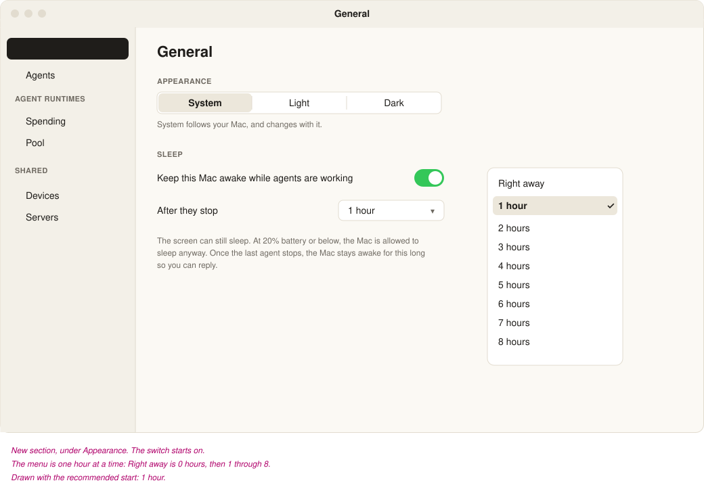
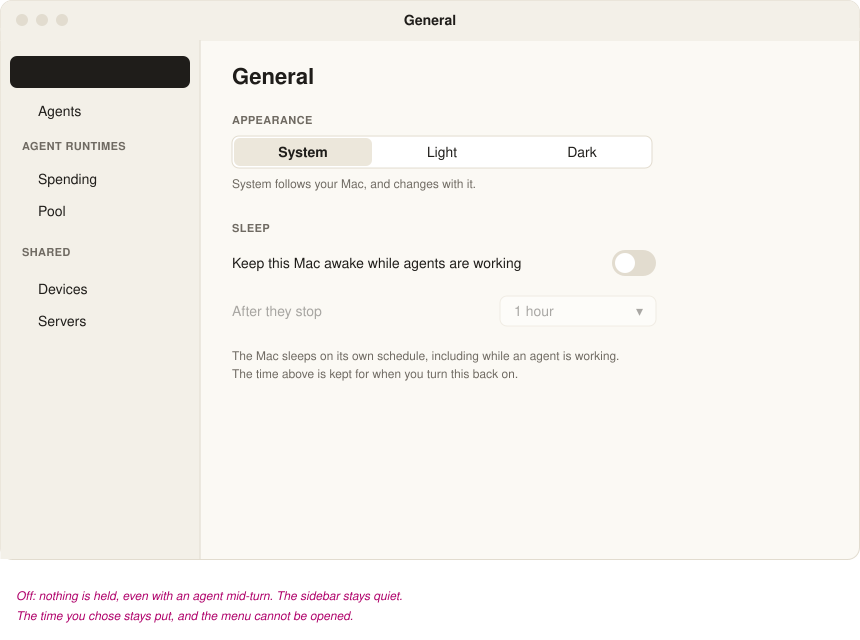
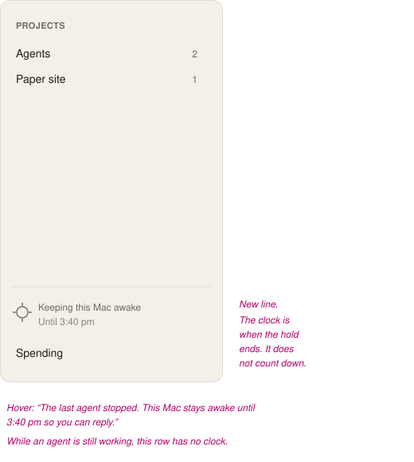

# Keep awake, with time to reply

Built on `agents/keep-awake-grace`. The switch starts on, the time starts at 1 hour, and the section is Settings ▸ General, under Appearance.

Today the Mac is held awake while any agent is starting or running, and the hold ends the moment the last one stops. That includes an agent that has just asked you something and is waiting. The screen can still sleep. On battery, at 20% or below, the hold ends even if an agent is still working. The sidebar says “Keeping this Mac awake” while the hold is on, and “Letting this Mac sleep” with the charge when the battery is what ended it. Otherwise that row is absent.

This adds two controls, both on this Mac, and a grace period so you can reply before the Mac sleeps.

## Settings

**Settings ▸ General**, a Sleep section under Appearance. The switch starts **on**, which is what the Mac does today. The time starts at **1 hour**.

| Control | What it does |
| --- | --- |
| Keep this Mac awake while agents are working | On: hold the Mac while an agent is working, then for the time below. Off: never hold it. The time you chose is kept, and the menu is dimmed. |
| After they stop | Right away, then 1 hour through 8 hours, one hour at a time. Right away is 0 hours: the hold ends when the last agent stops. |

The screen can still sleep. The 20% battery floor stays, and it is not a setting. A server has no idle sleep to hold off, and the phone has no control for this. You change it on the Mac. The choice is kept in the daemon, so it still applies with the window closed.

## After the last agent stops

The grace starts when no agent is starting or running. That is a finished turn, a stop, a crash, or a question waiting for you. One agent still working means there is no grace yet.

For 1 to 8 hours the hold stays up until that time has passed, counted from the moment the last agent stopped. The sidebar keeps “Keeping this Mac awake” and adds the clock time the hold will end. The time is fixed for the whole grace, so the row does not tick. A grace that crosses midnight says the day as well (“Until tomorrow, 1:10 am”).

Hover on that row: “The last agent stopped. This Mac stays awake until 3:40 pm so you can reply.”

While an agent is mid-turn the row stays as it is today: “Keeping this Mac awake”, no clock, and the hover says the Mac will not sleep while an agent is mid-turn.

Someone starting work during the grace clears the clock and the hold continues because of that work. When everyone has stopped again, a new grace starts from that moment.

Changing the hours during a grace counts the new length from when they stopped. If that time has already passed, the hold ends now. Turning the switch off ends the hold now. Turning it back on while nothing is working does not start a grace on its own. A grace begins only from a stop this daemon saw.

At 20% battery or below the hold ends, including during a grace. With nothing in flight the sidebar goes quiet. With an agent still working, the row stays “Letting this Mac sleep” and shows the charge.

Quitting or killing the daemon ends the hold with the process, as it does today. A grace already running is not resumed. The setting is.

`pmset -g assertions` reads “Agents: a turn is in flight” while someone is working, and “Agents: staying awake so you can reply” during the grace. The reason is rewritten at that boundary by letting go and taking the hold again. Work has already stopped, and the Mac’s own idle timer is minutes, so that gap does not put it to sleep.

## What the hold does in each case

| What is happening | Switch | Time | Battery | The Mac |
| --- | --- | --- | --- | --- |
| An agent is working | On | any | above 20%, or plugged in | Held. Sidebar has no clock. |
| An agent is working | On | any | 20% or below, on battery | Allowed to sleep. Sidebar names the charge. |
| An agent is working | Off | any | any | Allowed to sleep. Sidebar quiet. |
| The last one just stopped | On | 1–8 hours | above the floor | Held until the clock. Sidebar shows it. |
| The last one just stopped | On | Right away | any | Allowed to sleep at once. Sidebar quiet. |
| The last one just stopped | Off | any | any | Allowed to sleep. Sidebar quiet. |
| Grace running, and someone starts | On | any | above the floor | Clock clears. Held because of the work. |
| The clock is reached | On | 1–8 hours | any | Allowed to sleep. Sidebar quiet. |
| You turn the switch off, or shorten the time past now | | | | Allowed to sleep at once. |
| The daemon quits | | | | The hold ends with it. The setting remains. |

The release on the hour is checked on the daemon’s existing short tick, so it can land a few seconds after the clock. For an hour or more that is the same moment.

## Where the change goes

The decision stays in the daemon, beside the hold it already takes. A small settings file in the daemon’s own root, the same kind of store as archived-agent retention, holds the switch and the hours. The Settings window reads and writes that file. The wake notice the windows already receive gains the clock time, left out when there is no grace, so an older phone still reads the rest.

The General pane is Appearance on its own today. Sleep becomes a second section in that pane, in its own view, so the appearance code does not take on the hold. If you would rather have it on Agents, it is the same section placed above Archived agents.

Tests cover the table above with a stand-in for the hold and a clock the test sets, the way the current wake tests do. A scratch copy of the app is for seeing the two settings frames and the sidebar line.

## What was built

The daemon keeps the switch and the hours in `wake.json`. The default, when that file is missing, is on for one hour. Settings ▸ General reads and writes it. The sidebar adds the clock only while the grace is what holds the Mac.

The wake tests cover the hour, a question waiting for you, work starting again during it, the switch turned off mid-turn, shortening the time past now, and the battery floor during the grace. The older tests still use Right away, so they still check that the hold ends when the work does.
