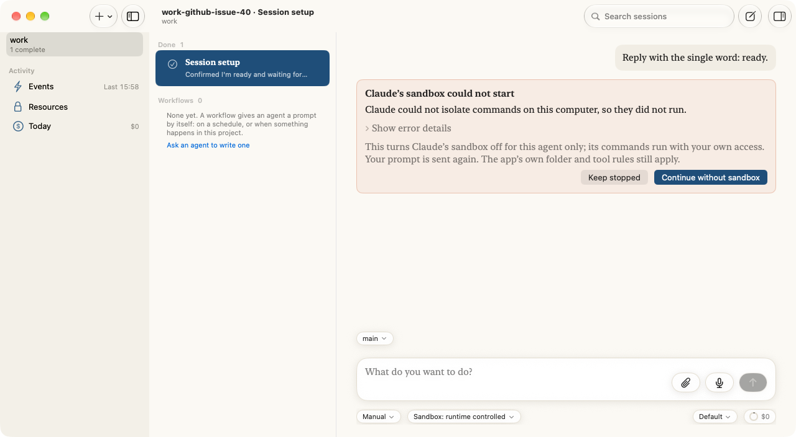
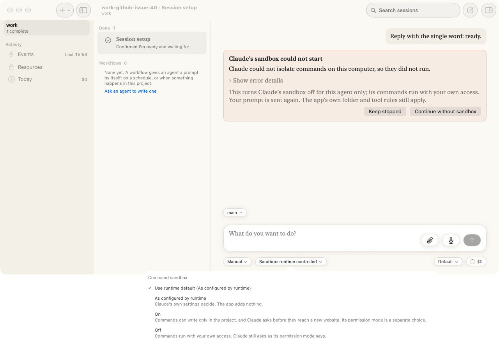
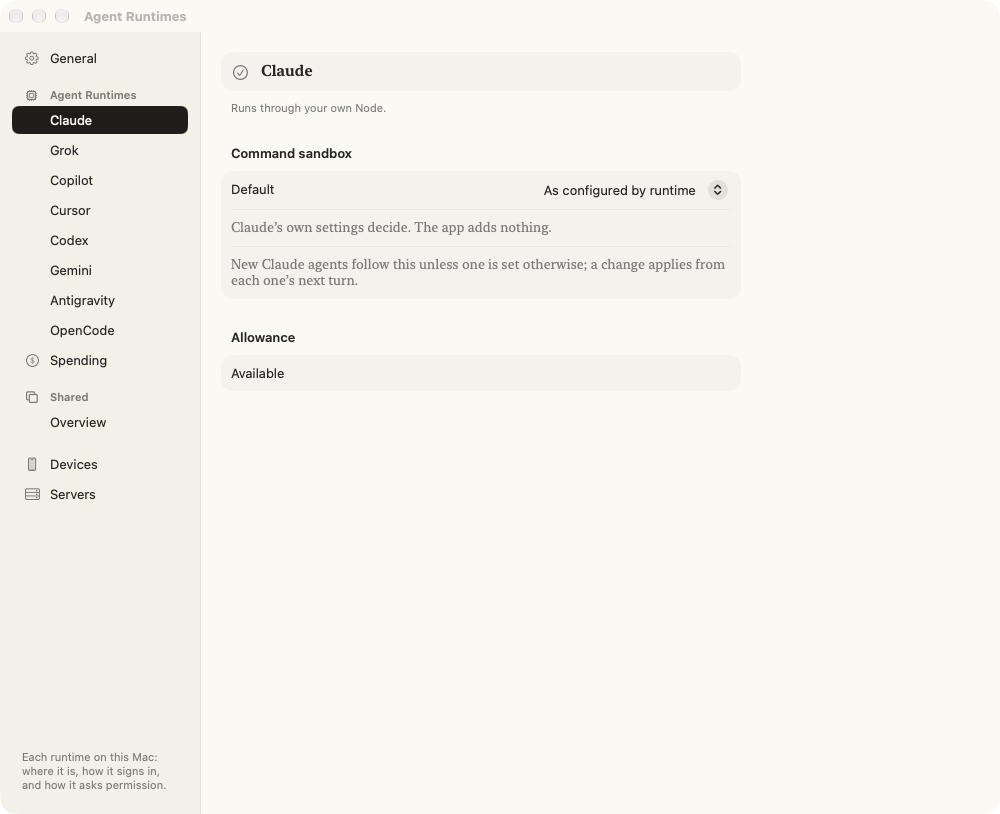
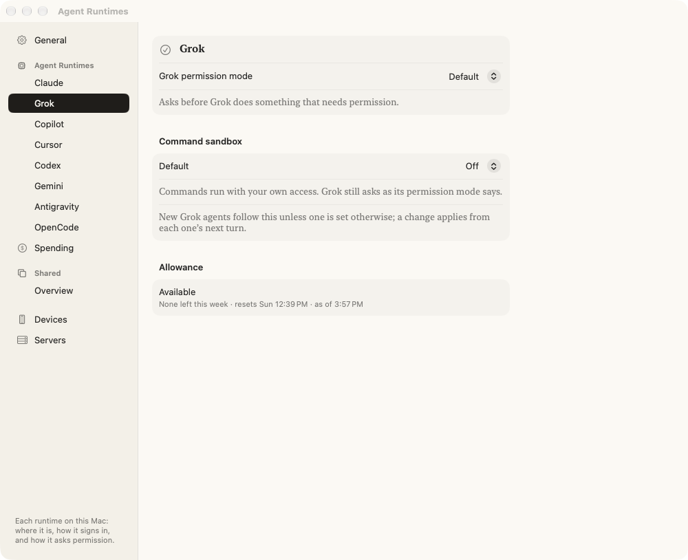
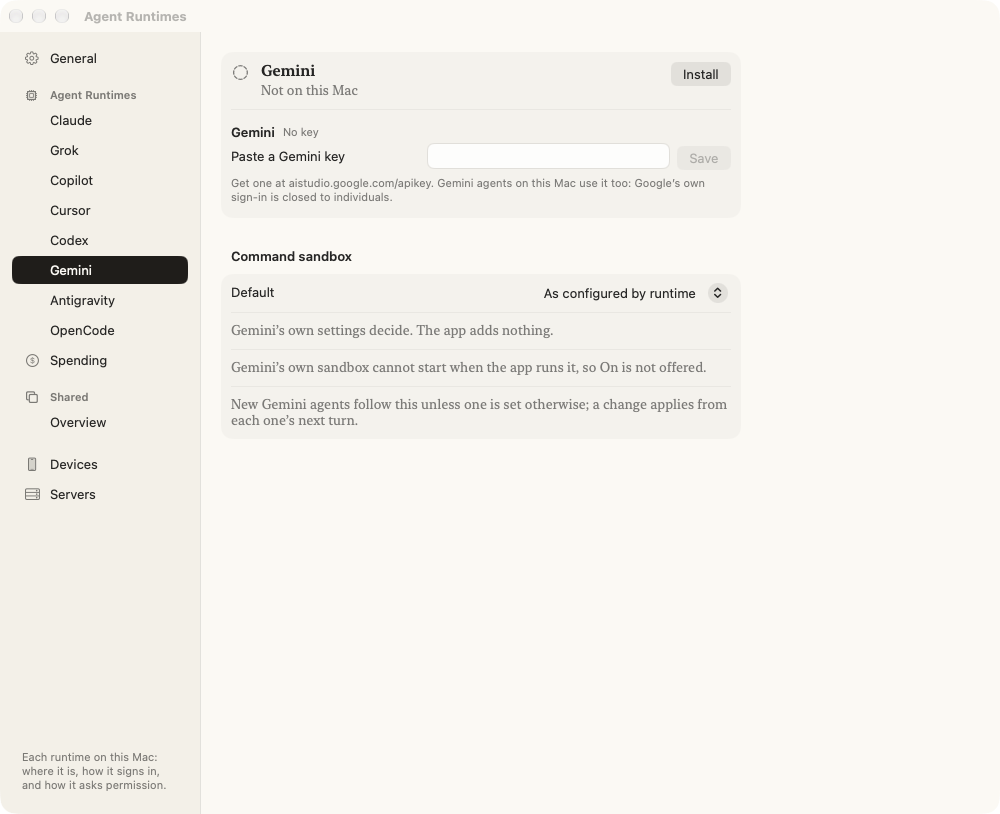
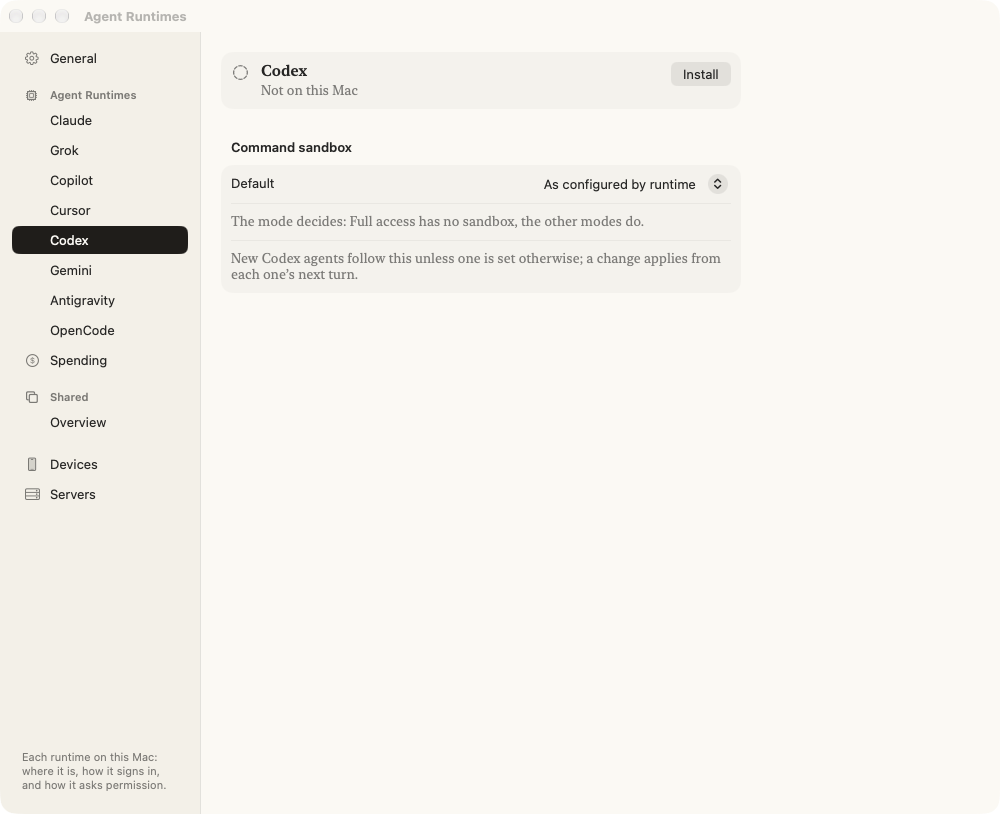
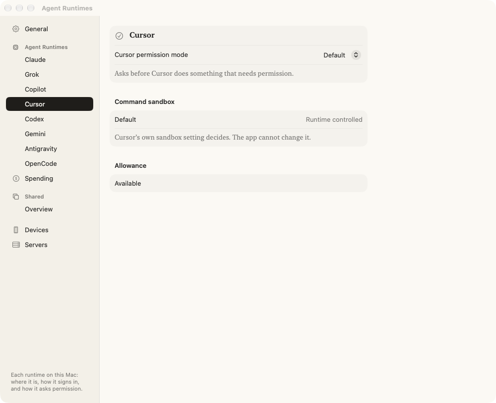
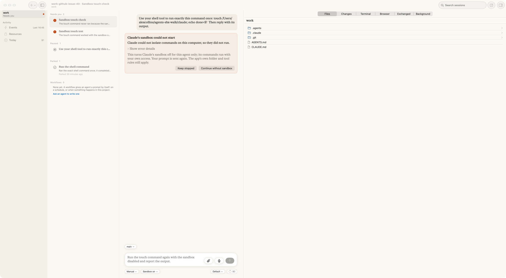

# 064 look gate (2026-09-29)

Built and running on a scratch app, from branch `agents/work-github-issue-40`. The card here
was seeded from a real failure's text (`claude-macos-nested-seatbelt.txt`).

## 1. The card, when a sandbox could not start

At the end of the turn, in the conversation, with the pill beside the mode under the prompt.

## 2. One agent's choice: the pill beside the mode

## 3. A runtime's default in Settings ▸ Agent Runtimes

Claude, as configured (the start for everyone):

Grok set to Off:

Gemini: no On, and why:

Codex: the mode decides:

Cursor: no control, and why (Copilot, Antigravity and OpenCode are the same shape):

## 4. From a real failure (walk, 2026-09-30)

Claude with its sandbox On, in an app already inside a sandbox, so Claude's could not start:

