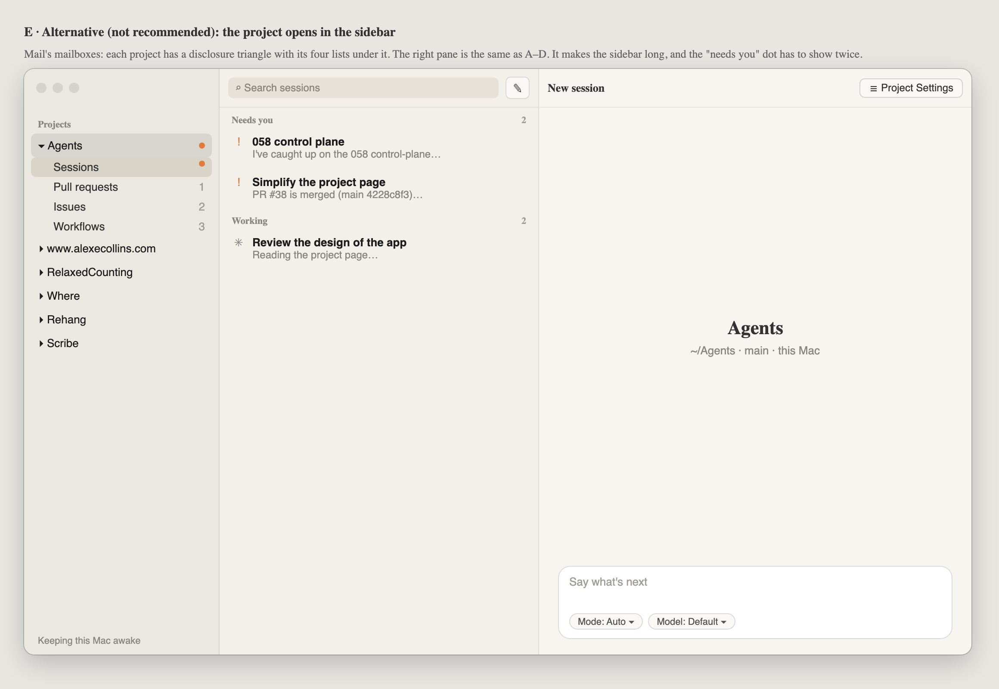

# 066 · Wireframes: a conventional project page

**Not approved yet.** Frames A–D are the proposal; frame E is the alternative layout, and it is
not recommended.

The goal is a project page that someone who has used Mail, Xcode or GitHub Desktop can work out
without being told: every row in a list opens in the pane beside it, a new conversation looks like
a conversation, and a project's settings open where settings usually do.

Source: [wireframes.html](wireframes.html). Open it with `#a` to `#e` to see one frame. The PNGs
beside it (`a.png` … `e.png`) are rendered from it with headless Chrome.

## What the page is today (main 4228c8f3)

Checked on the live window at 20:5x on 2026-09-28, with the Agents project selected and no session
open.

| # | What you see | Why it trips people up |
|---|---|---|
| 1 | The right pane is the project's name, "$10,965 all time · at least, 59 chats went unpriced", and a prompt at the **top**. Below that, about two thirds of the pane is empty. | A chat has its prompt at the bottom. Here the same bar sits at the top, so starting a session and carrying one on look like two different places. The empty space makes the pane look unfinished. |
| 2 | The middle column holds five kinds of thing in one list: sessions (grouped), Archived 407, Pull requests, Ready issues and Workflows. | Pull requests and issues sit below 407 archived sessions (collapsed, but still in the way). With a few more live sessions they scroll off. The list has no single subject. |
| 3 | Clicking a session opens it beside the list. Clicking a pull request or an issue opens **the browser**. Clicking a workflow **replaces the page**. | The same gesture on rows in one list does three different things. In a three-column window, clicking a row shows it in the pane on the right. |
| 4 | "New session" is a row at the top of the list, and the empty project page is also a new session. | There are two ways into one thing, and the row does nothing visible when you are already on the project page. |
| 5 | The toolbar's ⚙ swaps the whole page for Configuration, which has a "‹ Project" back button. | A gear on the toolbar usually means app Settings, and a back button is how a web page works. On the Mac, a document's settings open as a sheet or an inspector. |
| 6 | Babysit, Assign and Carry on are buttons inside list rows. They make rows different heights, and Babysit and Assign fill a prompt somewhere else. | The action happens away from where you clicked, and the button is easy to hit when you only meant to select the row. |
| 7 | The money line is the second-largest text on the page, and "at least, 59 chats went unpriced" is hard to parse. | It is a report, not something you do on this page. |

What works and stays: the three columns, the sidebar, the sessions' groups (Needs you, Waiting,
Working, Archived) and their rows, search in the toolbar, and the prompt bar itself.

## The proposal in one paragraph

The middle column shows **one kind of thing at a time**, chosen with a segmented control at its
top: Sessions, Pull requests, Issues, Workflows. Xcode's navigator bar and Mail's mailboxes work
this way. Whatever you pick in the list opens on the right: a session's chat, a pull request's
page, an issue's page, a workflow's page. With nothing picked, the right pane is an **empty new
chat**, laid out like any chat, with the prompt at the bottom. Actions live on the thing's page
("Babysit", "Start a session"), and they open that new chat already filled in. **Project
Settings** is a sheet with a sidebar of its own.

## A. A project with nothing open

- **Scope bar** at the top of the middle column: `Sessions | Pull requests 1 | Issues 2 |
  Workflows 3`. A count appears only when it is above zero. A badge dot shows on a segment when
  something in it needs you (failing checks, a workflow waiting for an OK). ⌘1–⌘4 switch between
  them, and View ▸ Show … lists them too. The choice is remembered per project.
- **The sessions list** is today's list without the other sections. Archived stays as the last
  collapsed group.
- **New session** moves to a compose button (`square.and.pencil`) on the middle column's toolbar,
  where Mail and Notes put it. ⌘N still works. The "New session" row goes.
- **The right pane is a new chat.** Its title is "New session". In the middle of the pane is the
  project's name, with where it is under it: `~/Agents · main · this Mac`. The prompt bar is at
  the bottom, exactly where it is in a chat, with the same chips. Sending turns this pane into the
  session and adds its row to the list.
- **The money line leaves the page.** It moves to Project Settings ▸ General ("Spent") and to the
  project's row tooltip in the sidebar.
- **A plugin waiting for an OK** is a banner across the top of the right pane, with a "Review…"
  button that opens Project Settings on Plugins. It is the same pattern as Safari's "This page
  wants to…" bar.

## B. Pull requests

- **Rows** have one shape: number and title, then a line with the checks icon, the review state
  and the branch. There are no buttons in the rows. The context menu has Open on GitHub, Babysit,
  and Copy Link.
- **Picking a row opens the pull request's page** on the right. It shows the title, `head → base`,
  author and age, then the checks (each with its state), the review, conflicts, the worktree it is
  checked out in, and **Sessions on this pull request**, which links to any session already working
  on it.
- **Babysit** is the page's primary button, in its header next to "Open on GitHub ↗". It opens the
  new chat (frame A's pane) filled with `Babysit PR#37`, with the worktree set the way it is set
  today. Nothing starts until the person sends it. If a session is already babysitting the PR, the
  button reads "Go to session" instead.
- ↻ refresh sits in the list's header, as it does now. It only appears on the GitHub scopes.

## C. Issues

- The segment is called **Issues**. A pop-up in the list's header filters by the linked GitHub
  Project's status: **Ready** (the default), In progress, All. Today only Ready is shown, and the
  pop-up says so.
- **Picking an issue opens its page**: the title, labels, status and body rendered as Markdown.
  The primary button is **Start a session**, which says what it does, instead of "Assign". It
  opens the new chat filled with the issue and set to a new worktree, as Assign does today.
- When the Project's statuses cannot be used (no Ready or In progress option), the button is
  disabled and the reason is shown under it. It is not hidden in a tooltip.

## D. Project Settings

- **A sheet**, 760 × 560, with a sidebar: General, Instructions & skills, Plugins, MCP servers,
  Worktrees. It is the System Settings pattern at a smaller size. Done closes it.
- **Ways in**: the toolbar button `slider.horizontal.3` labelled "Project Settings" (not a gear,
  which is the app's), the project's context menu in the sidebar ("Project Settings…"), and
  Project ▸ Settings… (⌥⌘,).
- **General** holds what the page used to say about the project: name, folder (Reveal in
  Finder), machine, GitHub repository and linked Project, and **Spent**: `$10,965 since it was
  added`, with "59 sessions ran on a runtime that reports no price, so this is a minimum" as a
  second line in plain words.
- The other panes are today's Configuration content, moved as it is.

## E. Alternative: the project opens in the sidebar

This is the Mail and Finder way: each project in the sidebar has a disclosure triangle, and under
it are Sessions, Pull requests, Issues and Workflows. Picking one fills the middle column. The
right pane behaves as in A–D.

**Not recommended.** Six projects × four rows is a long sidebar, and it gets longer with each
project. The "needs you" dot then has to be shown on both the project and the child row. The scope
bar in A keeps the sidebar a list of projects and puts the switch next to the list it changes.

## Decided here, not in a spec

- One kind of thing per list, and a list row always opens on the right.
- No action buttons in list rows. Row actions go in the context menu, the swipe and the page's
  header.
- The empty right pane is a new chat, with its prompt at the bottom.
- "Assign" is renamed "Start a session", and "Configuration" is renamed "Project Settings".

## Open for Alex

- Whether Carry on (on a waiting session's row) follows rule 6 and moves to the chat's header.
  It is the one row button that acts on the row's own session, so keeping it is defensible.
- Whether the Remote gets the same four scopes. The phone's project page would use a segmented
  control at the top of the list.
