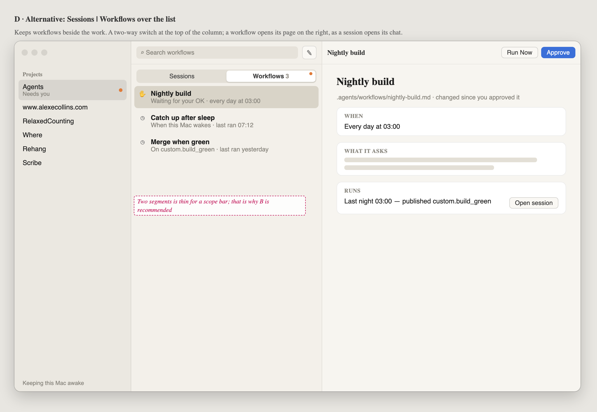

# 066 · Wireframes: a conventional project page

**Not approved yet.** Frames A–C are the proposal. Frame D is the alternative for workflows.

These frames assume the app has no GitHub support (pull requests, issues, Projects) and no
Worktrees section in Configuration, as Alex has them now. What is left on the project page is
sessions, workflows, the project's settings and the prompt.

The goal is a project page that someone who has used Mail or Notes can work out without being
told:
- every row in the list opens in the pane beside it;
- a new conversation looks like a conversation;
- the project's settings open where settings usually do.

Source: [wireframes.html](wireframes.html). Open it with `#a` to `#d` to see one frame. The PNGs
beside it are rendered from it with headless Chrome.

## What the page is today

I checked the live window (main 4228c8f3) at 20:5x on 2026-09-28, with the Agents project
selected and no session open. The GitHub rows in that window are left out here.

| # | What you see | Why it trips people up |
|---|---|---|
| 1 | The right pane is the project's name, "$10,965 all time · at least, 59 chats went unpriced", and a prompt at the **top**. Below that, about two thirds of the pane is empty. | A chat has its prompt at the bottom. Here the same bar sits at the top, so starting a session and carrying one on look like two different places. The empty space makes the pane look unfinished. |
| 2 | The middle column lists sessions, then Archived 407, then Workflows. | Workflows sit below 407 archived sessions. They are rules rather than work, but they are drawn as if they were work. |
| 3 | Clicking a session opens it beside the list. Clicking a workflow **replaces the page**. | The same gesture on two rows of one list does two different things. |
| 4 | "New session" is a row at the top of the list, and the empty project page is also a new session. | There are two ways into one thing. The row does nothing visible when you are already on the project page. |
| 5 | The toolbar's ⚙ swaps the whole page for Configuration, which has a "‹ Project" back button. | A gear usually means the app's Settings, and a back button is a web page's pattern. On the Mac, settings for one document open as a sheet. |
| 6 | The money line is the second-largest text on the page, and "at least, 59 chats went unpriced" is hard to parse. | It is a report. Nobody acts on it from this page. |

What works and stays: the three columns, the sidebar, the sessions' groups and their rows, search
in the toolbar, and the prompt bar itself.

## The proposal in one paragraph

The middle column is **the project's sessions and nothing else**, so every row opens its chat on
the right. With nothing picked, the right pane is an **empty new chat**, laid out like any chat,
with the prompt at the bottom. **Project Settings** is a sheet with a sidebar: General,
Instructions & skills, Plugins, MCP servers and **Workflows**. Workflows are rules the project
follows, so they go where Mail keeps its Rules. A session a workflow starts still shows in the
list like any other.

## A. A project with nothing open

- **Sessions only.** It is today's list without the Workflows section. Archived stays as the last
  collapsed group.
- **New session** moves to a compose button (`square.and.pencil`) on the middle column's toolbar,
  where Mail and Notes put it. ⌘N still works, and the "New session" row goes.
- **The right pane is a new chat.** Its title is "New session". In the middle of the pane is the
  project's name, with where it is under it: `~/Agents · this Mac`. The prompt bar is at the
  bottom, exactly where it is in a chat, with the same chips. Sending turns this pane into the
  session and adds its row to the list.
- **The money line leaves the page.** It moves to Project Settings ▸ General.
- **One banner for anything waiting for an OK**, across the top of the right pane: a plugin or a
  workflow that is new or has changed since it was approved. "Review…" opens Project Settings on
  that pane. The project's dot in the sidebar already says something needs you. Today only plugins
  get a line.

## B. Project Settings ▸ Workflows

- **A list of the project's workflows.** Each row shows the name, what starts it and when it last
  ran. A workflow waiting for an OK is tinted, is first in the list, and has "Review…" on it.
- **Clicking a row opens today's workflow page inside the sheet**, with ‹ back, the way System
  Settings drills in. Run Now, Approve and Archive are on that page and in the row's context menu.
- **＋ New Workflow…** is in the pane's header.
- The Workflows item in the sheet's sidebar gets a dot while one is waiting.

## C. Project Settings ▸ General

- **A sheet**, 760 × 560, with a sidebar. It is the System Settings pattern at a smaller size.
  Done closes it.
- **Ways in**:
  - the toolbar button `slider.horizontal.3` labelled "Project Settings" (not a gear, which is the
    app's);
  - the project's context menu in the sidebar ("Project Settings…");
  - Project ▸ Settings… (⌥⌘,).
- **General** holds what the page used to say about the project: name, folder (Reveal in Finder)
  and machine. It also has **Spent**, `$10,965 since it was added`, with the unpriced sessions as a
  second line in plain words ("59 sessions ran on a runtime that reports no price, so this is a
  minimum"). Remove Project… sits at the bottom.
- Instructions & skills, Plugins and MCP servers are today's Configuration content, moved as it
  is.

## D. Alternative: Sessions | Workflows over the list

This keeps workflows next to the work. A two-way segmented control sits at the top of the middle
column, and a workflow opens its page on the right, with Run Now and Approve in the header.

**Not recommended.** A switch with two segments, one of which you rarely use, takes a row at the
top of every project for little gain. It also makes workflows look like the project's work
rather than its rules. Choose it if you open workflows often enough that a sheet is in the way.

## Decided here, not in a spec

- The middle column holds one kind of row, and a row always opens on the right.
- The empty right pane is a new chat, with its prompt at the bottom.
- "Configuration" is renamed "Project Settings", and it opens as a sheet.
- Anything waiting for an OK is one banner on the project, not a line per kind.

## Open for Alex

- Workflows in Project Settings (B) or beside the sessions (D).
- Whether Carry on, the button on a waiting session's row, moves to the chat's header, so that no
  row has a button in it.
- Whether the Remote follows. On the phone, the project page would become the sessions list with
  a compose button, and settings would be a sheet.
