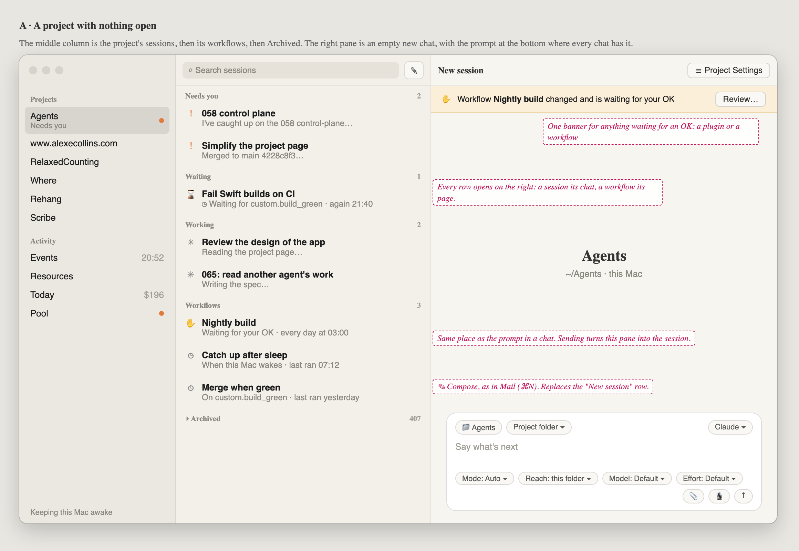
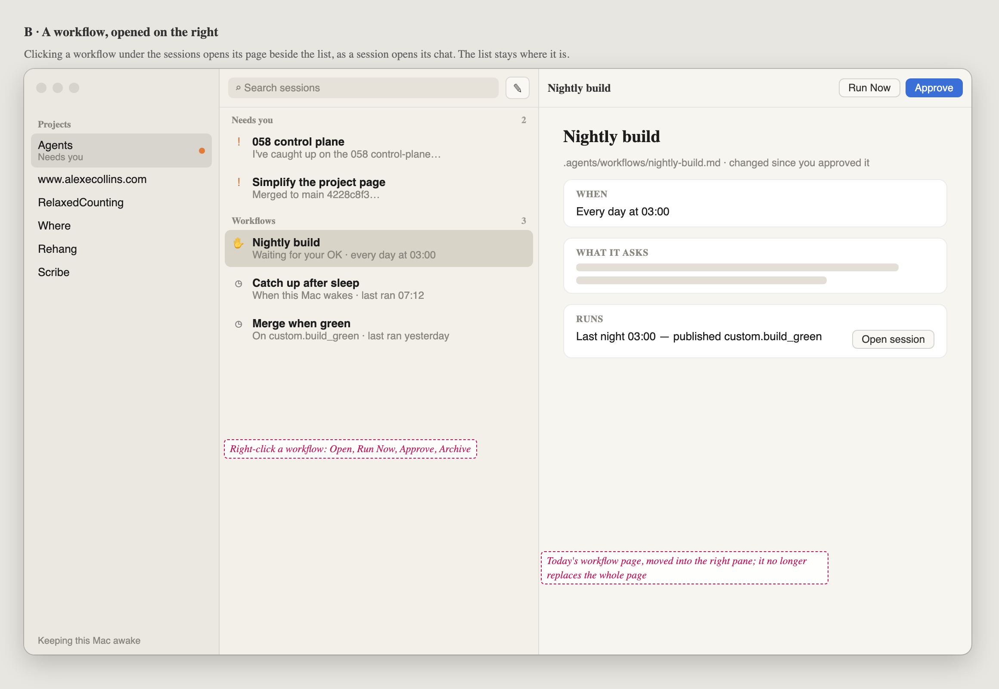
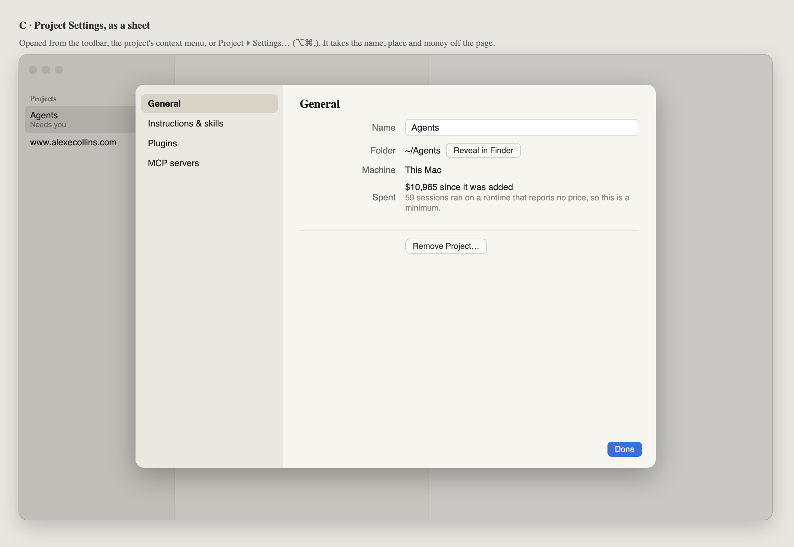

# 066 · Wireframes: a conventional project page

**Approved by Alex, 2026-09-28: frames A–C.** Workflows stay below the sessions in the middle
column, as he chose. Built in 909b1004; there the sheet keeps a Worktrees pane (main still has
it) and General has Archive Project where the frame has Remove Project…, since the app has no
remove.

These frames assume the app has no GitHub support (pull requests, issues, Projects) and no
Worktrees section in Configuration, as Alex has them now. What is left on the project page is
sessions, workflows, the project's settings and the prompt.

The goal is a project page that someone who has used Mail or Notes can work out without being
told:
- every row in the list opens in the pane beside it;
- a new conversation looks like a conversation;
- the project's settings open where settings usually do.

Source: [wireframes.html](wireframes.html). Open it with `#a` to `#c` to see one frame. The PNGs
beside it are rendered from it with headless Chrome.

## What the page is today

I checked the live window (main 4228c8f3) at 20:5x on 2026-09-28, with the Agents project
selected and no session open. The GitHub rows in that window are left out here.

| # | What you see | Why it trips people up |
|---|---|---|
| 1 | The right pane is the project's name, "$10,965 all time · at least, 59 chats went unpriced", and a prompt at the **top**. Below that, about two thirds of the pane is empty. | A chat has its prompt at the bottom. Here the same bar sits at the top, so starting a session and carrying one on look like two different places. The empty space makes the pane look unfinished. |
| 2 | The middle column lists sessions, then Archived 407, then Workflows. | The workflows sit below 407 archived sessions. |
| 3 | Clicking a session opens it beside the list. Clicking a workflow **replaces the page**. | The same gesture on two rows of one list does two different things. |
| 4 | "New session" is a row at the top of the list, and the empty project page is also a new session. | There are two ways into one thing. The row does nothing visible when you are already on the project page. |
| 5 | The toolbar's ⚙ swaps the whole page for Configuration, which has a "‹ Project" back button. | A gear usually means the app's Settings, and a back button is a web page's pattern. On the Mac, settings for one document open as a sheet. |
| 6 | The money line is the second-largest text on the page, and "at least, 59 chats went unpriced" is hard to parse. | It is a report. Nobody acts on it from this page. |

What works and stays: the three columns, the sidebar, the sessions' groups and their rows, search
in the toolbar, and the prompt bar itself.

## The proposal in one paragraph

The middle column is **the project's sessions, then its workflows, then Archived**, and every
row opens on the right: a session opens its chat and a workflow opens its page. With nothing
picked, the right pane is an **empty new chat**, laid out like any chat, with the prompt at the
bottom. **Project Settings** is a sheet with a sidebar.

## A. A project with nothing open

- **Sessions, then Workflows, then Archived.** Workflows come before the collapsed Archived group
  so that 407 archived sessions never sit above them. The Workflows section is left out when the
  project has none, as it is today. Search is a search of the sessions, so the Workflows section
  hides while you type.
- **New session** moves to a compose button (`square.and.pencil`) on the middle column's toolbar,
  where Mail and Notes put it. ⌘N still works, and the "New session" row goes.
- **The right pane is a new chat.** Its title is "New session". In the middle of the pane is the
  project's name, with where it is under it: `~/Agents · this Mac`. The prompt bar is at the
  bottom, exactly where it is in a chat, with the same chips. Sending turns this pane into the
  session and adds its row to the list.
- **The money line leaves the page.** It moves to Project Settings ▸ General.
- **One banner for anything waiting for an OK**, across the top of the right pane: a plugin or a
  workflow that is new or has changed since it was approved. "Review…" opens the plugin in
  Project Settings, or the workflow's page. Today only plugins get a line.

## B. A workflow, opened on the right

- **Clicking a workflow opens its page in the right pane**, the way a session opens its chat. The
  list stays where it is and the row stays selected. Today the page replaces everything.
- The page is today's `WorkflowPage`, moved into the pane. Its actions, **Run Now** and
  **Approve** (when it is waiting), sit in the pane's header.
- A workflow's **context menu** has Open, Run Now, Approve and Archive, as it does now. There are
  no buttons in the row.
- **A workflow waiting for an OK** shows ✋ and "Waiting for your OK" on its row.

## C. Project Settings, as a sheet

- **A sheet**, 760 × 560, with a sidebar: General, Instructions & skills, Plugins, MCP servers.
  It is the System Settings pattern at a smaller size. Done closes it.
- **Ways in**:
  - the toolbar button `slider.horizontal.3` labelled "Project Settings" (not a gear, which is the
    app's);
  - the project's context menu in the sidebar ("Project Settings…");
  - Project ▸ Settings… (⌥⌘,).
- **General** holds what the page used to say about the project: name, folder (Reveal in Finder)
  and machine. It also has **Spent**, `$10,965 since it was added`, with the unpriced sessions as a
  second line in plain words ("59 sessions ran on a runtime that reports no price, so this is a
  minimum"). Remove Project… sits at the bottom.
- The other panes are today's Configuration content, moved as it is.

## Decided here, not in a spec

- Every row in the middle column opens on the right. Nothing in it replaces the whole page or
  opens a browser.
- The empty right pane is a new chat, with its prompt at the bottom.
- "Configuration" is renamed "Project Settings", and it opens as a sheet.
- Anything waiting for an OK is one banner on the project, not a line per kind.

## Open for Alex

- Whether Carry on, the button on a waiting session's row, moves to the chat's header, so that no
  row has a button in it.
- Whether the Remote follows. On the phone, the project page would become the list with a compose
  button, and settings would be a sheet.
