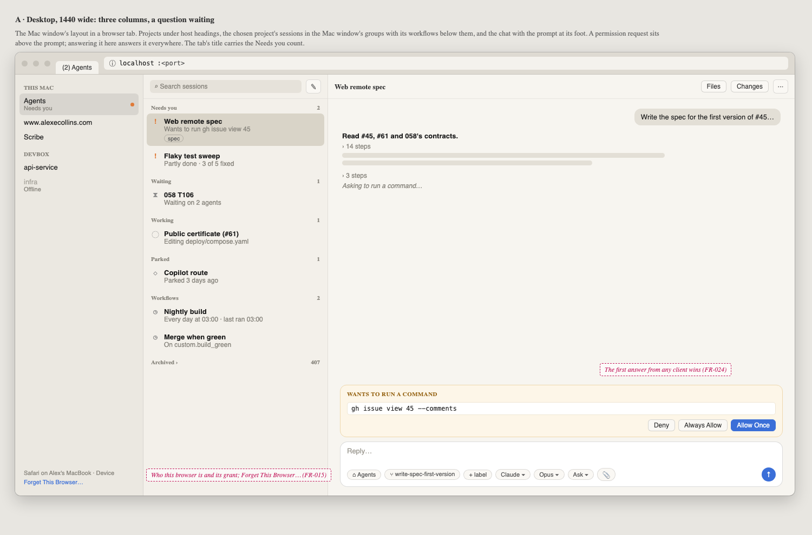
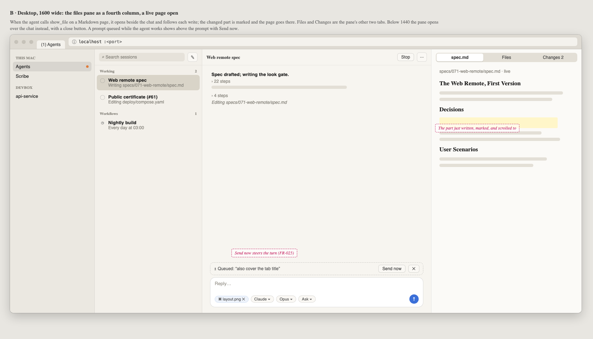
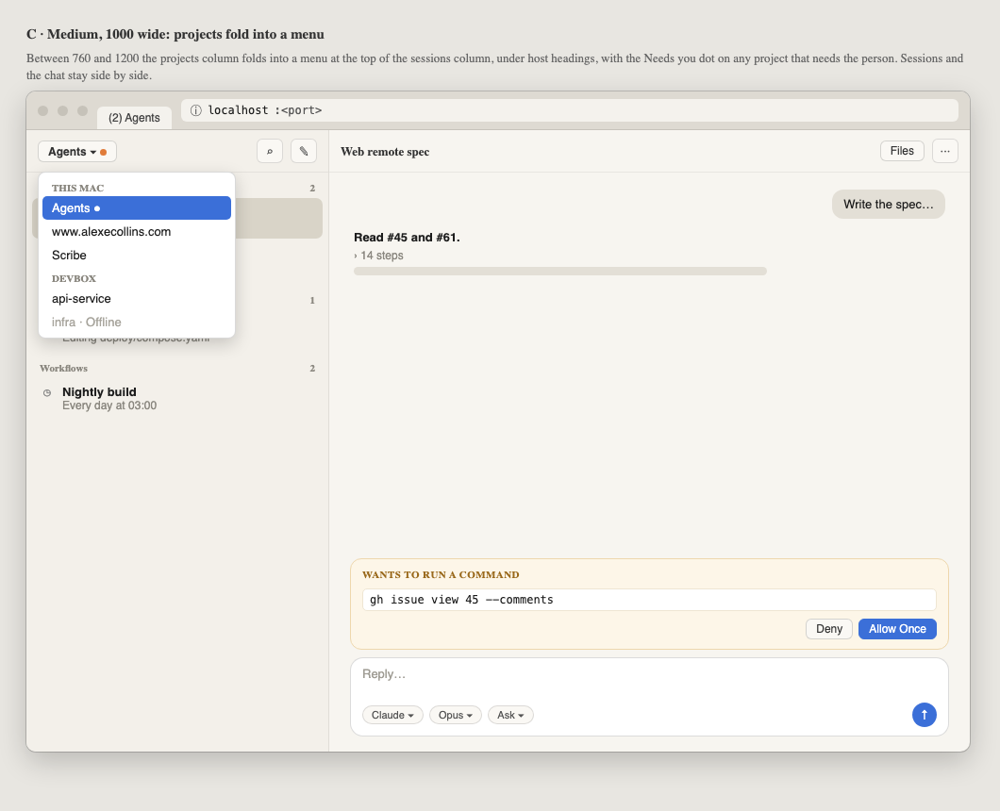
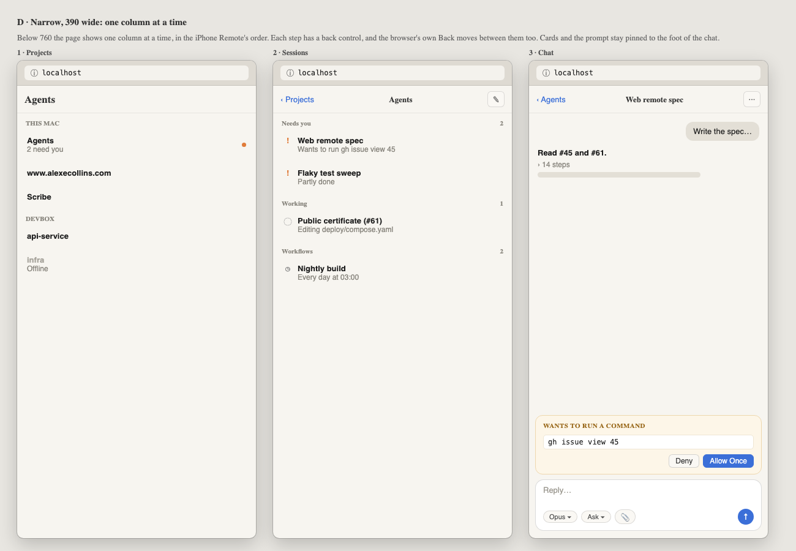
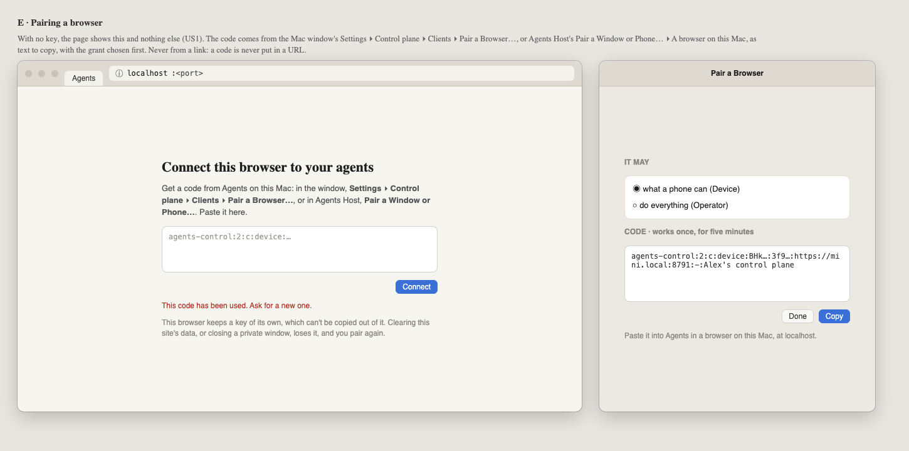
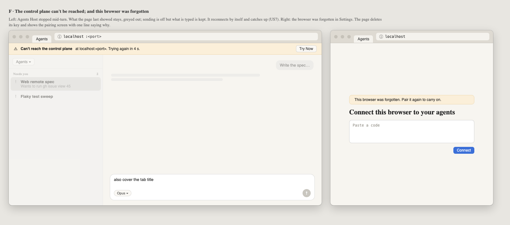

# 071 · Wireframes: the web remote, first version

**Approved by Alex, 2026-09-30: frames A–F.** This was the look gate for 071.

The web remote is the Mac window's layout in a browser tab on this Mac, at
`http://localhost:<port>`, served by the control plane. These frames cover the three columns at
desktop, medium and phone widths, the files pane, pairing, and the two ways the page loses its
connection. Words, groups and colours are the Mac window's; only **Needs you** is drawn in
colour.

Source: [wireframes.html](wireframes.html). Open it with `#a` to `#f` to see one frame. The PNGs
beside it are rendered from it with headless Chrome.

| Frame | What it shows |
|---|---|
| [A](wireframes.html#a) | Desktop, 1440 wide: projects under host headings, sessions in their groups with workflows below, the chat with a permission request above the prompt. Who this browser is sits at the foot of the projects column. |
| [B](wireframes.html#b) | Desktop, 1600 wide: the files pane as a fourth column with a live page following the agent's writes, and a queued prompt with **Send now**. |
| [C](wireframes.html#c) | Medium, 1000 wide: the projects column folded into a menu atop the sessions. |
| [D](wireframes.html#d) | Narrow, 390 wide: projects, sessions and chat one at a time, as on the iPhone. |
| [E](wireframes.html#e) | Pairing: the page with no key, and **Pair a Browser…** in the Mac window. |
| [F](wireframes.html#f) | **Can't reach the control plane**, greyed out with the draft kept; and **This browser was forgotten**. |

## The rules the frames follow

1. **Three widths, three layouts.** At least 1200: three columns, and the files pane as a fourth
   when there is room (1440 and up), over the chat otherwise. 760 to 1200: projects fold into a
   menu. Under 760: one column at a time, with a back control and the browser's Back.
2. **The prompt and its cards are never covered.** At every width they are pinned to the foot of
   the chat.
3. **The tab says what needs you.** Its title is `(2) Agents` while two sessions need the person.
4. **Who this browser is stays visible.** The foot of the projects column names it and its grant,
   with **Forget This Browser…**. At narrower widths it moves into the ··· menu.
5. **A code is pasted, never followed.** Nothing puts a code in a link.
6. **Losing the connection greys out, never blanks.** What was shown stays, sending is off, and
   what was typed is kept.
