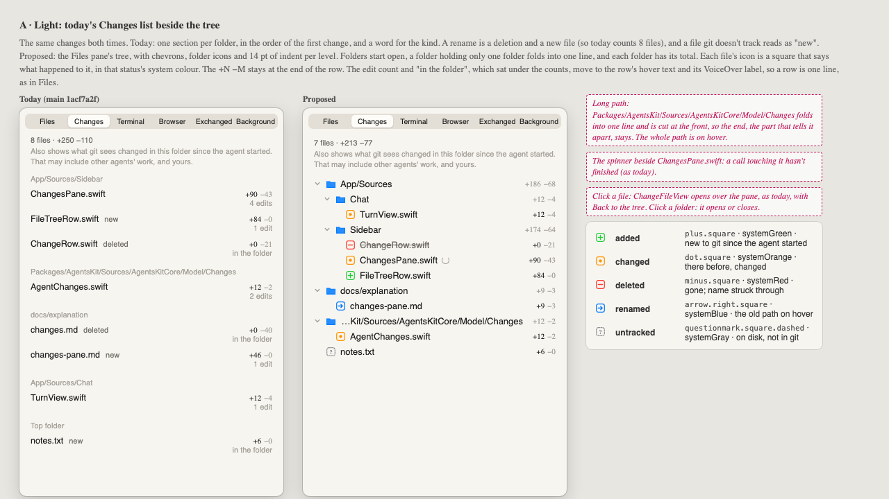
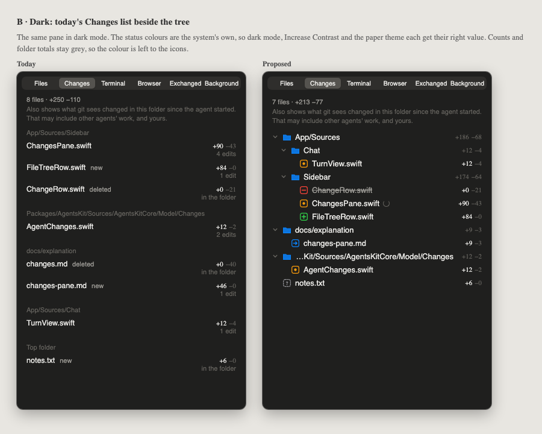
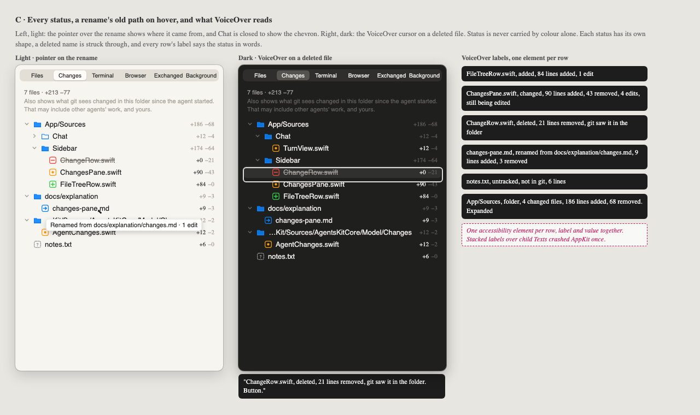
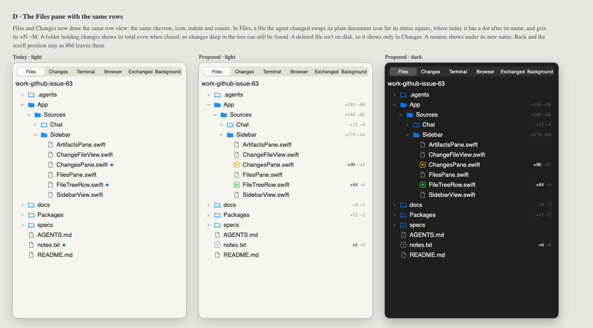

# 072 · Wireframes: Changes as a tree (#63)

**Approved by Alex, 2026-10-01: frames A–D.** This was the look gate for #63. He chose to follow git strictly for new files: a file git doesn't track is grey (untracked) even when the agent wrote it, and turns green (added) once it is staged or committed.

The Changes pane becomes the Files pane's tree, in the style GitHub's "Files changed" made
familiar. Files and Changes draw the same row view, so they read as one pane with two filters.
Each changed file's icon is a square whose shape and colour say what happened to it.

Source: [wireframes.html](wireframes.html). Open it with `#a` to `#d` to see one frame. The PNGs
beside it are rendered from it with headless Chrome.

| Frame | What it shows |
|---|---|
| [A](wireframes.html#a) | Light: today's Changes list (main 1acf7a2f) beside the proposed tree, the same changes in both, with a key to the five statuses. |
| [B](wireframes.html#b) | The same in dark mode. |
| [C](wireframes.html#c) | Every status. The pointer on a rename shows its old path. A closed folder. VoiceOver on a deleted file, and every row's label. |
| [D](wireframes.html#d) | The Files pane today, and with the shared rows in light and dark. Changed files show their status square and +N −M, and folders their totals. |

## The rules the frames follow

1. **One row view, two panes.** The chevron, the icon, 14 pt of indent per level, the name and
   then the counts at the end, the same in Files and Changes.
2. **A tree like GitHub's.** Folders come first, then files, by name, as Files sorts them.
   Folders start open. A folder holding only one folder folds into one line
   (`App/Sources`). A long folded path is cut at the front, so its last part stays, with the
   whole path on hover.
3. **Status is shape, colour and words.**

   | Status | Icon | Colour | Extra cue |
   |---|---|---|---|
   | added | `plus.square` | systemGreen | |
   | changed | `dot.square` | systemOrange | |
   | deleted | `minus.square` | systemRed | name struck through |
   | renamed | `arrow.right.square` | systemBlue | old path on hover and in the label |
   | untracked | `questionmark.square.dashed` | systemGray | dashed outline |

   The colours are the system's own, so dark mode, Increase Contrast and the paper theme each get
   the right value. Counts stay grey, so the only colour on a row is its icon.
4. **Counts on every row that changed.** Each file shows +N −M. Each folder shows the total of
   what changed under it, in Files too, so a closed folder still shows that it holds changes.
5. **One line per row.** The edit count, "in the folder" and "changed since" used to sit under
   the counts. They move to the row's hover text and its VoiceOver label.
6. **One accessibility element per row,** labelled for example "changes-pane.md, renamed from
   docs/explanation/changes.md, 9 lines added, 3 removed". A folder's label adds its count and
   whether it is expanded.
7. **Clicking does what it does today.** A file opens `ChangeFileView` over the pane, with Back to
   the tree. A folder opens or closes. In Files, a file opens as it does now, and #66's Back and
   scroll position are kept.

## What building it takes beyond the views

- **Renames and untracked files aren't in the model yet.** `GitChanges` runs git with
  `--no-renames`, so a rename arrives as a deletion plus an addition. An untracked file (`?`)
  arrives as `added`. `ChangeState` gains `renamed` (with the old path) and `untracked`, and git
  is asked with `-M` for the name status.
- **The Files pane learns statuses from the Changes list.** Today it marks a file by reading the
  conversation (`TouchedPaths`). Status and counts come only from the daemon's list, so Files
  asks for it too.
- **The Remote has no Changes list.** On the iPhone and iPad, "What the agent did" is a page for
  one file, reached from Files, and Files is browsed one folder at a time, not as a tree. So the
  Remote has no tree to change. Its Files rows can take the status squares once the phone asks
  for the Changes list as well. That is a separate step, and the phone's look is Alex's.
